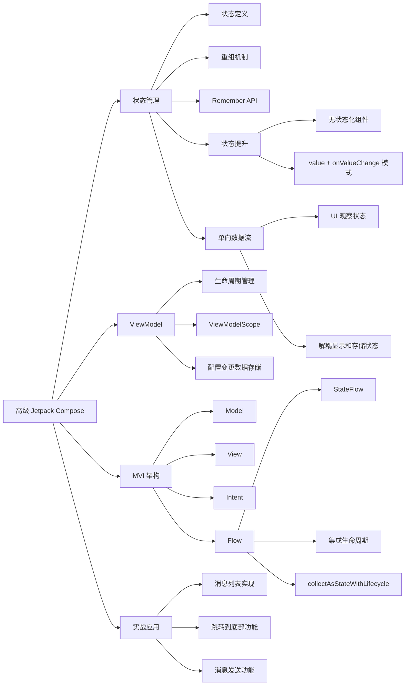

# 《6. 高级 Jetpack Compose》总结

## 核心概述

本文深入探讨了 Jetpack Compose 中的高级概念，重点关注如何使用 ViewModel 管理应用数据、采用 MVI（Model-View-Intent）架构模式组织应用行为，以及如何实现聊天应用中的状态管理。文章以聊天应用为实例，展示了如何从简单的 UI 界面过渡到功能完整的应用程序，特别强调了单向数据流和状态管理的重要性。

## 关键技术点

- **状态管理**
  - 状态定义：任何随时间变化的值，从数据库条目到类属性
  - 重组（Recomposition）：状态更新时，Compose 通过调用相同的可组合函数并传入新参数来更新 UI
  - Remember API：使用 `remember { mutableStateOf() }` 在可组合函数内存储状态
  - 状态提升：将状态移至调用者，使组件无状态化

- **状态提升模式**
  - 引入两个关键参数：`value: T`（当前值）和 `onValueChange: (T) -> Unit`（值变化事件）
  - 无状态组件更易测试、复用性更高、bug 更少

- **单向数据流**
  - 状态变化和 UI 更新只有一个方向
  - 解耦显示状态的组件和存储/改变状态的组件
  - UI 观察状态，当状态变化时自动重组

- **ViewModel**
  - 用于在配置更改（如屏幕旋转）时保留数据
  - 将应用数据与逻辑从 UI 层解耦
  - 使用 `ViewModelScope` 确保协程生命周期与 ViewModel 绑定

- **MVI、Flow 和 StateFlow**
  - MVI（Model-View-Intent）：聚焦单向数据流和不可变性
  - Flow：能够顺序发射多个值的类型，支持实时数据更新
  - StateFlow：扩展 Flow，提供内置的生命周期感知能力
  - 反应式架构：观察数据变化而非频繁请求

## UI 示例

以下是聊天应用中消息列表的核心实现代码：

```kotlin
import androidx.compose.foundation.layout.Box
import androidx.compose.foundation.layout.fillMaxSize
import androidx.compose.foundation.lazy.LazyColumn
import androidx.compose.foundation.lazy.LazyListState
import androidx.compose.foundation.lazy.itemsIndexed
import androidx.compose.runtime.Composable
import androidx.compose.runtime.derivedStateOf
import androidx.compose.runtime.getValue
import androidx.compose.runtime.remember
import androidx.compose.runtime.rememberCoroutineScope
import androidx.compose.ui.Alignment
import androidx.compose.ui.Modifier
import androidx.compose.ui.platform.LocalDensity
import androidx.compose.ui.unit.dp
import kotlinx.coroutines.launch

@Composable
fun Messages(
  messages: List<MessageUiModel>,
  authorId: String,
  scrollState: LazyListState,
  modifier: Modifier = Modifier
) {
  val scope = rememberCoroutineScope()
  Box(modifier = modifier) {
    LazyColumn(
      reverseLayout = true,
      state = scrollState,
      contentPadding = WindowInsets.statusBars.add(WindowInsets(top = 90.dp)).asPaddingValues(),
      modifier = Modifier.fillMaxSize()
    ) {
      itemsIndexed(
        items = messages,
        key = { _, message -> message.id }
      ) { index, content ->
        val prevAuthor = messages.getOrNull(index - 1)?.message?.userId
        val nextAuthor = messages.getOrNull(index + 1)?.message?.userId
        val userId = messages.getOrNull(index)?.message?.userId
        val isFirstMessageByAuthor = prevAuthor != content.message.userId
        val isLastMessageByAuthor = nextAuthor != content.message.userId
        
        MessageUi(
          onAuthorClick = { },
          msg = content,
          authorId = authorId,
          userId = userId ?: "",
          isFirstMessageByAuthor = isFirstMessageByAuthor,
          isLastMessageByAuthor = isLastMessageByAuthor
        )
      }
    }
    
    // "跳转到底部"按钮逻辑
    val jumpThreshold = with(LocalDensity.current) {
      JumpToBottomThreshold.toPx()
    }
    
    val jumpToBottomButtonEnabled by remember {
      derivedStateOf {
        scrollState.firstVisibleItemIndex != 0 ||
        scrollState.firstVisibleItemScrollOffset > jumpThreshold
      }
    }
    
    JumpToBottom(
      enabled = jumpToBottomButtonEnabled,
      onClicked = {
        scope.launch {
          scrollState.animateScrollToItem(0)
        }
      },
      modifier = Modifier.align(Alignment.BottomCenter)
    )
  }
}

// 定义底部按钮显示阈值
private val JumpToBottomThreshold = 56.dp
```

## ViewModel 核心实现

```kotlin
import androidx.lifecycle.ViewModel
import androidx.lifecycle.viewModelScope
import kotlinx.coroutines.Dispatchers
import kotlinx.coroutines.flow.MutableStateFlow
import kotlinx.coroutines.flow.asStateFlow
import kotlinx.coroutines.launch
import java.util.UUID

class MainViewModel : ViewModel() {
  private val userId = UUID.randomUUID().toString()
  private val _messages: MutableList<MessageUiModel> = initialMessages.toMutableStateList()
  private val _messagesFlow: MutableStateFlow<List<MessageUiModel>> by lazy {
    MutableStateFlow(emptyList())
  }
  val messages = _messagesFlow.asStateFlow()
  var currentUserId = MutableStateFlow(userId)
  
  fun onCreateNewMessageClick(messageText: String, photoUri: Uri?) {
    val currentMoment: Instant = Clock.System.now()
    val message = Message(
      UUID.randomUUID().toString(),
      currentMoment,
      currentRoom.value.id,
      messageText,
      userId,
      photoUri
    )
    
    if (message.photoUri == null) {
      viewModelScope.launch(Dispatchers.Default) {
        createMessageForRoom(message, currentRoom.value)
      }
    }
  }
  
  suspend fun createMessageForRoom(message: Message, chatRoom: ChatRoom) {
    val user = User(userId)
    val messageUIModel = MessageUiModel(message, user)
    _messages.add(0, messageUIModel) // 添加到列表头部
    _messagesFlow.emit(_messages)
  }
}
```

## Activity 中的集成

```kotlin
import androidx.activity.ComponentActivity
import androidx.activity.viewModels
import androidx.lifecycle.compose.collectAsStateWithLifecycle
import androidx.compose.runtime.getValue

class MainActivity : ComponentActivity() {
  private val viewModel: MainViewModel by viewModels()

  override fun onCreate(savedInstanceState: Bundle?) {
    super.onCreate(savedInstanceState)
    setContent {
      val messagesWithUsers by viewModel.messages.collectAsStateWithLifecycle()
      val currentUiState = ConversationUiState(
        channelName = "Android Apprentice",
        initialMessages = messagesWithUsers,
        viewModel = viewModel
      )

      KodecochatTheme {
        ConversationContent(currentUiState)
      }
    }
  }
}
```

## 目标分析

本文面向具有 Jetpack Compose 基础知识的 Android 开发者，目标是帮助开发者从简单的 UI 构建过渡到功能完整的应用程序。文章重点关注聊天应用的状态管理、数据流和架构设计，适合希望深入了解 Compose 应用架构的中级到高级开发者。

## 技术价值

1. **架构分离**：展示了如何将 UI、数据和应用逻辑有效分离，提高代码可维护性和可测试性
2. **单向数据流**：介绍了 MVI 架构模式在 Compose 中的应用，解决了传统 Android 开发中多源 UI 更新导致的同步问题
3. **状态管理最佳实践**：提供了状态提升和状态观察的具体实现，指导开发者创建可维护的状态管理方案
4. **ViewModel 集成**：详细展示了 ViewModel 与 Compose 的集成方式，解决了配置更改时数据丢失的问题
5. **协程与 Flow**：演示了如何使用协程和 Flow 实现响应式 UI 更新，提高应用性能和用户体验

## 思维导图


