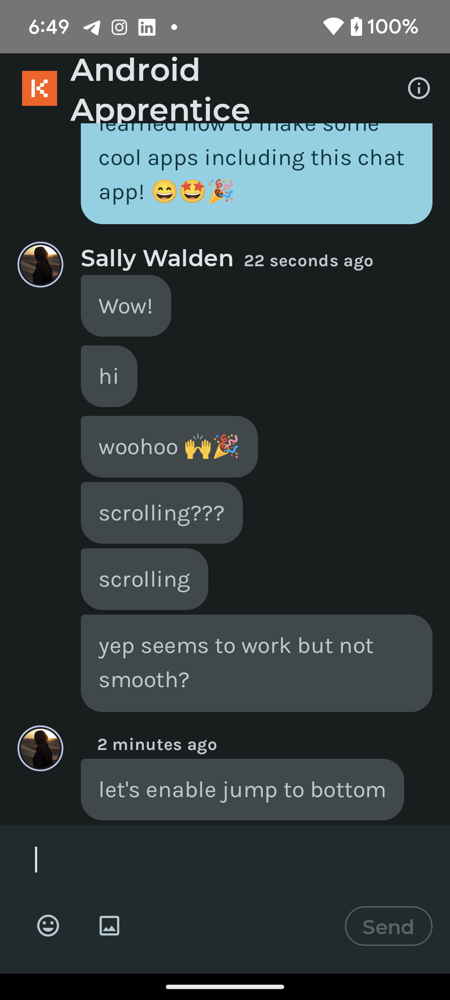
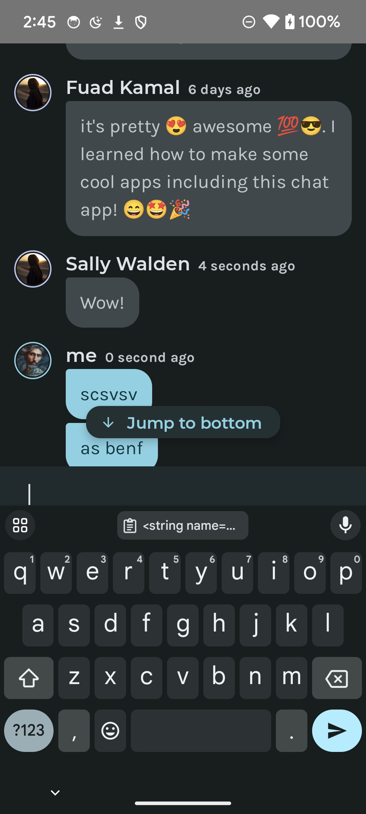

# 6. 高级 Jetpack Compose

在上一章中，你学习了 Compose UI 中的一些构建块，以开始为 Android 应用开发基本 UI。你使用 Compose 和模拟数据构建了聊天应用的界面。这就像商店里展示的那些看起来美味但完全是假的蛋糕。但你想要拥有蛋糕并且能吃掉它！在本章中，你将学习如何通过使用 ViewModel 管理应用数据、采用 MVI（模型-视图-意图）架构来组织应用行为，以及使用 Navigation 库在应用屏幕之间导航，从而使你的应用更加实用。准备好 *畅聊* 吧！

## 状态

要使任何应用具有功能性，你必须知道如何**管理状态**。从本质上讲，每个应用都处理着可能**变化**的特定值。例如，在 Kodeco chat 中，用户可以：

+ 添加新的聊天消息
+ 删除聊天消息
+ 上传图片附件到聊天消息

**状态（State）** 是任何随时间**可能变化**的值。这些值可以包括从数据库条目到类属性的任何内容。随着状态的变化，UI 准确反映该状态至关重要，因此当状态改变时，你需要**更新 UI**。

Compose 是声明式的，因此更新它的唯一方法是使用新的参数调用相同的可组合函数。这些参数是 UI 状态的表示。任何时候状态更新，都会发生*重组（Recomposition）*。你可能没有意识到，但你已经一直在更新可组合项的状态。回想一下上一章中用于用户输入聊天消息的 `UserInputText` 可组合函数：

```kotlin
@ExperimentalFoundationApi
@Composable
private fun UserInputText(
  keyboardType: KeyboardType = KeyboardType.Text,
  onTextChanged: (TextFieldValue) -> Unit,
  textFieldValue: TextFieldValue,
  photoUri: Uri?,
  keyboardShown: Boolean,
  onTextFieldFocused: (Boolean) -> Unit,
  focusState: Boolean,
  onMessageSent: KeyboardActionScope.() -> Unit
) {
  // ...
  BasicTextField(
    value = textFieldValue,
    onValueChange = { onTextChanged(it) }
  )
  // ...
}
```

当你在文本字段中输入文本时，显示的值实时反映你的输入非常重要。这就是使用 `onValueChange` 的地方。每次你在文本字段中键入一个字符，这个可组合函数就会*重组*。换句话说，文本字段的*状态*会更新。

另外，回想一下你之前使用 `remember` 来存储可组合项的状态：

```kotlin
var chatInputText by remember { mutableStateOf("") }
```

使用 `remember` 来存储对象的可组合函数会创建内部状态，使该可组合函数*有状态（Stateful）*。当你希望简单的可组合函数管理自己的状态时，这可能很有用。但这些可组合函数的可重用性较低，并且更难测试。

### 状态提升

*无状态（Stateless）* 的可组合函数是指不持有任何状态的可组合函数。实现无状态的一种简单方法是使用*状态提升（State Hoisting）*。你也已经使用过这种方法了。再次看：

```kotlin
BasicTextField(
  value = textFieldValue,
  onValueChange = { onTextChanged(it) }
)
```

状态提升是一种编程模式，通过将可组合函数中的内部状态替换为**参数**和**事件**，将**状态移动到可组合函数的调用方**。

对于可组合函数，这通常意味着向可组合函数引入两个参数：

+ **value: T**: 要显示的当前值。
+ **onValueChange: (T) -> Unit**: 请求更改值的事件，其中 `(T)` 表示提供新值。

标记 `T` 代表一个泛型类型，具体取决于你所展示的数据和 UI。如果你再次查看 `UserInputText` 的参数，你会发现你对状态和事件遵循了相同的方法。在这种情况下，你的 `T` 是一个 `TextFieldValue`。

通过对可组合函数应用**状态提升**，你可以使其无状态——这意味着它不能改变任何状态。无状态的可组合函数更容易测试，bug 更少，并提供更多的重用机会。

### 单向数据流

在 Compose 出现之前，开发 Android 应用的一个缺点是应用的 UI 可能从许多不同的地方更新。这变得难以管理，事情常常会失去同步，导致难以调试的问题。随着 Compose 的出现，另一个原则被采纳——**单向数据流（Unidirectional Data Flow）**。

在单向数据流中，状态更改和 UI 更新都只有一个方向。这意味着状态更改事件只能来自一个来源，通常是用户交互，而 UI 更新只能来自状态管理器。Compose 基于**解耦** UI 中**显示状态**的组件与**存储和更改状态**的应用部分的理念。

<svg width="600" height="197" viewBox="0 0 600 197" fill="none" xmlns="http://www.w3.org/2000/svg">
<g id="unidirectional_data_flow">
<g id="Arrow">
<path id="Line" d="M222 56L222 128" stroke="#333333" stroke-width="2" stroke-miterlimit="16" stroke-linecap="round"></path>
<path id="Tip" d="M228.345 126.805L222.175 134.805C221.971 135.069 221.571 135.064 221.375 134.794L215.545 126.794C215.304 126.464 215.54 126 215.949 126L227.949 126C228.364 126 228.598 126.477 228.345 126.805Z" fill="white" stroke="#333333" stroke-width="2"></path>
<circle id="Circle" cx="222" cy="50" r="5" transform="rotate(90 222 50)" fill="white" stroke="#333333" stroke-width="2"></circle>
</g>
<g id="Arrow_2">
<path id="Line_2" d="M378 140L378 68" stroke="#333333" stroke-width="2" stroke-miterlimit="16" stroke-linecap="round"></path>
<path id="Tip_2" d="M371.655 69.1946L377.825 61.1949C378.029 60.9309 378.429 60.9363 378.625 61.2058L384.455 69.2055C384.696 69.536 384.46 70 384.051 70L372.051 70C371.636 70 371.402 69.5234 371.655 69.1946Z" fill="white" stroke="#333333" stroke-width="2"></path>
<circle id="Circle_2" cx="378" cy="146" r="5" transform="rotate(-90 378 146)" fill="white" stroke="#333333" stroke-width="2"></circle>
</g>
<g id="Shape">
<rect x="395" y="87" width="55" height="28" rx="8" fill="white"></rect>
<rect x="395" y="87" width="55" height="28" rx="8" stroke="#333333" stroke-width="2"></rect>
<text id="Event" fill="#333333" xml:space="preserve" style="white-space: pre" font-family="IBM Plex Sans" font-size="12" font-weight="500" letter-spacing="0em"><tspan x="406.914" y="105.5">Event</tspan></text>
</g>
<g id="Shape_2">
<rect x="150" y="87" width="55" height="28" rx="8" fill="white"></rect>
<rect x="150" y="87" width="55" height="28" rx="8" stroke="#333333" stroke-width="2"></rect>
<text id="State" fill="#333333" xml:space="preserve" style="white-space: pre" font-family="IBM Plex Sans" font-size="12" font-weight="500" letter-spacing="0em"><tspan x="162.957" y="105.5">State</tspan></text>
</g>
<g id="ShapeGreen">
<rect x="199" y="11" width="202" height="48" rx="13" fill="#D6E18D"></rect>
<rect x="199" y="11" width="202" height="48" rx="13" stroke="#333333" stroke-width="2"></rect>
<text id="State_2" fill="#333333" xml:space="preserve" style="white-space: pre" font-family="IBM Plex Sans" font-size="16" font-weight="500" letter-spacing="0em"><tspan x="280.609" y="41">State</tspan></text>
</g>
<g id="ShapeGreen_2">
<rect x="199" y="138" width="202" height="48" rx="13" fill="#D6E18D"></rect>
<rect x="199" y="138" width="202" height="48" rx="13" stroke="#333333" stroke-width="2"></rect>
<text id="UI" fill="#333333" xml:space="preserve" style="white-space: pre" font-family="IBM Plex Sans" font-size="16" font-weight="500" letter-spacing="0em"><tspan x="291.188" y="168">UI</tspan></text>
</g>
</g>
</svg>

另一个关键概念是 UI **观察状态**。每当有新状态时，UI 就会*重组*以显示它。Android 提供了一些非常方便的 **Android 架构组件**来帮助实现这一点。对于状态管理器，有 **ViewModel**。对于以单向方式观察数据，有 **Flow**。

## ViewModel

在第 3 章“Android 基础”中，你了解了 Activity 的生命周期。在 Android 中，每当发生配置更改（例如设备旋转）时，Activity 生命周期事件就会被触发。本质上，像旋转设备这样无害的事情会导致 Activity 从头开始重新创建。如果你的数据或状态信息与 UI 紧密耦合，当配置更改发生时你可能会丢失它。随着应用复杂性和规模的增长，将应用程序数据和逻辑解耦到**可组合函数**和 UI 层之外变得越来越重要。幸运的是，Android 提供了一个内置的架构组件来帮助你做到这一点：ViewModel。

在 **com.kodeco.chat** 下创建一个新包，并将其命名为 **viewmodel**。右键单击该包并创建一个新的 **MainViewModel** Kotlin 类。你可以有多个 ViewModel；你可以为应用中的每个 Activity 创建一个 ViewModel，并在 Activity 之间共享一个 ViewModel。目前，你只需要一个。

打开 **MainViewModel** 并更新它以扩展 ViewModel 类：

```kotlin
class MainViewModel : ViewModel() {
}
```

Android Studio 应该会自动导入 `androidx.lifecycle.ViewModel` 包。

你需要在 ViewModel 中创建逻辑，用于将新消息添加到消息列表中。但要做到这一点，你首先必须将消息列表保存在某个地方！

你可能还记得，在上一章中你创建了一个 `MessageUiModel`——一个包含聊天 `Message` 和 `User` 的对象。消息列表将是一个 `MessageUiModel` 的列表。将以下属性添加到 `MainViewModel`：

```kotlin
// 1
private val userId = UUID.randomUUID().toString()
// 2
private val _messages: MutableList<MessageUiModel> = initialMessages.toMutableStateList()
// 3
private val _messagesFlow: MutableStateFlow<List<MessageUiModel>> by lazy {
  MutableStateFlow(emptyList())
}
val messages = _messagesFlow.asStateFlow()
```

1. 这是在此设备上使用应用的人的 ID。它是一个随机的 UUID，确保每个聊天用户都有唯一的身份。理想情况下，你会在应用首次启动时生成此 ID 并存储起来以备将来使用。你将在第 9 章“Data Store”中学习如何存储像这样的值以供应用再次启动时使用。
2. 这是聊天中的消息列表。在本章后面，你将从服务中检索此列表，但现在先将其存储在 ViewModel 中。它最初会用假消息列表填充。如果你不想看到虚拟消息数据，可以用空列表初始化它。
3. 你将在下一节学习关于 MVI 和 Flow 的所有知识。基本上，`_messagesFlow` 是一个私有 Flow，只能由 ViewModel 内部的方法修改。`messages` 是你的 Compose UI 监听变化并在变量更新时进行更新的变量。

接下来，将这些函数添加到你的 ViewModel 中，用于处理用户在消息输入 UI 中点击“发送”时的操作：

```kotlin
// 1
fun onCreateNewMessageClick(messageText: String, photoUri: Uri?) {
  // 2
  val currentMoment: Instant = Clock.System.now()
  // 3
  val message = Message(
    UUID.randomUUID().toString(),
     currentMoment,
     currentRoom.value.id, // 译者注：此处 currentRoom 似乎未定义，原文可能遗漏或有上下文
     messageText,
     userId,
     photoUri
  )
  // 4
  if (message.photoUri == null) {
    viewModelScope.launch(Dispatchers.Default) {
      createMessageForRoom(message, currentRoom.value) // 译者注：此处 currentRoom 似乎未定义
    }
  }
}
// 5
suspend fun createMessageForRoom(message: Message, chatRoom: ChatRoom) { // 译者注：ChatRoom 类型未定义
  // 6
  val user = User(userId)
  val messageUIModel = MessageUiModel(message, user)
  // 7
  _messages.add(messageUIModel)
  // 8
  _messagesFlow.emit(_messages)
}
```

1. 处理消息点击的函数接受两个参数。实际的消息文本是必需的，照片附件是可选的。消息输入 UI 已经有一个按钮用于从设备的相册添加照片。点击它会显示你可以从相册附加的图片，但它们实际上并没有被附加，因为你还没有添加该功能。
2. 发送消息时的当前时间被计算出来。这个时间戳是 UI 的一部分。但它的措辞取决于这个时刻过去了多久，就像你已经看到的虚拟消息数据一样。
3. 创建一个新的 `Message`。
4. 目前，你只处理消息中没有图片附件的情况。为应用中的每个 [`ViewModel`](https://developer.android.com/topic/libraries/architecture/viewmodel) 定义了一个 `ViewModelScope`。在此作用域中启动的任何协程（Coroutine）如果在 `ViewModel` 被清除时都会自动取消。因此，开箱即用的 `ViewModel` 为你提供了一种非常重要的方式来限定处理 UI 的协程的作用域，以便在给定屏幕不再活动时取消它们。这避免了一个遗留的 Android 开发中的老问题：由视图放入内存然后当视图超出作用域时被遗弃的东西引起的内存泄漏。
5. 因为你正在使用协程，为聊天室创建消息必须是一个 `suspend` 函数（挂起函数）。现在，应用中只有一个名为“Android Apprentice”的聊天室。但是一旦你有了多个设备和用户，你就可以拥有许多聊天室：两个或多个用户之间的直接消息。目前，`chatRoom` 参数尚未使用。
6. 使用之前生成的 userID 和消息文本创建一个 `MessageUiModel` 实例。
7. 将 `MessageUiModel` 添加到你在 ViewModel 中存储的列表中。
8. 这里是真正“魔法”发生的地方。UI 监听的 Flow 通过使用 `emit()` 更新为一个新值，即更新后的消息列表。

### MVI、Flows 和 StateFlow

传统上，如果你的应用需要数据，它可能会通过网络 API 或数据库服务等方式创建一个对此数据的请求。例如，当视图启动时，你从 ViewModel 请求数据，然后 ViewModel 从数据层请求该数据。接收到的数据沿相反方向返回，从数据层到 ViewModel，然后 UI 被更新。你可能使用挂起函数（协程）异步完成所有这些操作。

<svg width="600" height="511" viewBox="0 0 600 511" fill="none" xmlns="http://www.w3.org/2000/svg">
<g id="traditional_data_flow">
<g id="Arrow">
<path id="Line" d="M150 433L150 386" stroke="#333333" stroke-width="2" stroke-miterlimit="16" stroke-linecap="round"></path>
<path id="Tip" d="M143.655 387.195L149.825 379.195C150.029 378.931 150.429 378.936 150.625 379.206L156.455 387.206C156.696 387.536 156.46 388 156.051 388L144.051 388C143.636 388 143.402 387.523 143.655 387.195Z" fill="white" stroke="#333333" stroke-width="2"></path>
<circle id="Circle" cx="150" cy="439" r="5" transform="rotate(-90 150 439)" fill="white" stroke="#333333" stroke-width="2"></circle>
</g>
<g id="Arrow_2">
<path id="Line_2" d="M151 216L151 128C151 104.528 170.028 85.5 193.5 85.5V85.5L215 85.5" stroke="#333333" stroke-width="2" stroke-miterlimit="1.11658" stroke-linejoin="round"></path>
<circle id="Circle_2" cx="6" cy="6" r="5" transform="matrix(1 -8.74228e-08 -8.74228e-08 -1 145 222)" fill="white" stroke="#333333" stroke-width="2"></circle>
<path id="Tip_2" d="M210.805 92.3447L218.805 86.1749C219.069 85.9713 219.064 85.5712 218.794 85.3749L210.794 79.5451C210.464 79.3043 210 79.5403 210 79.9492L210 91.9488C210 92.3639 210.477 92.5983 210.805 92.3447Z" fill="white" stroke="#333333" stroke-width="2"></path>
</g>
<g id="Arrow_3">
<path id="Line_3" d="M316 85.5L404 85.5C427.472 85.5 446.5 104.528 446.5 128V128L446.5 170.5" stroke="#333333" stroke-width="2" stroke-miterlimit="1.11658" stroke-linejoin="round"></path>
<path id="Tip_3" d="M439.655 169.305L445.825 177.305C446.029 177.569 446.429 177.564 446.625 177.294L452.455 169.294C452.696 168.964 452.46 168.5 452.051 168.5L440.051 168.5C439.636 168.5 439.402 168.977 439.655 169.305Z" fill="white" stroke="#333333" stroke-width="2"></path>
<circle id="Circle_3" cx="6" cy="6" r="5" transform="matrix(-4.37114e-08 1 1 4.37114e-08 310 79.5)" fill="white" stroke="#333333" stroke-width="2"></circle>
</g>
<g id="ShapeGreen">
<rect x="76" y="181" width="151" height="74" rx="13" fill="#D6E18D"></rect>
<rect x="76" y="181" width="151" height="74" rx="13" stroke="#333333" stroke-width="2"></rect>
<text id="Data Layer creates request" fill="#333333" xml:space="preserve" style="white-space: pre" font-family="IBM Plex Sans" font-size="14" font-weight="500" letter-spacing="0em"><tspan x="117.334" y="213.25">Data Layer
</tspan><tspan x="101.447" y="233.25">creates request</tspan></text>
</g>
<g id="Arrow_4">
<path id="Line_4" d="M150 312L150 265" stroke="#333333" stroke-width="2" stroke-miterlimit="16" stroke-linecap="round"></path>
<path id="Tip_4" d="M143.655 266.195L149.825 258.195C150.029 257.931 150.429 257.936 150.625 258.206L156.455 266.206C156.696 266.536 156.46 267 156.051 267L144.051 267C143.636 267 143.402 266.523 143.655 266.195Z" fill="white" stroke="#333333" stroke-width="2"></path>
<circle id="Circle_4" cx="150" cy="318" r="5" transform="rotate(-90 150 318)" fill="white" stroke="#333333" stroke-width="2"></circle>
</g>
<g id="ShapeGreen_2">
<rect x="76" y="302" width="151" height="74" rx="13" fill="#D6E18D"></rect>
<rect x="76" y="302" width="151" height="74" rx="13" stroke="#333333" stroke-width="2"></rect>
<text id="View Requests Data" fill="#333333" xml:space="preserve" style="white-space: pre" font-family="IBM Plex Sans" font-size="14" font-weight="500" letter-spacing="0em"><tspan x="87.6045" y="344.25">View Requests Data</tspan></text>
</g>
<g id="ShapeGreen_3">
<rect x="76" y="423" width="151" height="74" rx="13" fill="#D6E18D"></rect>
<rect x="76" y="423" width="151" height="74" rx="13" stroke="#333333" stroke-width="2"></rect>
<text id="View Starts" fill="#333333" xml:space="preserve" style="white-space: pre" font-family="IBM Plex Sans" font-size="14" font-weight="500" letter-spacing="0em"><tspan x="114.859" y="465.25">View Starts</tspan></text>
</g>
<g id="Arrow_5">
<path id="Line_5" d="M447 245L447 292" stroke="#333333" stroke-width="2" stroke-miterlimit="16" stroke-linecap="round"></path>
<path id="Tip_5" d="M453.345 290.805L447.175 298.805C446.971 299.069 446.571 299.064 446.375 298.794L440.545 290.794C440.304 290.464 440.54 290 440.949 290L452.949 290C453.364 290 453.598 290.477 453.345 290.805Z" fill="white" stroke="#333333" stroke-width="2"></path>
<circle id="Circle_5" cx="447" cy="239" r="5" transform="rotate(90 447 239)" fill="white" stroke="#333333" stroke-width="2"></circle>
</g>
<g id="ShapeGreen_4">
<rect x="372" y="181" width="151" height="74" rx="13" fill="#D6E18D"></rect>
<rect x="372" y="181" width="151" height="74" rx="13" stroke="#333333" stroke-width="2"></rect>
<text id="Data Layer receives data" fill="#333333" xml:space="preserve" style="white-space: pre" font-family="IBM Plex Sans" font-size="14" font-weight="500" letter-spacing="0em"><tspan x="413.334" y="213.25">Data Layer
</tspan><tspan x="404.803" y="233.25">receives data</tspan></text>
</g>
<g id="Arrow_6">
<path id="Line_6" d="M447 366L447 413" stroke="#333333" stroke-width="2" stroke-miterlimit="16" stroke-linecap="round"></path>
<path id="Tip_6" d="M453.345 411.805L447.175 419.805C446.971 420.069 446.571 420.064 446.375 419.794L440.545 411.794C440.304 411.464 440.54 411 440.949 411L452.949 411C453.364 411 453.598 411.477 453.345 411.805Z" fill="white" stroke="#333333" stroke-width="2"></path>
<circle id="Circle_6" cx="447" cy="360" r="5" transform="rotate(90 447 360)" fill="white" stroke="#333333" stroke-width="2"></circle>
</g>
<g id="ShapeGreen_5">
<rect x="372" y="302" width="151" height="74" rx="13" fill="#D6E18D"></rect>
<rect x="372" y="302" width="151" height="74" rx="13" stroke="#333333" stroke-width="2"></rect>
<text id="ViewModel Receives Data" fill="#333333" xml:space="preserve" style="white-space: pre" font-family="IBM Plex Sans" font-size="14" font-weight="500" letter-spacing="0em"><tspan x="381.95" y="334.25">ViewModel Receives
</tspan><tspan x="432.502" y="354.25">Data</tspan></text>
</g>
<g id="ShapeGreen_6">
<rect x="372" y="423" width="151" height="74" rx="13" fill="#D6E18D"></rect>
<rect x="372" y="423" width="151" height="74" rx="13" stroke="#333333" stroke-width="2"></rect>
<text id="View Receives Data" fill="#333333" xml:space="preserve" style="white-space: pre" font-family="IBM Plex Sans" font-size="14" font-weight="500" letter-spacing="0em"><tspan x="384.979" y="465.25">View Receives Data</tspan></text>
</g>
<g id="Device">
<g id="ShapePattern">
<rect x="222" y="169" width="155" height="155" rx="77.5" transform="rotate(-90 222 169)" fill="white"></rect>
<rect x="222" y="169" width="155" height="155" rx="77.5" transform="rotate(-90 222 169)" stroke="#333333" stroke-width="2"></rect>
<g id="Pattern">
<path id="Line_7" d="M309.5 168.303V14.6973" stroke="#333333" stroke-width="2" stroke-miterlimit="16"></path>
<path id="Line_8" d="M305.5 169.151V14.6973" stroke="#333333" stroke-width="2" stroke-miterlimit="16"></path>
<path id="Line_9" d="M301.5 170V13" stroke="#333333" stroke-width="2" stroke-miterlimit="16"></path>
<path id="Line_10" d="M297.5 170V13" stroke="#333333" stroke-width="2" stroke-miterlimit="16"></path>
<path id="Line_11" d="M293.5 169.151V13.8487" stroke="#333333" stroke-width="2" stroke-miterlimit="16"></path>
<path id="Line_12" d="M289.5 168.303V14.6973" stroke="#333333" stroke-width="2" stroke-miterlimit="16"></path>
</g>
</g>
<g id="ShapeInner">
<rect x="238" y="68" width="123" height="43" rx="13" fill="white"></rect>
<rect x="238" y="68" width="123" height="43" rx="13" stroke="#333333" stroke-width="2"></rect>
<g id="ShapeInnerForeGreen">
<rect x="243" y="73" width="113" height="33" rx="9" fill="#D6E18D"></rect>
<rect x="243" y="73" width="113" height="33" rx="9" stroke="#333333" stroke-width="2"></rect>
</g>
</g>
</g>
</g>
</svg>

但更有效的架构是*观察*数据变化而不是持续请求它们。然后，数据源中的任何更新都会自动流（Flow）向视图。

<svg width="600" height="574" viewBox="0 0 600 574" fill="none" xmlns="http://www.w3.org/2000/svg">
<g id="observing_data_flow">
<g id="Arrow">
<path id="Line" d="M301 311L301 358" stroke="#333333" stroke-width="2" stroke-miterlimit="16" stroke-linecap="round"></path>
<path id="Tip" d="M307.345 356.805L301.175 364.805C300.971 365.069 300.571 365.064 300.375 364.794L294.545 356.794C294.304 356.464 294.54 356 294.949 356L306.949 356C307.364 356 307.598 356.477 307.345 356.805Z" fill="white" stroke="#333333" stroke-width="2"></path>
<circle id="Circle" cx="301" cy="305" r="5" transform="rotate(90 301 305)" fill="white" stroke="#333333" stroke-width="2"></circle>
</g>
<g id="ShapeGreen">
<rect x="226" y="247" width="151" height="74" rx="13" fill="#D6E18D"></rect>
<rect x="226" y="247" width="151" height="74" rx="13" stroke="#333333" stroke-width="2"></rect>
<text id="Data Layer observes source" fill="#333333" xml:space="preserve" style="white-space: pre" font-family="IBM Plex Sans" font-size="14" font-weight="500" letter-spacing="0em"><tspan x="267.334" y="279.25">Data Layer
</tspan><tspan x="249.253" y="299.25">observes source</tspan></text>
</g>
<g id="Arrow_2">
<path id="Line_2" d="M301 432L301 479" stroke="#333333" stroke-width="2" stroke-miterlimit="16" stroke-linecap="round"></path>
<path id="Tip_2" d="M307.345 477.805L301.175 485.805C300.971 486.069 300.571 486.064 300.375 485.794L294.545 477.794C294.304 477.464 294.54 477 294.949 477L306.949 477C307.364 477 307.598 477.477 307.345 477.805Z" fill="white" stroke="#333333" stroke-width="2"></path>
<circle id="Circle_2" cx="301" cy="426" r="5" transform="rotate(90 301 426)" fill="white" stroke="#333333" stroke-width="2"></circle>
</g>
<g id="ShapeGreen_2">
<rect x="226" y="368" width="151" height="74" rx="13" fill="#D6E18D"></rect>
<rect x="226" y="368" width="151" height="74" rx="13" stroke="#333333" stroke-width="2"></rect>
<text id="ViewModel Observes Data Layer" fill="#333333" xml:space="preserve" style="white-space: pre" font-family="IBM Plex Sans" font-size="14" font-weight="500" letter-spacing="0em"><tspan x="234.378" y="400.25">ViewModel Observes
</tspan><tspan x="267.334" y="420.25">Data Layer</tspan></text>
</g>
<g id="ShapeGreen_3">
<rect x="226" y="489" width="151" height="74" rx="13" fill="#D6E18D"></rect>
<rect x="226" y="489" width="151" height="74" rx="13" stroke="#333333" stroke-width="2"></rect>
<text id="View Observes ViewModel" fill="#333333" xml:space="preserve" style="white-space: pre" font-family="IBM Plex Sans" font-size="14" font-weight="500" letter-spacing="0em"><tspan x="254.059" y="521.25">View Observes
</tspan><tspan x="266.124" y="541.25">ViewModel</tspan></text>
</g>
<g id="Device">
<g id="ShapePattern">
<rect x="222" y="166" width="155" height="155" rx="77.5" transform="rotate(-90 222 166)" fill="white"></rect>
<rect x="222" y="166" width="155" height="155" rx="77.5" transform="rotate(-90 222 166)" stroke="#333333" stroke-width="2"></rect>
<g id="Pattern">
<path id="Line_3" d="M309.5 165.303V11.6973" stroke="#333333" stroke-width="2" stroke-miterlimit="16"></path>
<path id="Line_4" d="M305.5 166.151V11.6973" stroke="#333333" stroke-width="2" stroke-miterlimit="16"></path>
<path id="Line_5" d="M301.5 167V10" stroke="#333333" stroke-width="2" stroke-miterlimit="16"></path>
<path id="Line_6" d="M297.5 167V10" stroke="#333333" stroke-width="2" stroke-miterlimit="16"></path>
<path id="Line_7" d="M293.5 166.151V10.8487" stroke="#333333" stroke-width="2" stroke-miterlimit="16"></path>
<path id="Line_8" d="M289.5 165.303V11.6973" stroke="#333333" stroke-width="2" stroke-miterlimit="16"></path>
</g>
</g>
<g id="ShapeInner">
<rect x="238" y="65" width="123" height="43" rx="13" fill="white"></rect>
<rect x="238" y="65" width="123" height="43" rx="13" stroke="#333333" stroke-width="2"></rect>
<g id="ShapeInnerForeGreen">
<rect x="243" y="70" width="113" height="33" rx="9" fill="#D6E18D"></rect>
<rect x="243" y="70" width="113" height="33" rx="9" stroke="#333333" stroke-width="2"></rect>
</g>
</g>
</g>
<g id="Group 2">
<g id="Arrow_3">
<path id="Line_9" d="M414 144V182.75C414 193.658 405.158 202.5 394.25 202.5V202.5H373" stroke="#333333" stroke-width="2" stroke-miterlimit="1.11658" stroke-linejoin="round"></path>
</g>
<g id="Arrow_4">
<path id="Line_10" d="M414 146V107.161C414 96.3024 405.198 87.5 394.339 87.5V87.5H376" stroke="#333333" stroke-width="2" stroke-miterlimit="1.11658" stroke-linejoin="round"></path>
</g>
<g id="Arrow_5">
<path id="Line_11" d="M300 237L300 223.695C300 211.989 309.489 202.5 321.195 202.5V202.5L376 202.5" stroke="#333333" stroke-width="2" stroke-miterlimit="1.11658" stroke-linejoin="round"></path>
</g>
</g>
<g id="Group 3">
<g id="Arrow_6">
<path id="Line_12" d="M186 144V182.75C186 193.658 194.842 202.5 205.75 202.5V202.5H227" stroke="#333333" stroke-width="2" stroke-miterlimit="1.11658" stroke-linejoin="round"></path>
</g>
<g id="Arrow_7">
<path id="Line_13" d="M186 146V107.161C186 96.3024 194.802 87.5 205.661 87.5V87.5H212" stroke="#333333" stroke-width="2" stroke-miterlimit="1.11658" stroke-linejoin="round"></path>
<path id="Tip_3" d="M210.805 81.6553L218.805 87.8251C219.069 88.0287 219.064 88.4288 218.794 88.6251L210.794 94.4549C210.464 94.6957 210 94.4597 210 94.0508V82.0512C210 81.6361 210.477 81.4017 210.805 81.6553Z" fill="white" stroke="#333333" stroke-width="2"></path>
</g>
<g id="Arrow_8">
<path id="Line_14" d="M300 237L300 223.695C300 211.989 290.511 202.5 278.805 202.5V202.5L224 202.5" stroke="#333333" stroke-width="2" stroke-miterlimit="1.11658" stroke-linejoin="round"></path>
</g>
</g>
<g id="Group 1">
<g id="Arrow_9">
<path id="Line_15" d="M300 237L300 223.695C300 211.989 290.511 202.5 278.805 202.5V202.5L224 202.5" stroke="#333333" stroke-width="2" stroke-miterlimit="1.11658" stroke-linejoin="round"></path>
<path id="Tip_4" d="M306.345 235.805L300.175 243.805C299.971 244.069 299.571 244.064 299.375 243.794L293.545 235.794C293.304 235.464 293.54 235 293.949 235L305.949 235C306.364 235 306.598 235.477 306.345 235.805Z" fill="white" stroke="#333333" stroke-width="2"></path>
</g>
</g>
</g>
</svg>

这种类型的系统称为*响应式（reactive）*，因为观察者会自动对被观察事物的变化做出反应。这里值得注意的另一个重要设计模式是数据只向一个方向流动。这种单向数据流是一种称为 **MVI** 的设计模式。MVI，即“模型-视图-意图（Model-View-Intent）”，侧重于单向数据流和不可变性（Immutability）。

**模型（Model）** 代表应用程序状态。**视图（View）** 代表基于从模型接收的状态渲染的 UI。**意图（Intent）** 代表用户操作或与视图的交互，触发分派给模型的事件。

*Flow* 是一种可以按顺序发出值的类型，与仅返回单个值的协程*挂起*函数相对。例如，你可以使用 Flow 从数据库或云 API 接收实时更新。

这使你可以从不同来源获取数据或更新 UI 而不阻塞主线程。

在 Compose 中，UI 组件订阅一个 Flow。当 Flow 更新时，这些订阅的*可组合函数*会重组以显示更新后的值。

**StateFlow** 扩展了 Flow，提供了内置的生命周期（Lifecycle）感知能力。通常，在 Android 应用中，你会希望使用 StateFlow，它特定于 Android 并提供生命周期感知的好处，而不是需要额外管理的、不特定于 Android 的通用 Flow。

ViewModel 和 Compose UI 的结合提供了一种高效的范例：在视图被查看时更新 UI，然后在相关 UI 不再使用时释放内存。

要了解有关 Android 中 Flows 和 StateFlow 的更多信息，请参阅 Android 开发者文档中的[此指南](https://developer.android.com/kotlin/flow)。

打开 **FakeData.kt**。为了让假数据与你的新 ViewModel 一起工作，删除 `initialMessages` 的 `private` 修饰符，以便可以从 ViewModel 访问它。然后，删除 `exampleUiState`，因为你不再需要它。

打开 **ConversationUiState.kt** 并添加此属性：

```kotlin
val viewModel: MainViewModel
```

然后，将 `addMessage()` 中的 TODO 注释替换为对你刚刚添加到 ViewModel 的函数的调用：

```kotlin
viewModel.onCreateNewMessageClick(msg, photoUri)
```

接下来，打开 **Conversation.kt**。将对 `UserInput` 的调用从

`UserInput(onMessageSent = {})` 更新为：

```kotlin
UserInput(onMessageSent = { content ->
  uiState.addMessage(content, null)
},
resetScroll = {
  scope.launch {
    scrollState.scrollToItem(0)
  }
},
// 使用 navigationBarsPadding() 和 imePadding() 将输入面板移动到导航栏和输入法键盘之上
modifier = Modifier
  .navigationBarsPadding()
  .imePadding(),
)
```

这将发送功能与通过 `ConversationUiState` 对 ViewModel 的函数调用连接起来。它还为内边距（Padding）和滚动行为添加了 Modifier。

同时，使用 `scrollState` 更新对 `Messages()` 的调用：

```kotlin
Messages(
  messages = uiState.messages,
  scrollState = scrollState,
  modifier = Modifier.weight(1f),
)
```

并相应地更新实际的 `Messages()` 可组合函数：

```kotlin
@Composable
fun Messages(
  messages: List<MessageUiModel>,
  scrollState: LazyListState,
  modifier: Modifier = Modifier,
) {
  Box(modifier = modifier) {
    LazyColumn(
      state = scrollState,
      // ...其他所有内容与之前相同
    ) { /* ... */ } // 译者注：添加了括号以符合 Kotlin 语法
  } // 译者注：添加了括号以符合 Kotlin 语法
} // 译者注：添加了括号以符合 Kotlin 语法
```

最后，更新 **MainActivity.kt**：

```kotlin
class MainActivity : ComponentActivity() {
  // 1
  private val viewModel: MainViewModel by viewModels()

  override fun onCreate(savedInstanceState: Bundle?) {
    super.onCreate(savedInstanceState)
    setContent {
      // 2
      val messagesWithUsers by viewModel.messages.collectAsStateWithLifecycle()
      // 3
      val currentUiState =
        ConversationUiState(
          channelName = "Android Apprentice",
          initialMessages = messagesWithUsers,
          viewModel = viewModel
        )

      KodecochatTheme {
        ConversationContent(
          currentUiState,
        )
      }
    }
  }
}
```

1. 为 ViewModel 添加一个属性。`by viewModels()` 是你从 Activity 访问 ViewModel 的方式。它是 `activity-ktx` 库提供的 Kotlin 属性委托。要从 Fragment 访问它，你将改用 `by activityViewModels()`。
2. 在 `setContent{...}` 内部，你现在正在使用可组合函数。这就是你从可组合函数内部访问 ViewModel 上公开暴露的属性的方式，即 `by viewModel.` 后跟属性名称。这个表达式的下一部分是关键：这是你*收集*从 Flow *发出*的数据的地方。请记住，你在这里使用的是 `StateFlow` 类型的 Flow，以受益于生命周期感知能力。
3. 你创建一个 `ConversationUiState` 的实例以传递给你的可组合函数。聊天室的名称在此处硬编码，因为此时只有一个聊天室。初始消息从 ViewModel 传递。请注意，此列表在 ViewModel 中初始化为 `emptyList()`。虚拟消息列表仅在用户发送第一条聊天消息后添加。如果你希望虚拟聊天消息从一开始就出现在 UI 中，你可以让一个 init 函数来完成此操作。而且，如前所述，如果你不想要任何虚拟数据，则无需传入此数据。现在，你可以保留虚拟数据以测试滚动行为。

要使用 `collectAsStateWithLifecycle`，你必须确保你的 Gradle 包含 `androidx.lifecycle:lifecycle-runtime-compose` 的依赖项。如果你在第 4 章“Gradle 基础：幕后一瞥”中跟着操作并且正在使用版本目录（Version Catalog），请确保你的 **libs.versions.toml** 文件中有以下内容：

```toml
[versions]
lifecycle-runtime-compose = "2.6.2"

[libraries]
androidx-lifecycle-runtime-compose = { module = "androidx.lifecycle:lifecycle-runtime-compose", version.ref = "lifecycle-runtime-compose" }
```

在你的模块级 Gradle 文件中，添加以下依赖项：

```gradle
// compose lifecycle
    implementation(libs.androidx.lifecycle.runtime.compose)
```

将项目与 Gradle 文件同步。现在，`collectAsStateWithLifecycle` 应该可供你使用了。

构建并运行。在文本输入区域键入内容，然后点击发送按钮或键盘上的发送图标（它位于右下角，看起来像一个纸飞机）。你的文本消息现在应该会更新 UI，先添加虚拟数据，然后是你键入的任何消息！



这很棒，但有些地方你可以改进，而且这仍然是一个单向对话。首先，请注意，当你发送聊天时，UI 显示的聊天消息来自非“我”的角色，而不是来自“我”。

其次，如果聊天包含大量文本并且你尚未到达末尾，那么通过点击快速跳转到最新消息会很棒。

在 **Conversation.kt** 中，查看 `Messages()` 可组合函数。注意对 `MessageUi()` 的调用：

```kotlin
MessageUi(
  onAuthorClick = {  },
  msg = content,
  authorId = "me", // 这是硬编码的
  userId = userId ?: "",
  isFirstMessageByAuthor = isFirstMessageByAuthor,
  isLastMessageByAuthor = isLastMessageByAuthor,
)
```

`authorId` 硬编码为“me”。但是，在 ViewModel 中，你现在通过私有的 `userId` UUID 来跟踪用户的身份。这是必要的；否则，每个设备用户都会是“me”，无法区分不同设备上的用户。

将以下内容添加到你的 ViewModel：

```kotlin
var currentUserId = MutableStateFlow(userId)
```

这将创建一个 `StateFlow` 并使用该设备上的 userId 初始化它。

在 **ConversationUiState.kt** 中，添加以下属性：

```kotlin
val authorId: MutableStateFlow<String> = viewModel.currentUserId
```

这将在渲染 UI 时用于判断消息是否从此用户（自己）发送。

在 **Conversation.kt** 中，将以下属性添加到 `ConversationContent()`：

```kotlin
val authorId = uiState.authorId.collectAsStateWithLifecycle()
```

更新对 `Messages()` 的调用以传入此值：

```kotlin
Messages(
  messages = uiState.messages,
  authorId = authorId.value,
  scrollState = scrollState,
  modifier = Modifier.weight(1f),
)
```

相应地更新 `Messages()` 的签名：

```kotlin
@Composable
fun Messages(
  messages: List<MessageUiModel>,
  authorId: String,
  scrollState: LazyListState,
  modifier: Modifier = Modifier,
) { /* ... */ } // 译者注：添加了括号以符合 Kotlin 语法
```

在对 `MessageUi()` 的调用中，将 `authorId` 的赋值更改为：

```kotlin
authorId = content.user.id,
```

然后，在 `MessageUi()` 的定义中，将 `val isUserMe = userId == "me"` 更改为：

```kotlin
val isUserMe = authorId == userId
```

构建并运行。你键入的任何消息现在都显示为从“我”发送，而不是“对方”的角色。

接下来，要添加一个“跳转到底部”按钮，请将本章最终项目 **conversation** 包中的 **JumpToBottom.kt** 文件复制到你项目中相同的位置。

更新你的 **res** 目录下的 **strings.xml** 文件，为按钮提供一个标签：

```xml
<string name="jumpBottom">Jump to bottom</string>
```

在 **Conversation.kt** 中，按如下方式更新 `Messages()` 可组合函数：

```kotlin
@Composable
fun Messages(
  messages: List<MessageUiModel>,
  authorId: String,
  scrollState: LazyListState,
  modifier: Modifier = Modifier,
) {
  // 1
  val scope = rememberCoroutineScope() // 记住协程作用域
  Box(modifier = modifier) {
    // ... LazyColumn 定义 ...
    LazyColumn(
      // 2
      reverseLayout = true, // 反转布局
      state = scrollState,
      // 添加内容内边距，以便内容可以在状态栏 + 应用栏下方滚动（y轴）
      contentPadding =
      WindowInsets.statusBars.add(WindowInsets(top = 90.dp)).asPaddingValues(),
      modifier = Modifier
        .fillMaxSize()
    ) {
      itemsIndexed(
        items = messages,
        key= { _, message -> message.id }
      ) { index, content ->
        val prevAuthor = messages.getOrNull(index - 1)?.message?.userId
        val nextAuthor = messages.getOrNull(index + 1)?.message?.userId
        val userId = messages.getOrNull(index)?.message?.userId
        val isFirstMessageByAuthor = prevAuthor != content.message.userId
        val isLastMessageByAuthor = nextAuthor != content.message.userId
        MessageUi(
          onAuthorClick = {  },
          msg = content,
          authorId = authorId, // 使用传入的 authorId (当前用户的 ID)
          userId = userId ?: "", // 使用消息本身的 userId
          isFirstMessageByAuthor = isFirstMessageByAuthor,
          isLastMessageByAuthor = isLastMessageByAuthor,
        )
      }
    }
    // 3
    // 跳转阈值，使用 LocalDensity 将 dp 转换为 px
    val jumpThreshold = with(LocalDensity.current) {
      JumpToBottomThreshold.toPx()
    }
    // 4
    // 通过派生状态记住按钮是否启用
    val jumpToBottomButtonEnabled by remember {
      derivedStateOf { // 派生状态
        scrollState.firstVisibleItemIndex != 0 ||
            scrollState.firstVisibleItemScrollOffset > jumpThreshold
      }
    }
    JumpToBottom(
      // 5
      enabled = jumpToBottomButtonEnabled, // 根据滚动状态决定是否启用
      onClicked = {
        scope.launch { // 在协程中执行滚动动画
          scrollState.animateScrollToItem(0) // 滚动到列表顶部 (由于 reverseLayout = true, 实际是底部)
        }
      },
      modifier = Modifier.align(Alignment.BottomCenter) // 对齐到底部中心
    )
  }
}
```

以下是主要更改：

1. 定义一个协程作用域（Coroutine Scope）。
2. 反转布局，使消息以相反的顺序出现。这很重要，因为跳转到底部的实现方式是：它跳转到列表的开头，而现在列表的开头出现在底部。
3. 当用户滚动超过阈值时，出现跳转到底部按钮。你计算以像素为单位的值。
4. 如果第一个可见项不是第一项，或者偏移量大于阈值，则显示按钮。
5. 仅当滚动条不在底部时才显示按钮。

在 **Conversation.kt** 的最末尾添加：

```kotlin
private val JumpToBottomThreshold = 56.dp
```

最后，在 **MainViewModel.kt** 中，更新 `createMessageForRoom()`，以便消息添加到消息列表的开头而不是末尾：

```kotlin
_messages.add(0, messageUIModel)
```

构建并运行。向聊天中添加新消息，直到消息列表超出 UI 中显示的内容。向上滚动，“跳转到底部”按钮就会出现。



点击按钮，消息列表就会滚动到底部！

## 关键点

做得好！你已经涵盖了 Android 和 Compose 中一些重要的概念、架构和设计模式。回顾一下，你学到了：

+ 关于 Compose 中状态的所有知识，以及如何制作有状态和无状态的可组合函数。
+ 如何使用 ViewModel 分离 UI、数据和应用程序逻辑之间的关注点。
+ 如何利用 Compose 中使用 Flow 和 MVI 架构模式的单向数据流。

## 何去何从？

在本章中，你已经初步了解了 Jetpack Compose 使用的一些新架构，即 MVI，以及如何将 Compose 与其他 Jetpack 库（如 ViewModel）结合使用。要了解更多关于 Google 对架构的看法、他们的建议和学习路径，请参阅文章 [*Rebuilding our Guide to app Architecture*](https://android-developers.googleblog.com/2021/12/rebuilding-our-guide-to-app-architecture.html?m=1) 和实际的[应用架构指南](https://developer.android.com/topic/architecture)，该指南仍在进行中，但比本章涉及的深度和广度都要大得多。

ViewModel 和 Compose 与另一个概念——**依赖注入（Dependency Injection，简称 DI）** 配合得很好。DI 使你的应用程序代码更清晰，并且更容易测试。有关使用 Android 的 DI 库 **Hilt**（它建立在另一个 DI 库 **Dagger** 之上并简化了其使用）的深入指南，请务必深入研究 Kodeco 的另一项惊人资源：[*Dagger by Tutorials*](https://www.kodeco.com/books/dagger-by-tutorials)。

在下一章中，你将学习移动开发中另一个重要的设计模式：**仓库模式（repository pattern）**。你还将完成 Kodeco 聊天应用！
