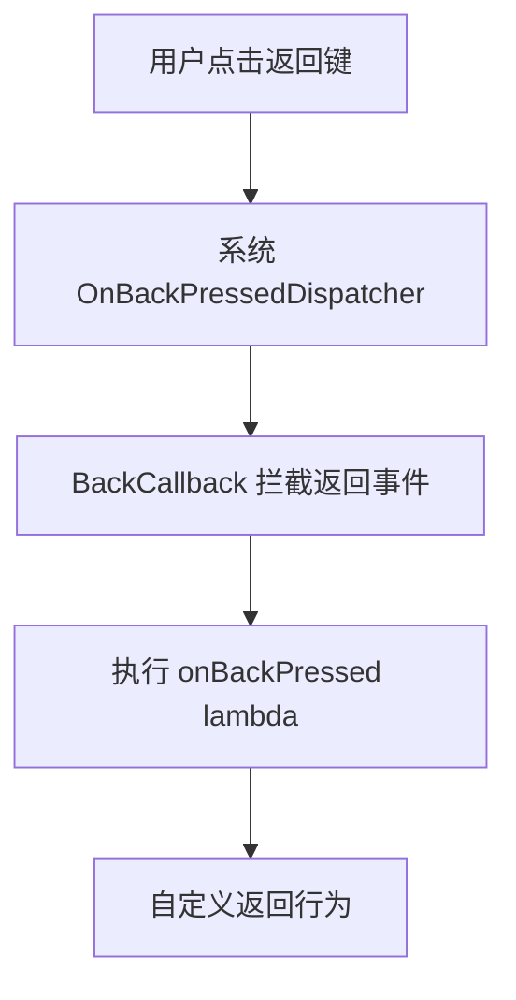

# 代码块分析报告：Jetpack Compose 返回键拦截处理机制实现

## 业务逻辑分析

### 功能与目的

`BackPressHandler` 是一个专门用于拦截 Android 系统返回按键事件的 Composable 函数。它通过 Android 的 `OnBackPressedDispatcher` 机制，允许开发者在 Compose 界面中自定义处理返回按键的行为，而不是默认的销毁当前界面。

### 数据流动与组件交互

整体数据流动过程如下：



该实现利用 Jetpack Compose 的组合模型和 Android 的返回键处理机制创建了一个桥接层，实现了两个系统之间的无缝集成。

### 状态管理

该组件通过 `rememberUpdatedState` 确保始终使用最新的 `onBackPressed` 回调函数，即使在重组过程中也能保持回调的一致性，这是 Compose 中处理可能变化的回调的标准模式。

### 设计模式与架构

该实现采用了以下设计模式：

- **观察者模式**：通过 `OnBackPressedCallback` 注册到 `OnBackPressedDispatcher` 中监听返回事件
- **依赖注入**：使用 `CompositionLocal` 提供 `OnBackPressedDispatcher` 实例
- **生命周期感知**：利用 `DisposableEffect` 在组件进入和离开组合时正确注册和注销回调

## Kotlin 语法特性

### 高阶函数与 Lambda 表达式

1. `BackPressHandler` 函数接收一个 `() -> Unit` 类型的参数 `onBackPressed`，这是一个无参数无返回值的高阶函数，用于定义返回按键被按下时的处理逻辑。

2. `object : OnBackPressedCallback(true)` 使用了 Kotlin 的对象表达式创建了 `OnBackPressedCallback` 的匿名子类实例，并重写了 `handleOnBackPressed` 方法。

### 属性委托

代码使用 `by` 关键字进行属性委托：

```kotlin
val currentOnBackPressed by rememberUpdatedState(onBackPressed)
```

这里使用 `rememberUpdatedState` 创建了一个始终引用最新 `onBackPressed` 值的 State 对象，并将其委托给 `currentOnBackPressed` 变量。

## Compose 技术解析

### Composable 函数与生命周期

`BackPressHandler` 被标记为 `@Composable`，表明它是一个可组合函数，能够参与 Compose 的组合过程。它不直接生成 UI 元素，而是通过副作用来影响应用行为。

### 状态记忆与重组

1. `rememberUpdatedState`：确保在重组过程中始终使用最新的 `onBackPressed` 回调，而不是捕获初始值，这解决了闭包捕获问题。

2. `remember`：用于在初始组合时创建 `OnBackPressedCallback` 对象，并在后续重组中重用该实例，避免不必要的对象创建。

### 副作用处理

`DisposableEffect` 用于管理副作用生命周期：

1. 当组件首次进入组合或 `backDispatcher` 发生变化时，将回调注册到 dispatcher
2. 当组件离开组合或 `backDispatcher` 变化时，移除回调，防止内存泄漏

这是处理需要清理的副作用的标准 Compose 模式。

### CompositionLocal

`LocalBackPressedDispatcher` 是一个 `staticCompositionLocalOf` 创建的 CompositionLocal，用于在组合树中向下提供 `OnBackPressedDispatcher` 实例。使用 `staticCompositionLocalOf` 而不是 `compositionLocalOf` 表明该值的变化不应触发使用它的可组合函数重组。

## 最佳实践与改进建议

### 符合最佳实践的部分

1. **单一职责原则**：组件只负责处理返回按键事件，职责明确
2. **声明式 API**：提供了简洁的声明式 API，使用方只需提供一个 lambda 表达式
3. **资源管理**：正确使用 `DisposableEffect` 管理资源的注册和释放
4. **状态更新**：使用 `rememberUpdatedState` 确保始终使用最新的回调函数

### 潜在改进

1. **增加启用/禁用功能**：可以考虑添加一个参数来控制回调是否启用，而不是硬编码为 `true`
2. **错误处理**：当 `LocalBackPressedDispatcher` 未提供时，可以提供更友好的错误信息或回退机制

## 补充说明

### 使用场景

1. 自定义导航：在多步骤表单中，返回键可能需要返回上一步而非退出表单
2. 对话框处理：当显示对话框时，返回键可能需要关闭对话框而非关闭整个页面
3. 底部菜单：当展开底部菜单时，返回键应该先关闭菜单

### 官方文档参考

- [Handling the back button in Compose](https://developer.android.com/jetpack/compose/navigation#back-handling)
- [OnBackPressedDispatcher](https://developer.android.com/reference/androidx/activity/OnBackPressedDispatcher)
- [Jetpack Compose 中的副作用](https://developer.android.com/jetpack/compose/side-effects)
