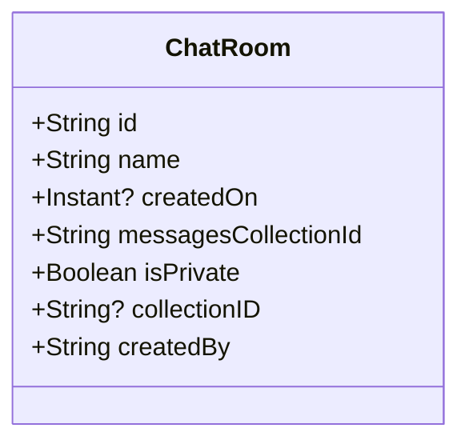

# ChatRoom.kt 文件分析

## 文件基本信息

- **文件名称**：ChatRoom.kt
- **文件路径**：app/src/main/java/com/kodeco/chat/data/model/ChatRoom.kt
- **主要功能**：定义聊天室数据模型，用于表示应用中的聊天室实体
- **技术要点**：
  - Kotlin 数据类（data class）
  - Jetpack Compose 的 Immutable 注解
  - Kotlin 空安全特性
  - kotlinx.datetime 日期时间库
- **Android 基础概念**：
  - 数据模型（Model）：在 MVC/MVP/MVVM 架构中，Model 层代表数据和业务逻辑，ChatRoom 是典型的数据模型类

## 语法元素分析

### 语法元素概览

- **包声明**：`package com.kodeco.chat.data.model`
  - 采用标准的 Java 包命名规范，遵循域名反转规则
  - 路径层次结构清晰：公司名(kodeco) → 应用名(chat) → 层次(data) → 类别(model)
  
- **导入声明**：
  - `androidx.compose.runtime.Immutable`：Jetpack Compose 提供的注解，标记不可变对象
  - `kotlinx.datetime.Clock`：提供系统时钟访问
  - `kotlinx.datetime.Instant`：表示时间点的类
  
- **元素统计**：

  | 元素类型 | 数量 | 备注 |
  |---------|-----|------|
  | 类      | 1   | 数据类 ChatRoom |
  | 接口    | 0   | 无 |
  | 对象    | 0   | 无 |
  | 函数    | 0   | 无显式函数（数据类自动生成 getter/setter） |
  | 扩展函数 | 0   | 无 |
  | 属性    | 7   | 数据类的成员属性 |

### 类与接口分析

- **类/接口名称**：ChatRoom
- **类型**：数据类 (data class)
- **职责描述**：表示聊天应用中的聊天室实体，存储聊天室的基本信息如ID、名称、创建时间等
- **Kotlin 语法特点**：
  - **数据类**：Kotlin 的数据类自动实现了 equals()、hashCode()、toString() 和 copy() 方法
  - **默认参数**：使用默认参数值简化了对象创建，如 `isPrivate: Boolean = false`
  - **可空类型**：使用 `?` 标记可空类型，如 `createdOn: Instant?`

- **注解分析**：
  - `@Immutable`：标记类为不可变，有助于 Jetpack Compose 的优化和重组（recomposition）管理

- **属性分析**：

  | 属性名 | 类型 | 可见性 | 用途 |
  |--------|------|-------|------|
  | id | String | public | 聊天室的唯一标识符 |
  | name | String | public | 聊天室的显示名称 |
  | createdOn | Instant? | public | 聊天室的创建时间，可为空，默认为当前系统时间 |
  | messagesCollectionId | String | public | 关联消息集合的ID，用于数据库关联 |
  | isPrivate | Boolean | public | 标记聊天室是否为私有，默认为 false |
  | collectionID | String? | public | 所属集合ID，可能用于分组功能，可为空 |
  | createdBy | String | public | 创建者ID，指示创建该聊天室的用户 |

- **类 UML 图**：

- **继承关系**：无显式继承关系
- **依赖关系**：
  - 依赖于 `androidx.compose.runtime.Immutable` 注解
  - 依赖于 `kotlinx.datetime` 包中的时间相关类

- **与 Java 对比**：
  - Java 实现同样功能需要显式编写 getter/setter、equals()、hashCode()、toString() 等方法
  - Java 中需要使用 @Nullable 注解或额外的空值检查，而 Kotlin 内置了空安全机制
  - Java 中无法直接给构造函数参数设置默认值，通常需要多个构造函数重载

## Kotlin 语法分析

### 空安全特性

- 在 `createdOn: Instant?` 和 `collectionID: String?` 中使用了可空类型
- 使用 `?` 标记表示该属性可能为 null，编译器会强制开发者处理可能的空值情况
- 这是 Kotlin 避免空指针异常（NullPointerException）的关键特性

### 数据类

- ChatRoom 是一个数据类，主要用于保存数据
- 编译器自动为数据类生成:
  - 成员变量的 getter/setter
  - equals()/hashCode() 方法，基于主构造函数中声明的属性
  - toString() 方法，格式为 "ChatRoom(id=..., name=...)"
  - copy() 方法，允许复制对象并修改部分属性
  - componentN() 函数，支持解构声明

## API 使用分析

- **重要 API**：

  | API 名称 | 用途 | 文档链接 |
  |---------|------|----------|
  | Immutable | Jetpack Compose 中标记不可变对象的注解，帮助 Compose 优化重组过程 | [Compose API](https://developer.android.com/jetpack/compose/documentation) |
  | kotlinx.datetime | Kotlin 多平台的日期时间库，提供跨平台的日期时间处理能力 | [kotlinx.datetime](https://github.com/Kotlin/kotlinx-datetime) |
  | Clock.System.now() | 获取当前系统时间的实用方法 | [Clock.System](https://kotlin.github.io/kotlinx-datetime/kotlinx-datetime/kotlinx.datetime/-clock/-system/index.html) |

## 注意事项与最佳实践

- **优点**：
  - 使用数据类简化了代码，提高了可读性
  - 通过 `@Immutable` 注解明确表明类的不可变性，有利于多线程安全和函数式编程
  - 合理使用默认参数，简化对象创建
  - 良好的命名规范，属性名直观明确

- **改进空间**：
  - `collectionID` 属性命名不一致，使用了大写 ID 而其他属性如 `messagesCollectionId` 使用小写 id
  - `createdOn` 默认值设置为 `Clock.System.now()`，这可能导致难以预测的行为，因为每次引用默认值时都会重新计算

- **初学者指南**：
  - Kotlin 数据类是处理纯数据对象的强大特性，大大减少了样板代码
  - `@Immutable` 注解在 Jetpack Compose 中很重要，它告诉 Compose 系统该对象在创建后不会更改
  - Kotlin 的空安全系统通过编译时检查帮助避免运行时的 NullPointerException 