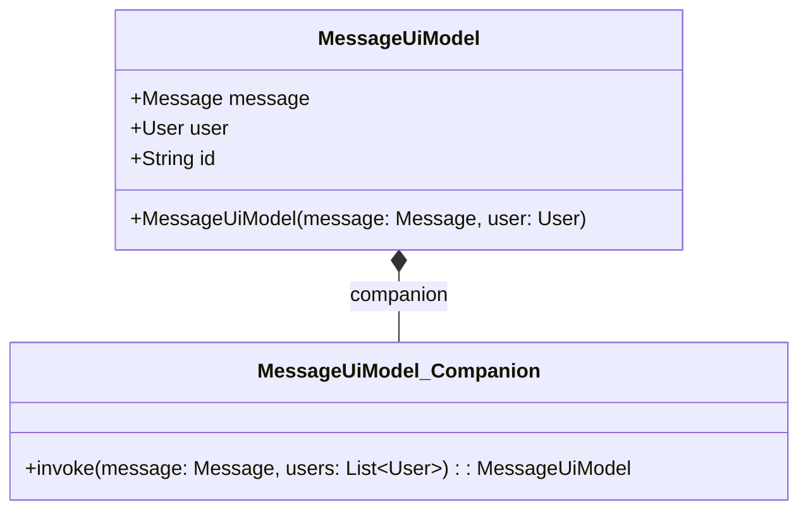
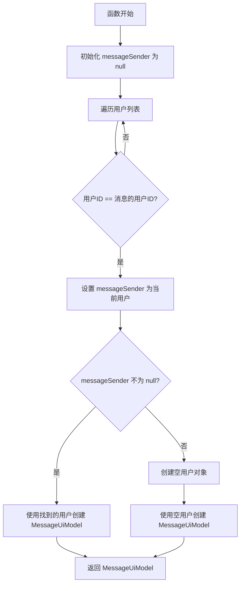

# MessageUiModel.kt 文件分析

## 文件基本信息

- **文件名称**：MessageUiModel.kt
- **文件路径**：app/src/main/java/com/kodeco/chat/data/model/MessageUiModel.kt
- **主要功能**：定义消息 UI 模型，将基础消息对象与用户信息关联，用于在 UI 层展示
- **技术要点**：
  - Kotlin 数据类（data class）
  - 伴生对象（companion object）工厂方法
  - 次级构造函数（secondary constructor）
  - 空安全处理
- **Android 基础概念**：
  - UI 模型：在 MVVM 架构中，用于 UI 层展示的数据模型，通常包含了视图需要的所有信息
  - 数据转换：将原始数据模型转换为适合 UI 展示的格式

## 语法元素分析

### 语法元素概览

- **包声明**：`package com.kodeco.chat.data.model`
  - 与项目其他模型类在同一包下
  - 包名遵循标准命名规范，表明是应用的数据模型部分
  
- **导入声明**：
  - `com.kodeco.chat.conversation.Message`：引入基础消息模型类
  
- **元素统计**：

  | 元素类型 | 数量 | 备注 |
  |---------|-----|------|
  | 类      | 1   | 数据类 MessageUiModel |
  | 接口    | 0   | 无 |
  | 对象    | 1   | 伴生对象（companion object） |
  | 函数    | 1   | 伴生对象中的工厂方法（invoke） |
  | 扩展函数 | 0   | 无 |
  | 属性    | 3   | 数据类的成员属性 |
  | 构造函数 | 2   | 主构造函数 + 次级构造函数 |

### 类与接口分析

- **类/接口名称**：MessageUiModel
- **类型**：数据类 (data class)
- **职责描述**：将基础消息对象与用户信息关联，用于在 UI 层展示完整的消息信息，包括消息内容和发送者详情
- **Kotlin 语法特点**：
  - **数据类**：用于存储数据，自动实现多个实用方法
  - **伴生对象**：提供类级别的工厂方法
  - **操作符重载**：通过 `operator fun invoke()` 实现自定义的构造语法
  - **次级构造函数**：提供替代的构造方式

- **属性分析**：

  | 属性名 | 类型 | 可见性 | 用途 |
  |--------|------|-------|------|
  | message | Message | public | 存储基础消息对象 |
  | user | User | public | 存储消息发送者的用户信息 |
  | id | String | public | 消息的唯一标识符，默认使用 message._id |

- **伴生对象分析**：
  - 提供了接收 `Message` 和用户列表的工厂方法
  - 通过遍历用户列表匹配消息发送者
  - 处理找不到用户的情况，使用默认空用户对象

- **构造函数分析**：
  - **主构造函数**：`MessageUiModel(val message: Message, val user: User, val id: String = message._id)`
  - **次级构造函数**：`constructor(message: Message, user: User) : this(id = message._id, message = message, user = user)`，提供替代的参数顺序

- **类 UML 图**：

- **继承关系**：无显式继承关系
- **依赖关系**：
  - 依赖 `Message` 类，作为属性和构造参数
  - 依赖 `User` 类，作为属性和构造参数

- **与 Java 对比**：
  - Java 中创建类似功能需要显式定义所有构造函数、getter/setter 和其他方法
  - Java 无法直接实现伴生对象，通常使用静态内部类和静态方法代替
  - Java 中无法通过操作符重载实现类似 `invoke()` 的自定义构造语法

### 函数分析

- **函数名称**：invoke (在伴生对象中)
- **函数签名**：`operator fun invoke(message: Message, users: List<User>): MessageUiModel`
- **函数职责**：根据消息和用户列表，找到消息发送者并创建 MessageUiModel 对象
- **参数分析**：
  - `message: Message`：要处理的消息对象
  - `users: List<User>`：可用的用户列表，用于查找消息发送者
- **返回值分析**：返回关联了用户信息的 MessageUiModel 对象
- **函数流程图**：

- **调用关系**：
  - 此函数是工厂方法，可能被应用中需要展示消息的组件调用
  - 调用了 MessageUiModel 的次级构造函数
- **边界条件**：
  - 当找不到对应用户时，创建默认用户对象
  - 列表为空时仍能正常工作，返回带有默认用户的模型
- **复杂度分析**：
  - 时间复杂度：O(n)，其中 n 是用户列表长度
  - 空间复杂度：O(1)，仅使用常数额外空间
- **Kotlin 特有语法**：
  - 操作符重载（operator fun invoke）：允许像函数一样调用对象，如 `MessageUiModel(message, users)`
  - 智能类型转换：使用 `messageSender?.let {}` 安全地处理可能为空的对象

## Kotlin 语法分析

### 空安全特性

- 使用安全调用操作符 `?.let { ... }` 处理可能为空的 messageSender
- 在找不到用户时提供默认值，避免空指针异常

### 函数式编程特性

- 使用 `let` 作用域函数处理非空值
- 工厂方法设计模式的函数式实现

### 数据类

- MessageUiModel 作为数据类，自动提供了：
  - equals()、hashCode() 方法
  - toString() 方法
  - copy() 方法
  - componentN() 方法，支持解构声明

### 操作符重载

- 伴生对象中的 `operator fun invoke()` 允许像调用函数一样创建对象
- 这提供了更灵活、更具表现力的对象创建语法

## API 使用分析

- **重要类依赖**：

  | 类名 | 用途 | 关系 |
  |------|------|------|
  | Message | 基础消息模型，包含原始消息数据 | 组合关系（Composition） |
  | User | 用户信息模型，包含发送者信息 | 组合关系（Composition） |

## 注意事项与最佳实践

- **优点**：
  - 使用工厂方法模式简化对象创建，提供友好的 API
  - 良好的空值处理，确保即使找不到用户也能返回有效对象
  - 命名清晰，表明这是用于 UI 层的模型

- **改进空间**：
  - 遍历用户列表寻找匹配用户效率较低，对于大列表可考虑使用 Map 结构优化
  - 当找不到用户时直接创建默认用户，可能需要添加日志或其他错误处理机制
  - 次级构造函数的设计可能有重复性，考虑是否必要

- **初学者指南**：
  - 伴生对象是 Kotlin 中实现静态成员的方式，等同于 Java 中的静态方法
  - 数据类是 Kotlin 中处理纯数据的强大工具，大大减少了样板代码
  - 操作符重载使代码更具表现力，但应谨慎使用以保持代码可读性
