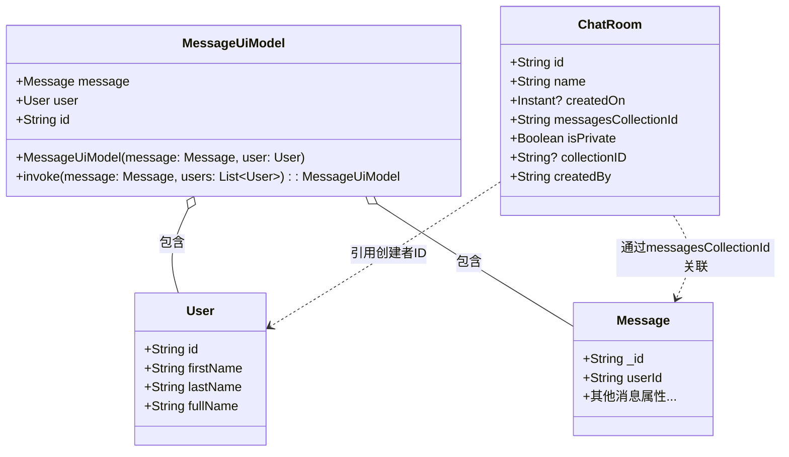
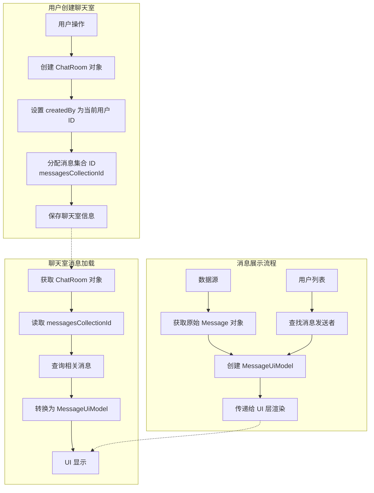
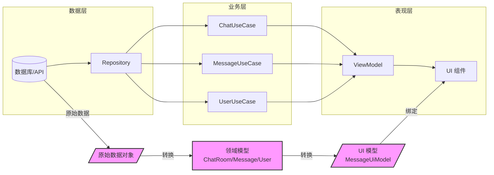
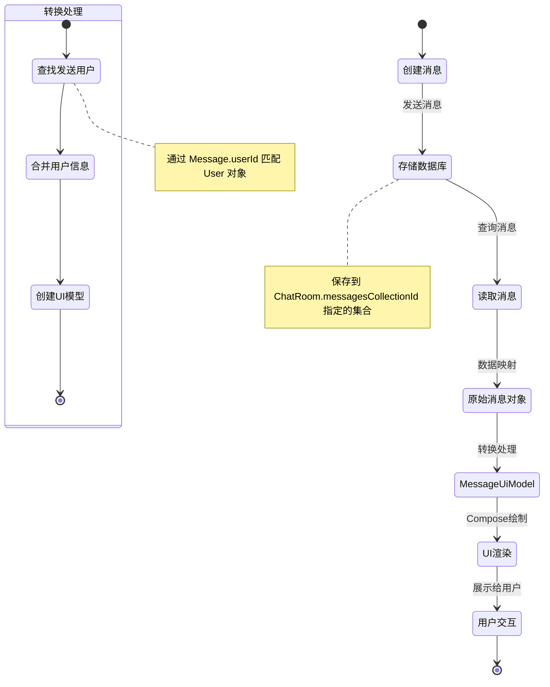

# 聊天应用模型类关系分析

## 模型类关系概述

在这个聊天应用的数据模型层中，我们分析了三个核心模型类：`ChatRoom`、`MessageUiModel` 和 `User`。这些类共同构成了应用的数据基础。下面我们将探讨这些类之间的关系，以及它们在整个应用架构中的位置。

## 类关系图

以下 UML 类图展示了这三个模型类及其相互关系：

## 关系详解

### 1. ChatRoom 与 User 的关系

- **引用关系**：ChatRoom 通过 `createdBy` 属性引用了创建该聊天室的用户 ID
- **关联方式**：这是一种松散的关联，通过 ID 字符串而非直接对象引用
- **关系特点**：
  - 一对一关系：一个聊天室只有一个创建者
  - 单向关联：从聊天室到用户的单向引用
  - 非强制性：ChatRoom 并不包含完整的 User 对象，仅存储其 ID

### 2. MessageUiModel 与 User 的关系

- **组合关系**：MessageUiModel 包含一个完整的 User 对象
- **关联方式**：直接对象引用，User 是 MessageUiModel 的一个属性
- **关系特点**：
  - 一对一关系：一条 UI 消息模型关联一个用户
  - 强组合：MessageUiModel 生命周期内包含 User 对象
  - 查找逻辑：通过 Message 中的 userId 在用户列表中查找匹配用户

### 3. MessageUiModel 与 Message 的关系

- **组合关系**：MessageUiModel 包含一个 Message 对象
- **关联方式**：直接对象引用，Message 是 MessageUiModel 的一个属性
- **关系特点**：
  - 一对一关系：一个 UI 消息模型包装一个基础消息对象
  - 装饰器模式：MessageUiModel 扩展了 Message 的功能，添加了用户信息
  - ID 复制：MessageUiModel 默认使用 Message 的 _id 作为自己的 id

### 4. ChatRoom 与 Message 的关系

- **关联关系**：ChatRoom 通过 `messagesCollectionId` 关联消息集合
- **关联方式**：通过集合 ID 字符串间接关联，而非直接对象引用
- **关系特点**：
  - 一对多关系：一个聊天室关联多条消息
  - 集合关联：通过集合 ID 而非直接引用单个消息
  - 数据库映射：这种设计暗示了底层可能使用了文档型数据库（如 Firestore）

## 数据流动分析

基于这些模型类关系，我们可以通过以下流程图直观地展示应用中的数据流动模式：

此外，数据流动过程中的关键步骤包括：

1. **用户创建聊天室**：
   - 创建 ChatRoom 对象，设置 createdBy 为当前用户 ID
   - 为消息分配一个集合 ID (messagesCollectionId)

2. **消息展示流程**：
   - 从数据源获取原始 Message 对象
   - 从用户列表中查找消息发送者
   - 使用 Message 和 User 创建 MessageUiModel
   - 将 MessageUiModel 传递给 UI 层进行渲染

3. **聊天室消息加载**：
   - 获取 ChatRoom 对象
   - 使用 messagesCollectionId 查询相关消息
   - 将消息转换为 MessageUiModel 用于显示

### 数据架构流动图

以下图表展示了聊天应用中数据在不同架构层之间的流动路径：

在这个架构中:
- 数据层负责原始数据的存取
- 业务层处理领域逻辑并转换数据模型
- 表现层将数据适配为UI友好的格式并管理状态
- MessageUiModel 作为桥接数据模型和UI的关键组件，包含了完整的显示信息

### 消息数据生命周期

下图展示了一条消息从创建到显示的完整生命周期：

这个生命周期图清晰地展示了消息数据是如何从用户输入到最终显示的整个流程，以及 MessageUiModel 在其中扮演的关键角色。

## 设计模式分析

在这三个模型类的设计中，我们可以识别出以下设计模式：

1. **装饰器模式**：MessageUiModel 装饰了基础的 Message，添加了用户信息
2. **工厂方法模式**：MessageUiModel 的伴生对象中的 invoke 方法作为工厂方法
3. **数据传输对象(DTO)模式**：所有这些类都是典型的 DTO，用于在应用层之间传递数据

## 架构意义

这些模型类在应用架构中的位置和意义：

1. **分层设计**：明确区分了数据模型层和 UI 表现层（MessageUiModel）
2. **关注点分离**：每个类都有明确的单一职责
3. **UI 适配**：通过 MessageUiModel 将底层数据转换为适合 UI 显示的格式
4. **领域模型**：这些类共同构成了聊天应用的领域模型，反映了业务概念

## 优化建议

基于对模型关系的分析，可以提出以下优化建议：

1. **关系明确化**：考虑在 ChatRoom 中直接引用 User 对象，而不仅是 ID
2. **命名一致性**：统一 ID 字段的命名，如将 collectionID 改为 collectionId
3. **双向关联**：在 User 中添加关联的聊天室集合，形成双向关联
4. **空值处理优化**：改进 MessageUiModel 在找不到用户时的处理逻辑
5. **数据查询优化**：将用户查找逻辑从线性查找改为使用 Map 结构，提高效率
