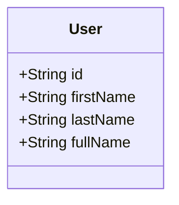

# User.kt 文件分析

## 文件基本信息

- **文件名称**：User.kt
- **文件路径**：app/src/main/java/com/kodeco/chat/data/model/User.kt
- **主要功能**：定义用户数据模型，表示聊天应用中的用户实体
- **技术要点**：
  - Kotlin 数据类（data class）
  - 默认参数值
  - 属性初始化表达式
  - Java UUID 生成
- **Android 基础概念**：
  - 数据模型（Model）：在 MVC/MVP/MVVM 架构中代表用户数据的实体类
  - 用户标识：使用唯一标识符（UUID）管理用户身份

## 语法元素分析

### 语法元素概览

- **包声明**：`package com.kodeco.chat.data.model`
  - 与项目其他模型类在同一包下
  - 表明这是应用数据模型层的一部分
  
- **导入声明**：
  - `java.util.UUID`：Java 标准库中用于生成通用唯一标识符的类
  
- **元素统计**：

  | 元素类型 | 数量 | 备注 |
  |---------|-----|------|
  | 类      | 1   | 数据类 User |
  | 接口    | 0   | 无 |
  | 对象    | 0   | 无 |
  | 函数    | 0   | 无显式函数（数据类自动生成 getter/setter） |
  | 扩展函数 | 0   | 无 |
  | 属性    | 4   | 数据类的成员属性 |

### 类与接口分析

- **类/接口名称**：User
- **类型**：数据类 (data class)
- **职责描述**：表示聊天应用中的用户，存储用户的基本信息，如 ID、姓名等
- **Kotlin 语法特点**：
  - **数据类**：用于存储数据，自动实现多个实用方法
  - **默认参数值**：所有参数都有默认值，允许创建空用户对象
  - **属性初始化表达式**：`fullName` 属性基于其他属性计算

- **属性分析**：

  | 属性名 | 类型 | 可见性 | 用途 |
  |--------|------|-------|------|
  | id | String | public | 用户的唯一标识符，默认使用 UUID 生成 |
  | firstName | String | public | 用户的名字，默认为空字符串 |
  | lastName | String | public | 用户的姓氏，默认为空字符串 |
  | fullName | String | public | 用户的全名，默认通过连接名字和姓氏计算 |

- **类 UML 图**：

- **继承关系**：无显式继承关系
- **依赖关系**：
  - 依赖 `java.util.UUID` 类生成唯一标识符

- **与 Java 对比**：
  - Java 中需要显式编写构造函数、getter/setter 方法和 equals/hashCode 方法
  - Java 中无法直接为属性设置默认值，通常需要多个构造函数或建造者模式
  - Java 中计算属性需要使用方法或在构造函数中设置，而不能直接在字段声明中计算

## Kotlin 语法分析

### 默认参数值与属性初始化

- 所有属性都有默认值，使空构造函数 `User()` 可用
- `id` 属性默认使用 `UUID.randomUUID().toString()` 生成唯一标识符
- `fullName` 属性使用初始化表达式 `firstName + " " + lastName` 计算，无需额外方法

### 数据类特性

- User 作为数据类，自动获得：
  - equals()/hashCode() 方法，基于主构造函数中的所有属性
  - toString() 方法，形如 "User(id=..., firstName=..., lastName=..., fullName=...)"
  - copy() 方法，允许复制对象并选择性修改部分属性
  - componentN() 函数，支持解构声明

## API 使用分析

- **重要 API**：

  | API 名称 | 用途 | 文档链接 |
  |---------|------|----------|
  | UUID.randomUUID() | 生成随机通用唯一标识符 | [Java UUID](https://docs.oracle.com/javase/8/docs/api/java/util/UUID.html) |

## 注意事项与最佳实践

- **优点**：
  - 使用 UUID 确保用户 ID 的唯一性，避免冲突
  - 所有参数都有默认值，使对象创建灵活
  - 使用数据类简化代码，提高可读性
  - 通过计算属性自动生成 fullName，保持数据一致性

- **改进空间**：
  - fullName 的计算逻辑简单连接字符串，可能导致名字和姓氏间多余的空格（如当其中一个为空时）
  - 缺少数据验证逻辑，如名字长度限制或格式验证
  - 如果用户名信息为空，fullName 将是一个空格，可能影响 UI 显示

- **初学者指南**：
  - Kotlin 数据类大大减少了定义数据模型的代码量
  - 默认参数值是 Kotlin 的强大特性，简化了 API 设计
  - UUID 是确保唯一标识符的常用方法，适合分布式系统
  - 计算属性可以避免数据冗余，但要注意性能影响（这里的计算非常简单，不是问题）

- **可能的扩展**：
  - 添加用户头像、电子邮件等其他用户属性
  - 考虑实现 Parcelable 接口，以便在 Android 组件间传递
  - 添加数据验证逻辑确保数据完整性
  - 设计更健壮的全名计算逻辑，处理边缘情况

- **与其他类的关系**：
  - 在 MessageUiModel 中被引用，用于表示消息发送者
  - 可能在用户认证、用户资料等功能中使用
