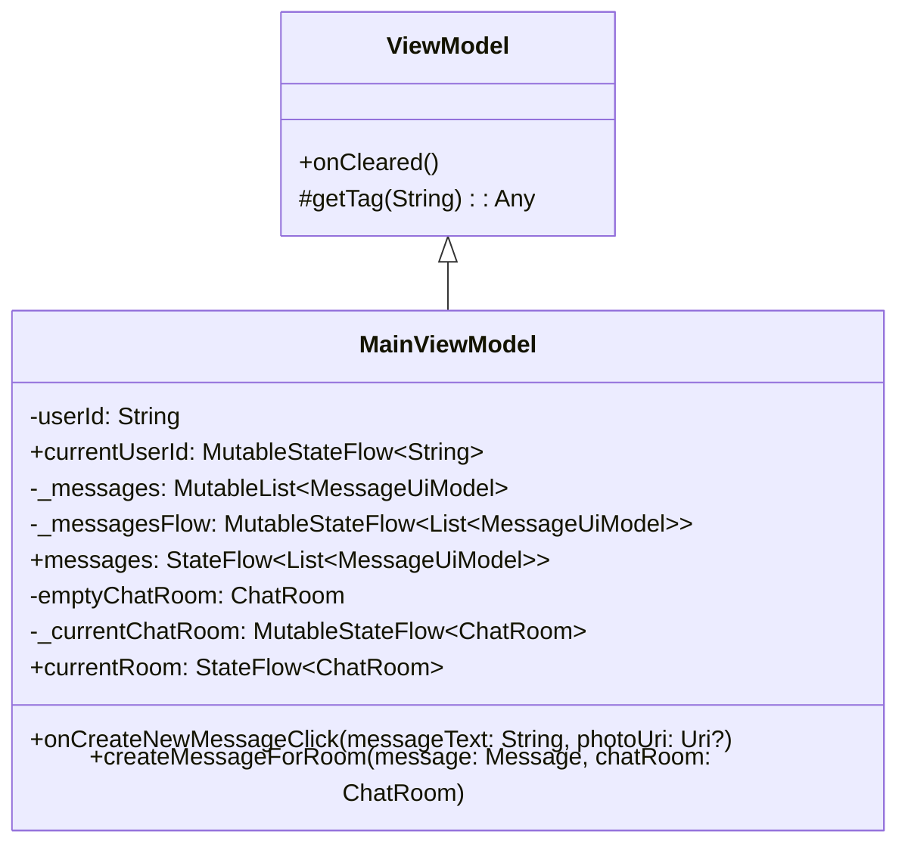
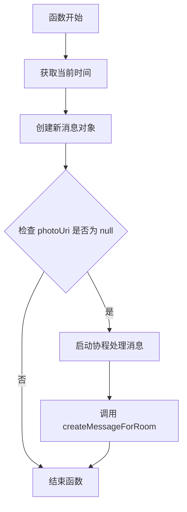
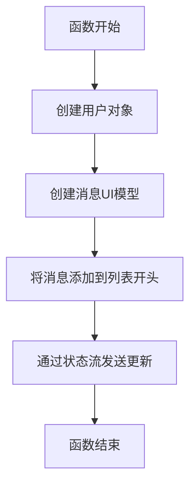

# MainViewModel.kt 分析报告

## 文件基本信息

- **文件名称**：MainViewModel.kt
- **文件路径**：app/src/main/java/com/kodeco/chat/viewmodel/MainViewModel.kt
- **主要功能**：管理聊天应用的消息数据流和用户状态，作为 UI 与数据层之间的桥梁
- **技术要点**：ViewModel、StateFlow、协程、懒加载
- **Android 基础概念**：
  - **ViewModel**：Android 架构组件之一，用于存储和管理 UI 相关的数据，在屏幕旋转等配置更改后仍能保持数据
  - **StateFlow**：Kotlin 协程库中的数据流类型，用于响应式地传递状态更新
  - **协程**：Kotlin 的异步编程解决方案，简化异步操作的代码编写

## 语法元素分析

### 语法元素概览

- **包声明**：com.kodeco.chat.viewmodel - 遵循标准 Android 项目域反转命名规范
- **导入声明**：导入了 Android 框架、Compose、Kotlin 协程和日期时间相关的库

| 元素类型  | 数量 | 备注                       |
|-----------|------|----------------------------|
| 类        | 1    | MainViewModel 普通类       |
| 接口      | 0    | 无接口定义                 |
| 对象      | 0    | 无对象定义                 |
| 函数      | 2    | 1 个普通函数，1 个挂起函数 |
| 扩展函数  | 0    | 无扩展函数                 |
| 属性      | 8    | 包括私有属性和公开属性     |

### 类与接口分析

#### 类名称：MainViewModel

- **类型**：普通类
- **职责描述**：作为 MVVM 架构中的 ViewModel 层，负责管理消息数据、聊天室状态，并向 UI 层提供数据流
- **Kotlin 语法特点**：
  - 继承使用冒号（:）语法，不同于 Java 的 extends 关键字
  - 使用 `by lazy` 进行属性懒加载初始化
  - 使用 `private val` 和 `val` 声明不可变属性，类似于 Java 的 final 变量

- **属性分析**：

| 属性名         | 类型                                 | 可见性   | 用途                                           |
|----------------|--------------------------------------|----------|------------------------------------------------|
| userId         | String                               | private  | 存储当前用户的唯一标识符                       |
| currentUserId  | MutableStateFlow\<String\>           | public   | 向 UI 层提供可观察的用户 ID 数据流             |
| _messages      | MutableList\<MessageUiModel\>        | private  | 存储聊天消息的内部可变列表                     |
| _messagesFlow  | MutableStateFlow\<List\<MessageUiModel\>\> | private  | 消息数据的内部可变状态流                       |
| messages       | StateFlow\<List\<MessageUiModel\>\>  | public   | 向 UI 层提供只读消息数据流                     |
| emptyChatRoom  | ChatRoom                             | private  | 预设的默认聊天室信息                           |
| _currentChatRoom | MutableStateFlow\<ChatRoom\>       | private  | 当前聊天室的内部可变状态流                     |
| currentRoom    | StateFlow\<ChatRoom\>                | public   | 向 UI 层提供只读的当前聊天室信息               |

- **方法分析**：

| 方法名                  | 参数                                        | 返回类型 | 用途                                     |
|-------------------------|---------------------------------------------|----------|------------------------------------------|
| onCreateNewMessageClick | messageText: String, photoUri: Uri?         | Unit     | 处理创建新消息的点击事件                 |
| createMessageForRoom    | message: Message, chatRoom: ChatRoom        | Unit     | 挂起函数，将新消息添加到消息列表并发送   |

- **类 UML 图**：



- **继承关系**：MainViewModel 继承自 Android 架构组件中的 ViewModel 类
- **依赖关系**：
  - 依赖 Message 类来创建新消息
  - 依赖 User 类创建用户信息
  - 依赖 MessageUiModel 管理 UI 层消息展示
  - 依赖 ChatRoom 类管理聊天室信息
  - 使用 Kotlin 协程和 StateFlow 管理异步操作和状态更新

- **与 Java 对比**：
  - 在 Java 中，ViewModel 类需要使用复杂的 LiveData 初始化，而 Kotlin 中使用更简洁的属性声明和懒加载
  - Java 中状态管理通常使用 LiveData，而此代码使用了 Kotlin Flow API
  - Kotlin 的属性语法比 Java 的 getter/setter 更简洁
  - Kotlin 可以直接声明可空类型（Uri?），而 Java 需要使用 @Nullable 注解

### 函数分析

#### 函数名称：onCreateNewMessageClick

- **函数签名**：`fun onCreateNewMessageClick(messageText: String, photoUri: Uri?)`
- **函数职责**：处理用户创建新消息的动作，创建消息对象并启动协程处理
- **参数分析**：
  - messageText：消息的文本内容，必须非空
  - photoUri：可选的图片 URI，可为 null

- **返回值分析**：Unit（相当于 Java 中的 void）
- **函数流程图**：



- **调用关系**：调用 createMessageForRoom 函数
- **边界条件**：
  - 当 photoUri 不为 null 时，函数不会创建消息（代码中的 if 条件）
  - 函数不验证 messageText 是否为空字符串
- **复杂度分析**：
  - 时间复杂度：O(1)，只执行简单的对象创建和方法调用
  - 空间复杂度：O(1)，只创建固定大小的对象
- **Kotlin 特有语法**：
  - 使用协程启动异步操作：`viewModelScope.launch`
  - 使用可空类型参数 `photoUri: Uri?`
  - 使用 Kotlin 的作用域函数来访问当前聊天室值：`currentRoom.value`

#### 函数名称：createMessageForRoom

- **函数签名**：`suspend fun createMessageForRoom(message: Message, chatRoom: ChatRoom)`
- **函数职责**：创建消息 UI 模型并将其添加到消息列表，然后通过状态流发送更新
- **参数分析**：
  - message：要添加的消息对象
  - chatRoom：消息所属的聊天室
- **返回值分析**：Unit（无返回值）
- **函数流程图**：



- **调用关系**：被 onCreateNewMessageClick 函数调用
- **边界条件**：
  - 函数使用挂起点（通过 emit 函数），可能会挂起协程执行
  - 始终使用相同的 userId 创建用户对象
- **复杂度分析**：
  - 时间复杂度：O(1)，主要操作是列表开头添加元素和状态流发送
  - 空间复杂度：O(1)，只创建固定数量的对象
- **Kotlin 特有语法**：
  - 使用 `suspend` 关键字标记挂起函数
  - 使用 StateFlow 的 `emit` 方法发送更新

### 全局变量与常量分析

- **变量名**：userId
  - **类型**：String
  - **作用域**：private，类内部可见
  - **用途**：存储生成的用户唯一标识符
  - **初始化**：使用 UUID.randomUUID().toString() 生成随机 ID
  - **使用方式**：在创建消息和初始化 currentUserId 时使用

- **变量名**：emptyChatRoom
  - **类型**：ChatRoom
  - **作用域**：private，类内部可见
  - **用途**：定义默认聊天室配置
  - **初始化**：直接使用 ChatRoom 构造函数初始化
  - **使用方式**：用于初始化 _currentChatRoom 状态流

### Kotlin 语法分析

#### 空安全特性

- 使用 `photoUri: Uri?` 声明可空参数类型
- 使用安全调用 `message.photoUri == null` 检查属性是否为 null
- 代码中未使用非空断言运算符（!!）避免了潜在的 NullPointerException

#### 函数式编程特性

- 使用 lambda 表达式作为协程启动的代码块：`viewModelScope.launch { ... }`
- 使用高阶函数 `launch` 启动协程

#### 协程与异步

- 使用 `viewModelScope.launch` 在 ViewModel 的生命周期内启动协程
- 使用 Dispatchers.Default 指定协程运行的线程池
- 使用 `suspend` 关键字声明挂起函数
- 使用 StateFlow 的 `emit` 方法发送异步更新

#### 智能类型转换

代码中未明显使用智能类型转换

#### 数据类与密封类

代码中没有定义数据类或密封类，但引用了其他文件中定义的数据类（ChatRoom、MessageUiModel、User）

#### 懒加载

- 使用 `by lazy` 委托实现属性的延迟初始化：

  ```kotlin
  private val _messagesFlow: MutableStateFlow<List<MessageUiModel>> by lazy {
    MutableStateFlow(emptyList())
  }
  ```

### API 使用分析

- **重要 API**：

| API 名称 | 用途 | 文档链接 |
|----------|------|----------|
| ViewModel | Android 架构组件，管理 UI 相关数据 | [链接](https://developer.android.com/topic/libraries/architecture/viewmodel) |
| StateFlow | Kotlin Flow API 的状态容器 | [链接](https://kotlinlang.org/api/kotlinx.coroutines/kotlinx-coroutines-core/kotlinx.coroutines.flow/-state-flow/) |
| viewModelScope | ViewModel 中用于启动协程的作用域 | [链接](https://developer.android.com/topic/libraries/architecture/coroutines#viewmodelscope) |
| UUID.randomUUID() | 生成随机 UUID | [链接](https://docs.oracle.com/javase/8/docs/api/java/util/UUID.html#randomUUID--) |

- **第三方库**：
  - kotlinx.coroutines：Kotlin 协程库，用于异步编程
  - kotlinx.datetime：Kotlin 的日期时间处理库

- **Android 框架 API**：
  - androidx.lifecycle.ViewModel：Android Jetpack 架构组件
  - androidx.lifecycle.viewModelScope：ViewModel 专用协程作用域
  - android.net.Uri：Android 资源标识符

## 注意事项与最佳实践

- **优点**：
  - 使用 StateFlow 提供响应式的数据流，符合现代 Android 开发趋势
  - 使用不可变对象（StateFlow 而非 MutableStateFlow）暴露给外部，保护内部状态
  - 代码结构清晰，职责分明
  - 使用协程处理异步操作，简化了代码

- **改进空间**：
  - 代码中存在被注释掉的未使用方法和初始化块，应该清理
  - 当 photoUri 不为 null 时没有处理逻辑，可能是未完成的功能
  - 缺少异常处理机制，特别是在协程操作中
  - 硬编码的用户 ID 生成逻辑应该移至数据层或存储库

- **风险点**：
  - 缺少消息创建失败时的异常处理
  - 在协程中使用 emit 可能会抛出异常
  - UUID 生成可能引起性能问题

- **初学者指南**：
  - ViewModel 是 Android 推荐的架构组件，负责处理 UI 相关的数据逻辑
  - StateFlow 提供响应式编程模型，适合处理 UI 状态更新
  - 协程是 Kotlin 中处理异步操作的推荐方式
  - 学习资源：
    - [Android 开发者指南 - ViewModel](https://developer.android.com/topic/libraries/architecture/viewmodel)
    - [Kotlin 协程指南](https://kotlinlang.org/docs/coroutines-guide.html)
    - [Kotlin Flow 指南](https://kotlinlang.org/docs/flow.html)

- **替代方案**：
  - 使用 Compose 的 State API 替代部分 StateFlow
  - 使用 Hilt 依赖注入代替手动创建对象
  - 使用 Room 数据库存储消息，提供更好的持久化解决方案
