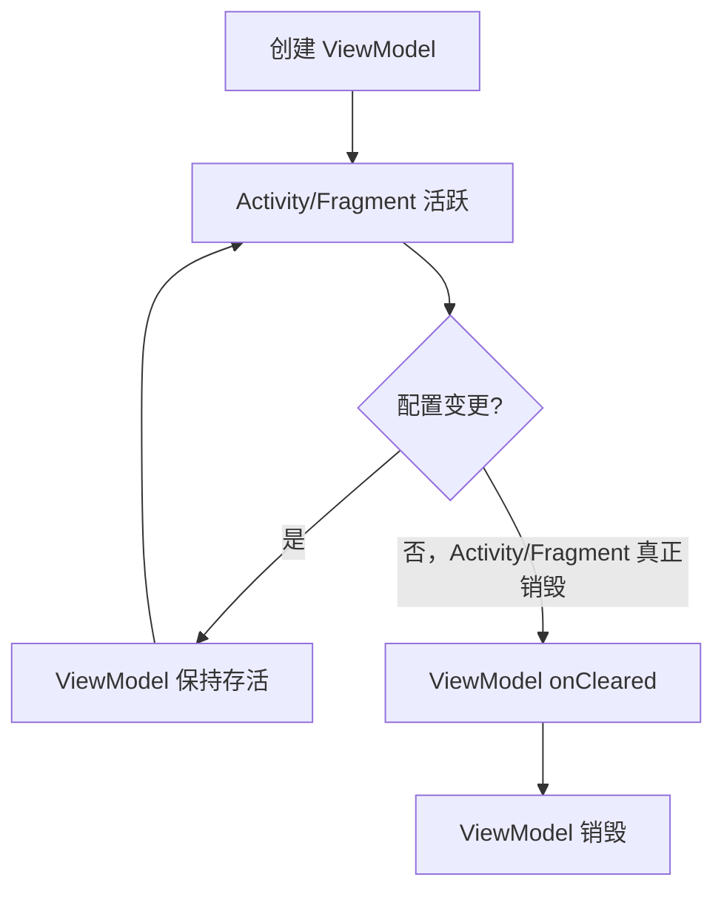
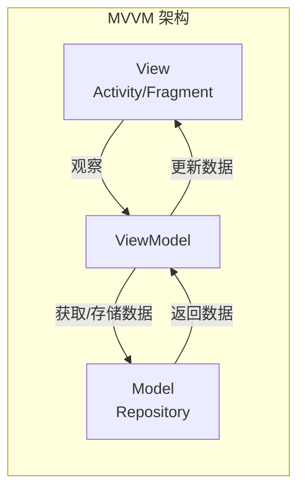

# Android ViewModel 详解

## 基础概念

ViewModel 是 Android 架构组件库中的一个组件，设计用来存储和管理与用户界面相关的数据。它的最大特点是能够在屏幕旋转等配置变更时保留数据，使应用界面状态不会丢失。

简单来说，ViewModel 就像是一个特殊的数据容器，它与界面（如 Activity 或 Fragment）的生命周期解耦，但又能感知它们的生命周期变化。这使得数据处理与显示分离，让代码更加清晰和易于维护。

### 核心要素

- **生命周期感知**：ViewModel 存活时间比创建它的 Activity 或 Fragment 更长
- **数据存储**：负责准备和管理 UI 所需的所有数据
- **配置变更幸存者**：在屏幕旋转等配置变更时不会被销毁
- **通信中心**：可作为视图层和数据层之间的通信桥梁

### 架构地位

在 Android 应用架构中，ViewModel 位于视图层（UI）和数据层（Repository）之间，是 MVVM（Model-View-ViewModel）架构中的核心组件，也是 Google 推荐的应用架构模式中的关键部分。

## 生动类比

### 类比一：个人助理

将 ViewModel 想象成一位个人助理。当你（Activity/Fragment）需要处理各种任务时，你的助理（ViewModel）会：

- 记住所有重要信息，即使你暂时离开（配置变更）
- 准备好你需要的所有资料（数据）
- 帮你联系其他部门（数据源）获取信息
- 不会因为你换了件衣服（屏幕旋转）就忘记正在处理的事务

这个类比的限制：助理最终会跟随你的离职而离开，同样 ViewModel 也会在 Activity 真正销毁（不是配置变更）时被清除。

### 类比二：记忆保险箱

想象 ViewModel 是一个特殊的保险箱：

- 连接在房间（Activity/Fragment）的墙上
- 当房间被临时改造（配置变更）时，保险箱依然安全地固定在原位
- 保存着房间主人需要的所有重要物品（状态和数据）
- 只有当整栋建筑被拆除（应用退出或导航离开）时，保险箱才会被移除

限制：保险箱不应存储过大物品（如大型数据库或图片），这些应该有专门的存储方式。

### 类比三：云数据备份

把 ViewModel 比作你手机的云备份系统：

- 即使你的手机重启（Activity 重建），数据仍然在云端安全存储
- 当你恢复手机（Activity 重建完成）时，所有数据都会恢复到原来的状态
- 云备份只关注重要数据，而不是手机的物理状态（视图状态）
- 但如果你换了一部全新的手机（新的 Activity 实例），就需要设置新的云账户（新的 ViewModel）

## 实际应用举例

### 基础实例：计数器应用

最简单的 ViewModel 应用就是计数器。当用户旋转屏幕时，计数不会重置为零。

### 中等实例：表单数据保存

在填写复杂表单时，使用 ViewModel 保存用户输入的数据，这样即使屏幕旋转或暂时切换到其他应用，表单数据也不会丢失。

### 高级实例：结合 LiveData 的网络请求

在加载网络数据的应用中，ViewModel 结合 LiveData 可以确保：

- 网络请求不会因屏幕旋转而重复发起
- UI 重建后自动接收最新数据
- 在后台线程处理数据转换，保持 UI 线程流畅

### 反例：不适合的使用场景

ViewModel 不应该：

- 持有 Activity、Fragment 或 View 的引用（会导致内存泄漏）
- 存储需要长期保存的数据（应使用数据库或偏好设置）
- 直接处理 UI 组件（应通过 LiveData 或其他观察模式）

## 应用场景详解

### 电商应用

在电商应用中，ViewModel 可以：

- 存储购物车内容，避免用户在浏览商品、筛选或旋转屏幕时丢失选择
- 保存商品列表和筛选条件，避免重复网络请求
- 缓存用户浏览历史，提升体验

### 社交媒体应用

在社交应用中，ViewModel 可以：

- 管理新闻流的分页加载状态
- 缓存已加载的内容，避免重复加载
- 保存用户正在编写的评论或帖子

### 生产力工具

在笔记或文档应用中，ViewModel 可以：

- 存储编辑中的文档状态
- 管理撤销/重做堆栈
- 处理自动保存逻辑

## ViewModel 的生命周期



ViewModel 的生命周期比创建它的 Activity 或 Fragment 更长。当 Activity 因配置变更（如屏幕旋转）重新创建时，ViewModel 保持存活；只有当 Activity 真正结束（如用户关闭它）时，ViewModel 才会被清除。

## ViewModel 与 MVVM 架构



在 MVVM 架构中，ViewModel 是连接 View 和 Model 的桥梁：

- View：对应 Activity/Fragment，负责 UI 显示
- ViewModel：管理 UI 相关数据，处理业务逻辑
- Model：对应 Repository 模式，管理数据源（网络、数据库等）

## 代码示例

### 示例 1：基础 ViewModel（简单）

```kotlin
// 1. 定义 ViewModel 类
class CounterViewModel : ViewModel() {
    // 存储计数值
    var count = 0
}

// 2. 在 Activity 中使用
class MainActivity : AppCompatActivity() {
    private lateinit var viewModel: CounterViewModel
    
    override fun onCreate(savedInstanceState: Bundle?) {
        super.onCreate(savedInstanceState)
        setContentView(R.layout.activity_main)
        
        // 获取 ViewModel 实例
        viewModel = ViewModelProvider(this).get(CounterViewModel::class.java)
        
        // 显示当前计数
        updateCounterDisplay()
        
        // 设置按钮点击事件
        findViewById<Button>(R.id.incrementButton).setOnClickListener {
            viewModel.count++
            updateCounterDisplay()
        }
    }
    
    private fun updateCounterDisplay() {
        findViewById<TextView>(R.id.counterText).text = viewModel.count.toString()
    }
}
```

### 示例 2：结合 LiveData（中等）

```kotlin
// 1. 定义带有 LiveData 的 ViewModel
class UserProfileViewModel : ViewModel() {
    // 使用 LiveData 存储用户信息
    private val _userName = MutableLiveData<String>()
    val userName: LiveData<String> = _userName
    
    private val _userAge = MutableLiveData<Int>()
    val userAge: LiveData<Int> = _userAge
    
    // 更新用户信息的方法
    fun updateUserInfo(name: String, age: Int) {
        _userName.value = name
        _userAge.value = age
    }
}

// 2. 在 Fragment 中使用
class ProfileFragment : Fragment() {
    private lateinit var viewModel: UserProfileViewModel
    
    override fun onCreateView(
        inflater: LayoutInflater,
        container: ViewGroup?,
        savedInstanceState: Bundle?
    ): View? {
        return inflater.inflate(R.layout.fragment_profile, container, false)
    }
    
    override fun onViewCreated(view: View, savedInstanceState: Bundle?) {
        super.onViewCreated(view, savedInstanceState)
        
        // 获取 ViewModel 实例
        viewModel = ViewModelProvider(this).get(UserProfileViewModel::class.java)
        
        // 观察 LiveData 变化
        viewModel.userName.observe(viewLifecycleOwner) { name ->
            view.findViewById<TextView>(R.id.nameTextView).text = name
        }
        
        viewModel.userAge.observe(viewLifecycleOwner) { age ->
            view.findViewById<TextView>(R.id.ageTextView).text = age.toString()
        }
        
        // 设置保存按钮点击事件
        view.findViewById<Button>(R.id.saveButton).setOnClickListener {
            val name = view.findViewById<EditText>(R.id.nameEditText).text.toString()
            val age = view.findViewById<EditText>(R.id.ageEditText).text.toString().toInt()
            viewModel.updateUserInfo(name, age)
        }
    }
}
```

### 示例 3：网络请求与错误处理（复杂）

```kotlin
// 1. 定义结果包装类
sealed class Result<out T> {
    data class Success<T>(val data: T) : Result<T>()
    data class Error(val message: String) : Result<Nothing>()
    object Loading : Result<Nothing>()
}

// 2. 定义数据模型
data class Product(val id: String, val name: String, val price: Double)

// 3. 定义 Repository
class ProductRepository {
    suspend fun getProducts(): List<Product> {
        // 实际应用中会调用网络服务或本地数据库
        delay(1000) // 模拟网络延迟
        return listOf(
            Product("1", "商品 1", 99.9),
            Product("2", "商品 2", 199.9),
            Product("3", "商品 3", 299.9)
        )
    }
}

// 4. 定义高级 ViewModel
class ProductViewModel : ViewModel() {
    private val repository = ProductRepository()
    
    // 使用 LiveData 存储产品列表状态
    private val _productsState = MutableLiveData<Result<List<Product>>>()
    val productsState: LiveData<Result<List<Product>>> = _productsState
    
    // 初始化加载数据
    init {
        loadProducts()
    }
    
    // 加载产品数据
    fun loadProducts() {
        viewModelScope.launch {
            try {
                // 显示加载状态
                _productsState.value = Result.Loading
                
                // 获取数据
                val products = repository.getProducts()
                
                // 更新为成功状态
                _productsState.value = Result.Success(products)
            } catch (e: Exception) {
                // 处理错误
                _productsState.value = Result.Error(e.message ?: "未知错误")
            }
        }
    }
    
    // 根据 ID 筛选产品
    fun filterProductById(id: String) {
        val currentProducts = (_productsState.value as? Result.Success)?.data ?: return
        val filtered = currentProducts.filter { it.id == id }
        _productsState.value = Result.Success(filtered)
    }
    
    // 清除筛选
    fun clearFilter() {
        loadProducts()
    }
}

// 5. 在 Activity 中使用
class ProductListActivity : AppCompatActivity() {
    private lateinit var viewModel: ProductViewModel
    private lateinit var adapter: ProductAdapter
    
    override fun onCreate(savedInstanceState: Bundle?) {
        super.onCreate(savedInstanceState)
        setContentView(R.layout.activity_product_list)
        
        // 初始化 RecyclerView
        val recyclerView = findViewById<RecyclerView>(R.id.recyclerView)
        adapter = ProductAdapter()
        recyclerView.adapter = adapter
        recyclerView.layoutManager = LinearLayoutManager(this)
        
        // 获取 ViewModel 实例
        viewModel = ViewModelProvider(this).get(ProductViewModel::class.java)
        
        // 观察产品列表状态
        viewModel.productsState.observe(this) { result ->
            when (result) {
                is Result.Loading -> {
                    // 显示加载进度条
                    findViewById<ProgressBar>(R.id.progressBar).visibility = View.VISIBLE
                    findViewById<TextView>(R.id.errorText).visibility = View.GONE
                }
                is Result.Success -> {
                    // 隐藏加载进度条，显示数据
                    findViewById<ProgressBar>(R.id.progressBar).visibility = View.GONE
                    findViewById<TextView>(R.id.errorText).visibility = View.GONE
                    adapter.submitList(result.data)
                }
                is Result.Error -> {
                    // 显示错误信息
                    findViewById<ProgressBar>(R.id.progressBar).visibility = View.GONE
                    findViewById<TextView>(R.id.errorText).apply {
                        visibility = View.VISIBLE
                        text = result.message
                    }
                }
            }
        }
        
        // 设置刷新按钮
        findViewById<Button>(R.id.refreshButton).setOnClickListener {
            viewModel.loadProducts()
        }
        
        // 设置筛选按钮
        findViewById<Button>(R.id.filterButton).setOnClickListener {
            val id = findViewById<EditText>(R.id.filterEditText).text.toString()
            if (id.isNotEmpty()) {
                viewModel.filterProductById(id)
            } else {
                viewModel.clearFilter()
            }
        }
    }
}
```

## 常见误解澄清

### 误解 1：ViewModel 是 MVVM 的全部

**误解**：只要使用了 ViewModel，就实现了 MVVM 架构。

**澄清**：ViewModel 只是 MVVM 架构的一部分。完整的 MVVM 还需要数据绑定机制和可观察的数据模型。Android 的 ViewModel 更关注生命周期管理而非完整的 MVVM 实现。

### 误解 2：ViewModel 可以代替 onSaveInstanceState

**误解**：ViewModel 可以完全替代 onSaveInstanceState。

**澄清**：ViewModel 只在配置变更（如旋转屏幕）时保留数据，而不是在进程被系统杀死时。当系统需要回收资源时，整个应用进程可能被杀死，此时 ViewModel 数据会丢失。关键数据仍需使用 onSaveInstanceState 保存。

### 误解 3：ViewModel 可以存储任何内容

**误解**：ViewModel 可以存储大量数据或持有 Activity/Fragment 引用。

**澄清**：ViewModel 不应存储大型数据集（如位图）或持有 Activity/Fragment 引用，这会导致内存泄漏。ViewModel 适合存储经过处理的、适合 UI 显示的数据。

## ViewModel 的技术演进

ViewModel 是 Google 在 2017 年推出的架构组件之一，旨在解决 Android 开发中的配置变更问题。

### 关键里程碑

- **2017 年**：作为架构组件的一部分首次发布
- **2018 年**：加入了 ViewModelScope，简化协程使用
- **2019 年**：SavedStateHandle 加入，结合了 ViewModel 和 onSaveInstanceState 的优点
- **2020 年**：Hilt 集成，简化依赖注入
- **2021 年**：与 Compose 集成，支持声明式 UI

### 与其他架构组件的关系

ViewModel 通常与 LiveData、Room、DataBinding 等其他架构组件一起使用，共同构成 Android 推荐的应用架构。

## 术语表

- **Activity**：Android 应用的基本组件，提供可视界面
- **Fragment**：Activity 中的模块化部分，有自己的生命周期
- **生命周期**：Android 组件从创建到销毁的整个过程
- **配置变更**：设备状态改变（如屏幕旋转、语言切换）导致 Activity 重建
- **LiveData**：一种可观察的数据持有者，具有生命周期感知能力
- **协程**：一种轻量级线程，用于异步编程
- **Repository**：数据操作的抽象层，管理多个数据源
- **MVVM**：Model-View-ViewModel，一种软件架构模式

## 总结

ViewModel 是 Android 开发中处理 UI 相关数据的强大工具，通过分离 UI 和数据逻辑，改善了应用架构和用户体验。它解决了配置变更导致的数据丢失问题，使开发者能专注于业务逻辑而非生命周期复杂性。

尽管如此，ViewModel 并非万能解决方案，它需要与其他架构组件结合使用，并遵循最佳实践才能发挥最大效用。理解 ViewModel 的生命周期和适用场景，是构建稳健 Android 应用的重要一步。
