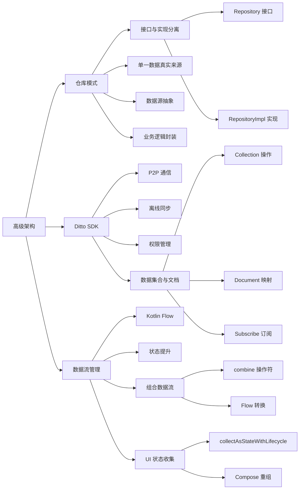

# 第 7 章：高级架构总结

## 文字摘要

### 核心概述

本章介绍了如何通过实现仓库模式（Repository Pattern）进一步完善 Android 聊天应用的架构，并利用 Ditto SDK 实现点对点（P2P）通信功能，使设备之间可以在无需互联网连接或云服务的情况下实现即时消息传递。

### 关键技术点

- **仓库模式（Repository Pattern）**：
  - 作为应用数据的单一真实来源
  - 将数据源（网络、缓存等）从 ViewModel 中抽象出来
  - 负责公开数据、集中处理变更、解决数据源冲突
  - 通常通过接口定义方法，由实现类提供具体逻辑
  
- **Ditto SDK**：
  - 跨平台的 P2P SDK，支持设备间直接通信
  - 无需互联网连接或云后端服务
  - 利用蓝牙、Wi-Fi 等无线传输方式
  - 通过集合（Collections）和文档（Documents）管理数据

- **数据流转换**：
  - 使用 Kotlin Flows 在仓库、ViewModel 和 UI 之间传递数据
  - 通过 `combine` 操作符合并多个数据流
  - 利用 `collectAsStateWithLifecycle` 在 Compose UI 中订阅数据变化

- **数据模型映射**：
  - 实现 Ditto 文档与应用数据模型的相互转换
  - 为数据类添加辅助构造函数接收 `DittoDocument` 参数

### UI 示例

Ditto P2P 聊天应用中，使用 Flow 结合 ViewModel 传递消息的关键代码：

```kotlin
// 在 MainViewModel 中创建消息流的组合
val roomMessagesWithUsersFlow: Flow<List<MessageUiModel>> = combine(
  repository.getAllUsers(),
  repository.getAllMessagesForRoom(currentRoom.value)
) { users: List<User>, messages:List<Message> ->
  messages.map {
    MessageUiModel.invoke(
      message = it,
      users = users
    )
  }
}

// 在 MainActivity 中收集流
val messagesWithUsers: List<MessageUiModel> by viewModel
  .roomMessagesWithUsersFlow
  .collectAsStateWithLifecycle(initialValue = emptyList())

// 在 ConversationUiState 中添加消息
fun addMessage(msg: String, photoUri: Uri?) {
  viewModel.onCreateNewMessageClick(msg, photoUri, null)
}
```

### 目标分析

本章内容面向已具备 Android 开发基础和 Kotlin 协程知识的开发者，通过引入仓库模式和 P2P 通信技术，引导开发者构建更加健壮、模块化和去中心化的应用架构。

### 技术价值

- **架构分离**：通过仓库模式进一步分离关注点，使应用更易维护和测试
- **点对点通信**：展示了无需依赖云服务的应用间通信方式，适用于离线场景
- **现代 Android 开发模式**：展示了 ViewModel、Flow、Compose 与仓库模式结合的最佳实践
- **代码复用**：通过抽象接口和实现类，提高了代码的可复用性和可扩展性

### 版本适用性

示例代码使用 Ditto SDK 4.5.0 版本，适用于当前 Android 开发环境和 Kotlin 协程。

### 状态管理

- 使用 `MutableStateFlow` 和 `Flow` 在各层之间传递和更新状态
- 应用单向数据流模式：仓库 → ViewModel → UI
- 利用 Flow 的组合操作符合并多个数据源
- 在 Repository 实现中通过 Ditto 订阅机制更新状态流

## 思维导图



## 扩展分析

### 与传统视图系统对比

相比传统的 Android 视图系统，本章展示的架构结合了 Jetpack Compose 和 Flow，具有以下优势：

- 声明式 UI 与响应式数据流的自然结合
- 状态变化自动触发 UI 更新，无需手动调用刷新
- 架构分层更清晰，职责划分更明确

### 性能考量

- Ditto 使用 BLE 和其他无线协议进行数据同步，需要考虑电池消耗
- 使用 Flow 的 `combine` 操作符需注意性能开销，特别是在数据量大的情况下
- 仓库模式可能增加代码复杂度，但带来的模块化和可测试性优势抵消了这一缺点

### 最佳实践

1. **接口与实现分离**：定义仓库接口，隐藏具体实现细节
2. **单例模式**：仓库通常实现为单例，避免多实例导致的数据不一致
3. **数据映射**：通过辅助构造函数实现数据模型与外部数据源格式的映射
4. **Flow 组合**：使用 `combine` 组合多个数据源，减少 UI 状态更新次数
5. **权限处理**：适当处理 P2P 通信所需的权限，提升用户体验
6. **密钥安全**：将 API 密钥等敏感信息存储在独立的配置文件中，避免泄露

### 动画与过渡

本章实例中没有特别强调动画和过渡效果，但在实际应用中，可以考虑在消息发送和接收时添加适当的动画效果，提升用户体验。

### 主题与样式

虽然本章重点是架构而非 UI 设计，但通过 ViewModel 和仓库模式的分离，UI 样式和主题可以更加灵活地调整，而不影响底层数据逻辑。
