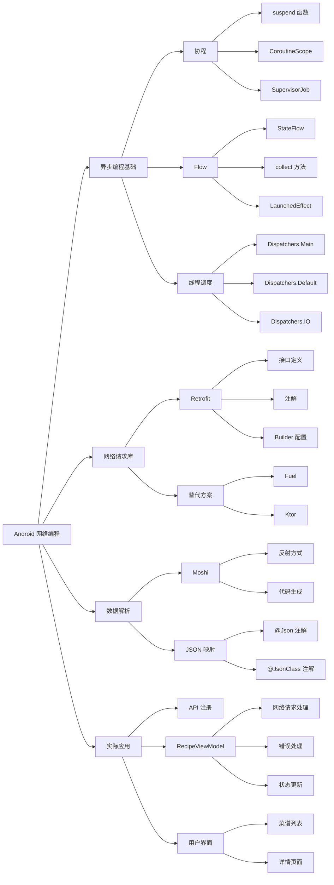

# 《8. 网络》总结

## 文字摘要

### 核心概述

本文详细介绍了 Android 应用开发中的网络编程基础知识。文章围绕构建一个食谱搜索应用，展示了如何从网络获取数据、处理异步操作，以及将数据转换为模型类。整个过程中使用了现代 Android 开发技术，包括协程、Flow 和流行的网络请求库。

### 关键技术点

- **协程**：用于处理异步操作，避免阻塞 UI 线程
  - 使用 `suspend` 关键字标记异步函数
  - 利用 `viewModelScope` 在 ViewModel 中启动协程
  - 使用 `Dispatchers` 控制协程在哪个线程上执行
  
- **Flow**：作为 LiveData 的替代品，用于在 ViewModel 和 UI 之间传递数据流
  - 通过 `MutableStateFlow` 创建可变状态
  - 使用 `asStateFlow()` 暴露不可变版本给 UI
  - 利用 `collect` 方法监听状态变化
  
- **Retrofit**：类型安全的 HTTP 客户端，用于进行网络请求
  - 通过接口和注解定义 API 端点
  - 利用 Builder 模式配置和创建 Retrofit 实例
  - 使用 `@GET`、`@Query` 和 `@Path` 等注解构建请求

- **Moshi**：JSON 解析库，用于将 JSON 数据转换为 Kotlin 对象
  - 使用 `@Json` 注解映射字段名
  - 支持代码生成优化，避免使用反射
  - 通过 `@JsonClass` 注解生成适配器

### UI 示例

文章中展示了一个基于 Flow 的数据收集和更新示例：

```kotlin
// ViewModel 中定义状态流
private val _queryState = MutableStateFlow(QueryState())
val queryState = _queryState.asStateFlow()

// UI 中监听状态变化
val scope = rememberCoroutineScope()
LaunchedEffect(Unit) {
    scope.launch {
        viewModel.recipeListState.collect { state ->
            recipeListState.value = state
        }
    }
}
```

### 目标分析

本文主要面向具有一定 Android 开发基础的开发者，帮助他们理解和实现网络数据获取和处理的最佳实践。文章通过一个实际的食谱搜索应用案例，展示了从 API 注册、服务定义、数据模型创建到最终 UI 显示的完整流程。

### 技术价值

文章最有价值的技术见解包括：

1. 展示了组合使用协程、Flow 和 Retrofit 进行网络请求的现代方法
2. 提供了处理异步操作的清晰模式，确保 UI 响应性
3. 介绍了将 API 响应与 UI 状态连接的流式架构
4. 展示了使用 Moshi 的代码生成功能优化 JSON 解析性能

### 扩展分析

#### 性能考量

文章提到了使用 Moshi 的代码生成功能而非反射来提高 JSON 解析性能：

```kotlin
// 从使用反射的方式
moshi-kotlin = {module="com.squareup.moshi:moshi-kotlin", version.ref="moshi" }

// 切换到代码生成方式
moshi = {module="com.squareup.moshi:moshi", version.ref="moshi" }
moshiCodeGen = {module="com.squareup.moshi:moshi-kotlin-codegen", version.ref="moshi" }
```

#### 状态管理

文章详细介绍了使用 Flow 进行状态管理的方法：

- 在 ViewModel 中使用 `MutableStateFlow` 维护内部状态
- 对外暴露只读版本 `StateFlow`
- UI 组件通过 `collect` 或 `collectAsState` 接收状态更新

#### 最佳实践

1. 使用 `viewModelScope` 确保协程生命周期与 ViewModel 一致
2. 将 API 密钥等敏感信息安全存储（推荐使用 secrets-gradle-plugin）
3. 使用 `try-catch` 块处理网络请求异常
4. 利用 Kotlin 的挂起函数特性简化异步代码

## 思维导图


