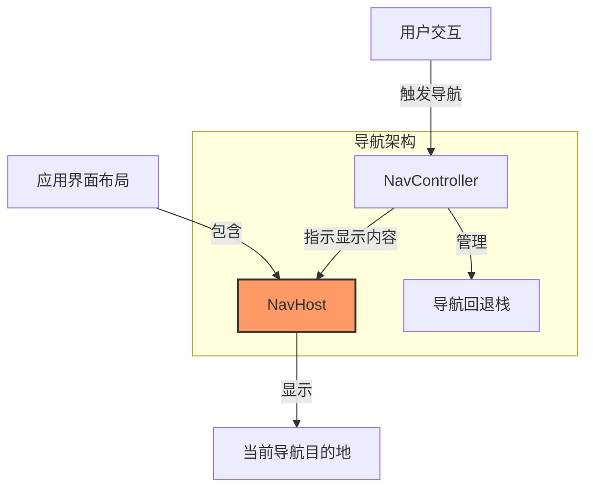

# NavHost：Android 导航的"舞台"

## 基础定义

NavHost 是 Android Jetpack Navigation 组件中的一个重要接口，它充当应用中导航目的地（如页面）的容器。简单来说，NavHost 就像是一个舞台，导航控制器决定在这个舞台上显示哪个"演员"（即哪个屏幕或页面）。

## 核心作用与原理

NavHost 的主要职责是在适当的时候接收 NavController 的指令，显示相应的导航目的地（Destination）。它是一个占位符，能够根据导航控制器的指示动态替换其内容，从而实现屏幕间的切换。

在 Android 架构中，NavHost 是连接导航控制器和实际 UI 内容的桥梁。它具有以下核心功能：
- 作为导航目的地的容器
- 根据 NavController 的指令展示不同的目的地
- 管理目的地之间的转场动画
- 维护导航回退栈的视觉部分

## 类比与比喻

### 类比一：舞台
把 NavHost 想象成一个剧院的舞台。NavController 是舞台导演，决定在什么时候让哪个演员（页面）上场表演。舞台本身不会改变，但站在舞台上的演员（显示的内容）会根据导演的指示而变化。当一个场景结束，另一个场景开始时，演员会在舞台上切换，但舞台仍然是那个舞台。

### 类比二：电视屏幕
NavHost 就像你家的电视屏幕，而 NavController 则是遥控器。当你按下遥控器上的按钮切换频道时，电视屏幕显示的内容会发生变化，但电视机本身并没有变。屏幕只是内容的容器，内容由遥控器（NavController）控制。

### 类比三：相框
NavHost 可以被比作一个固定在墙上的相框。相框本身不会变化，但你可以不断更换里面的照片。每一张照片就像应用中的一个页面，而决定展示哪张照片的人就是 NavController。

## 实例与举例

### 简单实例：在传统 View 系统中使用 NavHost

```xml
<!-- 在布局文件中声明 NavHostFragment -->
<androidx.fragment.app.FragmentContainerView
    android:id="@+id/nav_host_fragment"
    android:name="androidx.navigation.fragment.NavHostFragment"
    android:layout_width="match_parent"
    android:layout_height="match_parent"
    app:defaultNavHost="true"
    app:navGraph="@navigation/nav_graph" />
```

```kotlin
// 在 Activity 中获取 NavController
val navHostFragment = supportFragmentManager
    .findFragmentById(R.id.nav_host_fragment) as NavHostFragment
val navController = navHostFragment.navController
```

### 实例：在 Jetpack Compose 中使用 NavHost

```kotlin
@Composable
fun MyApp() {
    // 创建一个 NavController
    val navController = rememberNavController()
    
    // 创建一个 NavHost，指定起始目的地
    NavHost(
        navController = navController,
        startDestination = "home"
    ) {
        // 定义各个导航目的地
        composable("home") { HomeScreen(navController) }
        composable("profile") { ProfileScreen(navController) }
        composable("settings") { SettingsScreen(navController) }
    }
}
```

### 复杂实例：嵌套导航和多返回栈

```kotlin
@Composable
fun AppWithBottomNav() {
    val navController = rememberNavController()
    
    Scaffold(
        bottomBar = { BottomNavigation { /* 底部导航栏内容 */ } }
    ) { innerPadding ->
        // NavHost 作为导航目的地的容器
        NavHost(
            navController = navController,
            startDestination = "home",
            modifier = Modifier.padding(innerPadding)
        ) {
            // 主页导航图
            navigation(startDestination = "feed", route = "home") {
                composable("feed") { FeedScreen() }
                composable("trending") { TrendingScreen() }
            }
            
            // 个人资料导航图
            navigation(startDestination = "profile_main", route = "profile") {
                composable("profile_main") { ProfileScreen() }
                composable("profile_edit") { EditProfileScreen() }
            }
            
            // 设置导航图
            navigation(startDestination = "settings_main", route = "settings") {
                composable("settings_main") { SettingsScreen() }
                composable("theme_settings") { ThemeSettingsScreen() }
                composable("notification_settings") { NotificationSettingsScreen() }
            }
        }
    }
}
```

### 反例：错误的使用方式

```kotlin
// ❌ 错误：在同一个布局中使用多个 NavHost 并共享同一个 NavController
@Composable
fun IncorrectImplementation() {
    val navController = rememberNavController()
    
    // 第一个 NavHost
    NavHost(
        navController = navController,
        startDestination = "home",
        route = "main"
    ) {
        composable("home") { HomeScreen() }
    }
    
    // 第二个 NavHost 使用相同的 NavController - 这会导致问题！
    NavHost(
        navController = navController,  // 错误：重复使用相同的 NavController
        startDestination = "profile", 
        route = "secondary"
    ) {
        composable("profile") { ProfileScreen() }
    }
}
```

## 应用场景

### 单活动应用架构
NavHost 是实现单活动（Single Activity）应用架构的关键组件。在这种架构中，应用只有一个 Activity，所有的屏幕切换都通过 Fragment 或 Composable 在 NavHost 内部进行，由 NavController 控制导航流程。

### 复杂的应用导航流程
对于具有复杂导航需求的应用，如电商应用（浏览商品→商品详情→购物车→结账流程）或社交应用（信息流→个人资料→聊天会话），NavHost 能够轻松管理这些复杂的导航关系。

### 模块化应用开发
在模块化应用中，NavHost 能够整合来自不同模块的导航图，实现模块间无缝导航，同时保持各模块的独立性。

### 对用户体验的影响
- **一致的导航体验**：无论应用复杂度如何，用户都能体验到一致的导航方式
- **平滑的转场动画**：NavHost 管理转场动画，使页面切换更自然
- **预期的回退行为**：符合用户对回退操作的直觉理解

## 可视化呈现



## 分层次讲解

### 初级理解（✅基础）
NavHost 就是一个容器，它的唯一目的是显示当前应用应该展示的页面。它接收 NavController 的指令，知道何时显示哪个页面，以及如何在页面之间切换。对于初学者来说，你只需要在布局中放置一个 NavHost，然后配置好导航图，剩下的工作交给 Navigation 组件。

### 中级理解（🔄进阶）
NavHost 不仅仅是一个简单的容器，它还负责：
- 保持与导航控制器的一致性
- 管理目的地之间的转场动画
- 处理导航过程中的状态保存和恢复
- 支持深层链接导航

### 高级理解（🔬深入）
对于高级开发者，NavHost 可以：
- 支持自定义导航行为和转场效果
- 为嵌套导航提供基础设施
- 与 ViewModel 和状态管理系统协同工作
- 支持动态导航目的地和条件导航

## 术语解释

- **导航宿主（NavHost）**：显示导航目的地的容器接口
- **NavHostFragment**：Navigation 组件提供的 NavHost 实现，用于传统 View 系统
- **导航图（Navigation Graph）**：定义应用中所有导航目的地和它们之间关系的结构
- **导航目的地（Navigation Destination）**：应用中的一个屏幕，可以是 Fragment 或 Composable
- **回退栈（Back Stack）**：跟踪用户访问过的屏幕，使回退按钮能正常工作
- **导航控制器（NavController）**：控制 NavHost 中显示内容的组件

## 历史与发展

NavHost 接口是随着 Jetpack Navigation 组件在 2018 年推出的。在传统的 Android 开发中，开发者通常使用 FragmentTransaction 或 Intent 手动管理屏幕切换，这种方式复杂且容易出错。

Navigation 组件推出后，提供了 NavHostFragment 作为 NavHost 的标准实现，大大简化了导航的复杂性。随着 Jetpack Compose 的发布，Navigation-Compose 库提供了声明式 UI 的 NavHost 实现，使导航系统与现代 UI 工具包无缝集成。

NavHost 的设计思想反映了 Android 平台向组件化、声明式 UI 和单活动架构的演进趋势。

## 常见误解澄清

### 误解1：NavHost 和 NavController 是相同的东西
**澄清**：NavHost 是显示导航目的地的容器，而 NavController 是控制导航行为的组件。它们是协同工作的两个不同部分：NavController 决定显示什么，NavHost 显示它。

### 误解2：一个应用可以有多个互相影响的 NavHost
**澄清**：虽然技术上可以在一个应用中使用多个 NavHost，但每个 NavHost 应该有自己独立的 NavController。多个 NavHost 共享一个 NavController 会导致冲突。

### 误解3：NavHost 只能用于简单导航
**澄清**：NavHost 完全能够支持复杂的导航场景，包括嵌套导航、条件导航、深层链接等高级功能。

## 代码示例

### 示例1：基本 NavHost 设置（初级）

**Fragment-based NavHost:**

```kotlin
// 在 Activity 布局中
// activity_main.xml
<androidx.constraintlayout.widget.ConstraintLayout 
    xmlns:android="http://schemas.android.com/apk/res/android"
    xmlns:app="http://schemas.android.com/apk/res-auto"
    android:layout_width="match_parent"
    android:layout_height="match_parent">

    <androidx.fragment.app.FragmentContainerView
        android:id="@+id/nav_host_fragment"
        android:name="androidx.navigation.fragment.NavHostFragment"
        android:layout_width="0dp"
        android:layout_height="0dp"
        app:defaultNavHost="true"
        app:navGraph="@navigation/main_nav_graph"
        app:layout_constraintBottom_toBottomOf="parent"
        app:layout_constraintLeft_toLeftOf="parent"
        app:layout_constraintRight_toRightOf="parent"
        app:layout_constraintTop_toTopOf="parent" />

</androidx.constraintlayout.widget.ConstraintLayout>

// 在 Activity 中
// MainActivity.kt
class MainActivity : AppCompatActivity() {
    override fun onCreate(savedInstanceState: Bundle?) {
        super.onCreate(savedInstanceState)
        setContentView(R.layout.activity_main)
        
        val navHostFragment = supportFragmentManager
            .findFragmentById(R.id.nav_host_fragment) as NavHostFragment
        val navController = navHostFragment.navController
        
        // 可选：设置 ActionBar 与导航控制器的联动
        setupActionBarWithNavController(navController)
    }
    
    // 处理 Up 按钮的导航
    override fun onSupportNavigateUp(): Boolean {
        val navController = findNavController(R.id.nav_host_fragment)
        return navController.navigateUp() || super.onSupportNavigateUp()
    }
}
```

**Compose-based NavHost:**

```kotlin
@Composable
fun BasicNavHostExample() {
    // 创建一个 NavController
    val navController = rememberNavController()
    
    // 创建 NavHost，设置起始目的地
    NavHost(
        navController = navController,
        startDestination = "home",
        modifier = Modifier.fillMaxSize()
    ) {
        // 定义目的地
        composable("home") { 
            HomeScreen(
                onNavigateToProfile = { navController.navigate("profile") }
            ) 
        }
        
        composable("profile") { 
            ProfileScreen(
                onNavigateBack = { navController.navigateUp() }
            ) 
        }
    }
}

// 示例屏幕组件
@Composable
fun HomeScreen(onNavigateToProfile: () -> Unit) {
    Column(
        modifier = Modifier
            .fillMaxSize()
            .padding(16.dp),
        verticalArrangement = Arrangement.Center,
        horizontalAlignment = Alignment.CenterHorizontally
    ) {
        Text("首页")
        Spacer(modifier = Modifier.height(16.dp))
        Button(onClick = onNavigateToProfile) {
            Text("前往个人资料")
        }
    }
}
```

### 示例2：带参数的导航（中级）

```kotlin
@Composable
fun NavHostWithParameters() {
    val navController = rememberNavController()
    
    NavHost(
        navController = navController,
        startDestination = "products"
    ) {
        // 产品列表页面
        composable("products") { 
            ProductListScreen(
                products = sampleProducts,
                onProductClick = { productId ->
                    navController.navigate("product_details/$productId")
                }
            ) 
        }
        
        // 产品详情页面，接收产品ID参数
        composable(
            route = "product_details/{productId}",
            arguments = listOf(
                navArgument("productId") { type = NavType.StringType }
            )
        ) { backStackEntry ->
            // 从路由中获取产品ID
            val productId = backStackEntry.arguments?.getString("productId")
            
            // 根据ID获取产品详情
            val product = sampleProducts.find { it.id == productId }
            
            // 显示产品详情页面
            ProductDetailsScreen(
                product = product,
                onNavigateUp = { navController.navigateUp() }
            )
        }
    }
}

// 产品列表屏幕
@Composable
fun ProductListScreen(
    products: List<Product>,
    onProductClick: (String) -> Unit
) {
    LazyColumn {
        items(products) { product ->
            ProductItem(
                product = product,
                onClick = { onProductClick(product.id) }
            )
        }
    }
}

// 产品详情屏幕
@Composable
fun ProductDetailsScreen(
    product: Product?,
    onNavigateUp: () -> Unit
) {
    Column {
        // 顶部应用栏
        TopAppBar(
            title = { Text("产品详情") },
            navigationIcon = {
                IconButton(onClick = onNavigateUp) {
                    Icon(Icons.Default.ArrowBack, contentDescription = "返回")
                }
            }
        )
        
        // 产品详情内容
        if (product != null) {
            // 显示产品信息
            Text(product.name, style = MaterialTheme.typography.h5)
            Text("价格: ¥${product.price}")
            Text(product.description)
        } else {
            // 产品不存在
            Text("未找到产品信息")
        }
    }
}
```

### 示例3：嵌套导航架构（高级）

```kotlin
@Composable
fun AdvancedNavHostExample() {
    val navController = rememberNavController()
    
    Scaffold(
        bottomBar = {
            BottomNavigation {
                val navBackStackEntry by navController.currentBackStackEntryAsState()
                val currentRoute = navBackStackEntry?.destination?.route
                
                // 底部导航项
                BottomNavigationItem(
                    selected = currentRoute?.startsWith("home") == true,
                    onClick = {
                        navController.navigate("home") {
                            popUpTo(navController.graph.startDestinationId) {
                                saveState = true
                            }
                            launchSingleTop = true
                            restoreState = true
                        }
                    },
                    icon = { Icon(Icons.Default.Home, contentDescription = "主页") },
                    label = { Text("主页") }
                )
                
                BottomNavigationItem(
                    selected = currentRoute?.startsWith("explore") == true,
                    onClick = {
                        navController.navigate("explore") {
                            popUpTo(navController.graph.startDestinationId) {
                                saveState = true
                            }
                            launchSingleTop = true
                            restoreState = true
                        }
                    },
                    icon = { Icon(Icons.Default.Search, contentDescription = "探索") },
                    label = { Text("探索") }
                )
                
                BottomNavigationItem(
                    selected = currentRoute?.startsWith("profile") == true,
                    onClick = {
                        navController.navigate("profile") {
                            popUpTo(navController.graph.startDestinationId) {
                                saveState = true
                            }
                            launchSingleTop = true
                            restoreState = true
                        }
                    },
                    icon = { Icon(Icons.Default.Person, contentDescription = "个人") },
                    label = { Text("个人") }
                )
            }
        }
    ) { innerPadding ->
        // 主要导航宿主
        NavHost(
            navController = navController,
            startDestination = "home",
            modifier = Modifier.padding(innerPadding)
        ) {
            // 主页导航图
            navigation(startDestination = "home_feed", route = "home") {
                composable("home_feed") { HomeFeedScreen(navController) }
                composable("home_details/{itemId}") { backStackEntry ->
                    val itemId = backStackEntry.arguments?.getString("itemId")
                    HomeDetailsScreen(itemId, navController)
                }
            }
            
            // 探索导航图
            navigation(startDestination = "explore_main", route = "explore") {
                composable("explore_main") { ExploreMainScreen(navController) }
                composable("explore_category/{categoryId}") { backStackEntry ->
                    val categoryId = backStackEntry.arguments?.getString("categoryId")
                    ExploreCategoryScreen(categoryId, navController)
                }
                composable("explore_item/{itemId}") { backStackEntry ->
                    val itemId = backStackEntry.arguments?.getString("itemId")
                    ExploreItemScreen(itemId, navController)
                }
            }
            
            // 个人资料导航图
            navigation(startDestination = "profile_main", route = "profile") {
                composable("profile_main") { ProfileMainScreen(navController) }
                composable("profile_edit") { ProfileEditScreen(navController) }
                composable("profile_settings") {
                    ProfileSettingsScreen(navController)
                }
                composable("profile_favorites") {
                    ProfileFavoritesScreen(navController)
                }
            }
            
            // 全局导航目的地，可以从任何地方访问
            composable("search") { SearchScreen(navController) }
            composable(
                "deeplink/{type}/{id}",
                deepLinks = listOf(
                    navDeepLink { 
                        uriPattern = "myapp://deeplink/{type}/{id}" 
                    }
                )
            ) { backStackEntry ->
                val type = backStackEntry.arguments?.getString("type")
                val id = backStackEntry.arguments?.getString("id")
                DeepLinkScreen(type, id, navController)
            }
        }
    }
}
```

## 总结

NavHost 是 Android 导航系统中的"舞台"，它承担着显示导航目的地的重要责任。作为一个容器接口，NavHost 根据 NavController 的指令，动态地显示不同的页面内容，实现了应用内导航的核心视觉部分。

NavHost 与 NavController 紧密协作，共同构成了 Android Jetpack Navigation 组件的核心架构。在传统 View 系统中，NavHostFragment 提供了 NavHost 的标准实现；而在 Jetpack Compose 中，NavHost 组合函数提供了声明式 UI 的导航容器。

通过正确使用 NavHost，开发者可以轻松实现从简单的页面切换到复杂的嵌套导航结构，同时保持清晰的代码结构和优秀的用户体验。无论是单活动应用架构还是模块化设计，NavHost 都能满足现代 Android 应用的导航需求。 