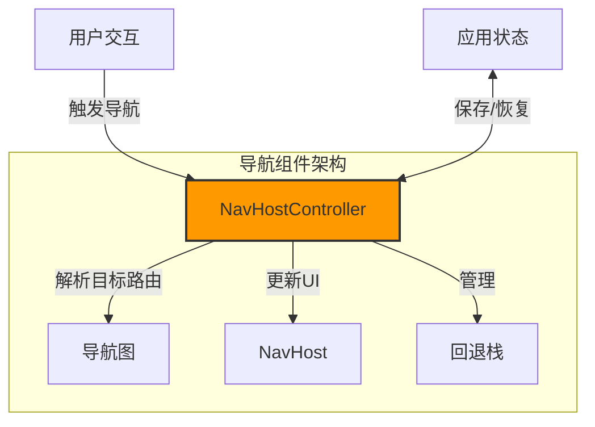

# NavHostController：Android 导航的"指挥官"

## 基础定义

NavHostController 是 Android Jetpack Navigation 组件中的核心类，它负责管理应用内的屏幕导航。简单来说，它就像是一个指挥交通的警察，决定用户在点击按钮或执行某个操作后应该去往哪个屏幕，以及如何在不同屏幕之间切换。

## 核心作用与原理

NavHostController 负责执行导航操作，它持有导航状态并控制导航行为。这个控制器知道：

- 当前你在哪个屏幕
- 有哪些可能的导航路径
- 如何处理导航回退
- 如何管理导航历史堆栈

在 Android 架构中，NavHostController 位于导航组件的核心位置，它连接导航图(Navigation Graph)和导航宿主(NavHost)，使整个导航流程协调一致地工作。

## 类比与比喻

### 类比一：交通警察

想象一下城市的交通警察。他们站在十字路口，指挥车辆（用户）如何行驶，决定哪条路应该绿灯通行，哪条路应该红灯等待。NavHostController 就像这个交通警察，它根据开发者预设的导航规则（导航图），决定用户应该前往哪个目的地（屏幕）。

### 类比二：列车调度员

NavHostController 也像火车站的调度员。他掌握着整个站点的列车运行图，决定哪趟列车（Fragment或Composable）应该进入哪个站台，什么时候出发，以及如何处理乘客（数据）的转乘。当用户需要从一个屏幕移动到另一个屏幕时，NavHostController 就会像调度员一样，安排这次"旅程"。

### 类比三：遥控器

你可以把 NavHostController 看作是应用的"遥控器"，通过它你可以切换不同的"频道"（屏幕）。遥控器上有不同的按钮（导航操作），你按下后就能跳转到想要的"节目"（目标页面）。

## 实例与举例

### 简单实例：基本页面跳转

```kotlin
// 获取导航控制器
val navController = rememberNavController()

// 使用导航控制器进行跳转
Button(onClick = { navController.navigate("profile") }) {
    Text("前往个人资料页")
}
```

### 中等复杂度：带参数的页面跳转

```kotlin
// 定义导航操作
Button(onClick = { 
    // 跳转到商品详情页并传递商品ID
    navController.navigate("productDetail/123") 
}) {
    Text("查看商品详情")
}

// 在目标页面接收参数
NavHost(navController, startDestination = "home") {
    // ...其他目的地
    composable(
        "productDetail/{productId}",
        arguments = listOf(navArgument("productId") { type = NavType.StringType })
    ) { backStackEntry ->
        val productId = backStackEntry.arguments?.getString("productId")
        ProductDetailScreen(productId = productId)
    }
}
```

### 复杂实例：深层链接与导航动作

```kotlin
// 定义导航图
val navController = rememberNavController()
NavHost(navController, startDestination = "home") {
    composable("home") { HomeScreen(navController) }
    composable("profile") { ProfileScreen(navController) }
    navigation(startDestination = "list", route = "items") {
        composable("list") { ItemListScreen(navController) }
        composable(
            "detail/{itemId}",
            arguments = listOf(navArgument("itemId") { type = NavType.StringType })
        ) { backStackEntry ->
            val itemId = backStackEntry.arguments?.getString("itemId")
            ItemDetailScreen(itemId = itemId, navController = navController)
        }
    }
}

// 使用导航控制器执行复杂导航操作
Button(onClick = {
    // 跳转到嵌套导航图中的项目详情页
    navController.navigate("items/detail/456") {
        // 配置导航选项
        popUpTo("home") // 弹出回退栈直到home页面
        launchSingleTop = true // 避免目标页面的多个实例
        restoreState = true // 恢复目标页面的状态
    }
}) {
    Text("查看特定项目")
}
```

### 反例：不当使用方式

```kotlin
// ❌ 错误：直接操作Activity或Fragment，绕过NavController
Button(onClick = {
    // 不要这样做！这会破坏导航组件的统一管理
    val intent = Intent(context, ProfileActivity::class.java)
    startActivity(intent)
}) {
    Text("前往个人资料")
}
```

## 应用场景

### 电子商务应用

在电商应用中，NavHostController 管理用户从商品列表到商品详情，再到购物车和结账流程的整个导航过程。它确保用户可以顺畅地浏览商品，同时又能轻松回到之前查看的页面。

### 社交媒体应用

社交应用中，用户需要在信息流、个人资料、聊天界面等多个功能模块间切换。NavHostController 确保这些转换流畅，并维护正确的回退栈，让用户能按预期返回之前的页面。

### 企业应用

在复杂的企业应用中，NavHostController 可以管理多层嵌套的导航结构，如主菜单、子模块、详情页等，同时还能保持应用的状态一致性和导航的可预测性。

### 对用户体验的影响

- **一致性**：提供统一的导航体验，无论应用多复杂
- **流畅性**：通过预定义的转场动画，使页面切换更加平滑
- **可预测性**：确保回退按钮的行为符合用户预期

## 可视化呈现



## 分层次讲解

### 初级理解（✅基础）

NavHostController 就是一个工具，它帮助你的应用在不同的屏幕之间进行切换。你只需调用它的 `navigate()` 方法，就能让应用显示不同的页面，它还会帮你记住用户访问过的页面历史，使回退功能正常工作。

### 中级理解（🔄进阶）

NavHostController 不仅仅是执行简单的页面切换，它还能：

- 管理复杂的导航回退栈
- 处理深层链接（Deep Links）
- 在导航过程中传递参数
- 执行带有特定选项的导航（如弹出回退栈、避免重复目的地等）

### 高级理解（🔬深入）

在高级应用中，NavHostController 可以：

- 与SavedStateHandle结合，在进程死亡后恢复导航状态
- 实现自定义的导航行为和转场动画
- 与ViewModel协同工作，确保在导航过程中数据的一致性
- 管理多个回退栈，支持底部导航等复杂UI模式

## 术语解释

- **导航图（Navigation Graph）**：定义应用中所有可能的导航路径和目的地的可视化表示
- **导航宿主（NavHost）**：显示导航目的地的容器，通常是一个Fragment容器或Composable函数
- **导航目的地（Navigation Destination）**：应用中的一个屏幕，如一个Fragment或Composable函数
- **回退栈（Back Stack）**：记录用户访问过的屏幕历史，使回退操作能够正常工作
- **导航动作（Navigation Action）**：从一个目的地到另一个目的地的连接，可以包含参数和选项
- **深层链接（Deep Link）**：允许直接导航到应用内特定页面的URI

## 历史与发展

NavHostController 是随着 Jetpack Navigation 组件在2018年推出的，作为现代Android应用导航解决方案的一部分。它的设计目标是统一Android应用的导航系统，解决过去使用Intent、FragmentTransaction等不同机制导致的导航混乱问题。

随着Jetpack Compose的推出，NavHostController也得到了扩展，支持声明式UI的导航需求。现在的NavHostController可以同时支持基于Fragment的传统视图和基于Compose的现代声明式UI导航。

## 常见误解澄清

### 误解1：NavHostController 和 NavController 是不同的东西

**澄清**：NavHostController 实际上是 NavController 的一个实现类。在大多数情况下，开发者直接使用 NavController 接口，而不需要关心它的具体实现。

### 误解2：每个页面都需要一个新的 NavController

**澄清**：一个应用通常只需要一个 NavController 实例来管理整个应用的导航。在 Compose 中，我们通常使用 `rememberNavController()` 在顶层组件中创建一个实例，然后通过参数传递给需要的组件。

### 误解3：NavController 只能用于简单的页面跳转

**澄清**：NavController 支持复杂的导航场景，包括嵌套导航、条件导航、动态导航以及深层链接等高级功能。

## 代码示例

### 示例1：基本设置与使用（初级）

```kotlin
// 在 Compose 中设置基本导航
@Composable
fun MyApp() {
    // 创建导航控制器
    val navController = rememberNavController()
    
    // 设置导航宿主和导航图
    NavHost(
        navController = navController,
        startDestination = "home"
    ) {
        composable("home") { HomeScreen(navController) }
        composable("profile") { ProfileScreen(navController) }
        composable("settings") { SettingsScreen(navController) }
    }
}

// 在屏幕中使用导航控制器
@Composable
fun HomeScreen(navController: NavController) {
    Column(modifier = Modifier.fillMaxSize()) {
        Text("首页")
        Button(onClick = { navController.navigate("profile") }) {
            Text("前往个人资料")
        }
    }
}
```

### 示例2：带参数和选项的导航（中级）

```kotlin
// 定义导航图，包含参数和导航选项
@Composable
fun NewsApp() {
    val navController = rememberNavController()
    
    NavHost(navController, startDestination = "articles") {
        composable("articles") { 
            ArticleListScreen(navController) 
        }
        composable(
            "articleDetail/{articleId}",
            arguments = listOf(
                navArgument("articleId") { 
                    type = NavType.StringType 
                }
            )
        ) { backStackEntry ->
            // 从路径中提取参数
            val articleId = backStackEntry.arguments?.getString("articleId")
            ArticleDetailScreen(articleId, navController)
        }
    }
}

// 在文章列表中使用导航控制器，带选项的导航
@Composable
fun ArticleListScreen(navController: NavController) {
    // 文章列表
    LazyColumn {
        items(sampleArticles) { article ->
            ArticleItem(
                article = article,
                onClick = {
                    // 导航到文章详情，带导航选项
                    navController.navigate("articleDetail/${article.id}") {
                        // 避免多次点击创建多个相同目的地实例
                        launchSingleTop = true
                        // 保存和恢复目的地的状态
                        restoreState = true
                    }
                }
            )
        }
    }
}
```

### 示例3：复杂导航架构（高级）

```kotlin
@Composable
fun ComplexNavigationApp() {
    val navController = rememberNavController()
    
    // 创建一个导航宿主以及复杂的导航结构
    NavHost(navController, startDestination = "main") {
        // 主导航图
        navigation(startDestination = "feed", route = "main") {
            composable("feed") { FeedScreen(navController) }
            composable("discover") { DiscoverScreen(navController) }
            
            // 嵌套导航图 - 个人资料部分
            navigation(startDestination = "profile_main", route = "profile") {
                composable("profile_main") { ProfileMainScreen(navController) }
                composable("profile_edit") { ProfileEditScreen(navController) }
                composable("profile_settings") { ProfileSettingsScreen(navController) }
            }
            
            // 嵌套导航图 - 消息部分
            navigation(startDestination = "inbox", route = "messages") {
                composable("inbox") { InboxScreen(navController) }
                composable(
                    "conversation/{userId}",
                    arguments = listOf(navArgument("userId") { type = NavType.StringType })
                ) { backStackEntry ->
                    val userId = backStackEntry.arguments?.getString("userId")
                    ConversationScreen(userId, navController)
                }
            }
        }
        
        // 独立的认证流程
        navigation(startDestination = "login", route = "auth") {
            composable("login") { LoginScreen(navController) }
            composable("register") { RegisterScreen(navController) }
            composable("forgot_password") { ForgotPasswordScreen(navController) }
        }
        
        // 深层链接目的地
        composable(
            "content/{contentType}/{contentId}",
            arguments = listOf(
                navArgument("contentType") { type = NavType.StringType },
                navArgument("contentId") { type = NavType.StringType }
            ),
            deepLinks = listOf(
                navDeepLink { 
                    uriPattern = "myapp://content/{contentType}/{contentId}" 
                }
            )
        ) { backStackEntry ->
            val contentType = backStackEntry.arguments?.getString("contentType")
            val contentId = backStackEntry.arguments?.getString("contentId")
            ContentDetailScreen(contentType, contentId, navController)
        }
    }
    
    // 底部导航实现
    Scaffold(
        bottomBar = {
            BottomNavigation {
                BottomNavigationItem(
                    selected = /* ... */,
                    onClick = { 
                        // 使用NavController导航到顶级目的地
                        navController.navigate("main/feed") {
                            // 弹出回退栈直到主导航图
                            popUpTo("main") {
                                saveState = true
                            }
                            // 避免创建多个实例
                            launchSingleTop = true
                            // 恢复状态
                            restoreState = true
                        }
                    },
                    icon = { Icon(Icons.Default.Home, contentDescription = "Feed") }
                )
                // ... 其他底部导航项 ...
            }
        }
    ) {
        // NavHost已在上面定义
    }
}
```

## 总结

NavHostController 是 Android 导航系统的核心组件，它像一位指挥交通的警察或列车调度员，负责管理应用中的屏幕切换。它不仅可以处理简单的页面跳转，还能管理复杂的导航场景，如参数传递、导航选项设置、回退栈管理等。随着 Android 平台的发展，NavHostController 同时支持传统的基于 View 的导航和现代的基于 Compose 的导航，为开发者提供了统一的导航解决方案。

通过正确使用 NavHostController，开发者可以构建出导航体验流畅、逻辑清晰的 Android 应用，从而提升用户体验和开发效率。
