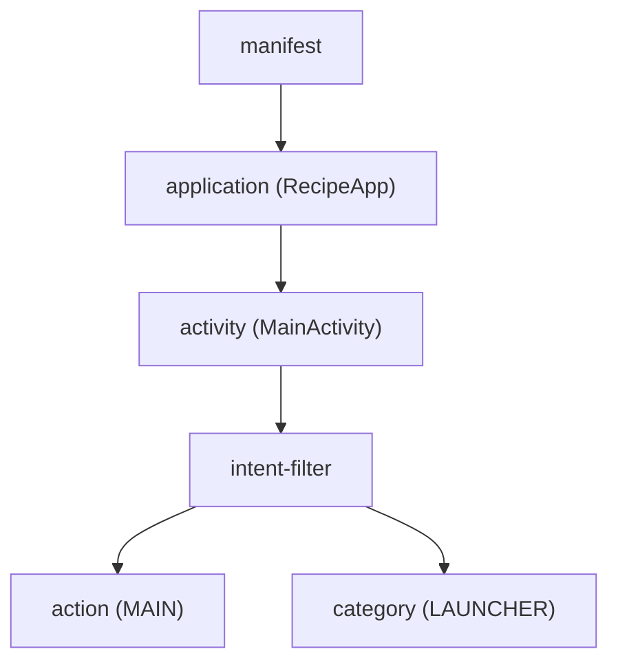

# AndroidManifest.xml 文件分析报告

## 文件基本信息

- **文件名称**：AndroidManifest.xml
- **文件路径**：app/src/main/AndroidManifest.xml
- **文件类型**：清单文件
- **主要功能**：定义应用程序的基本配置、权限、组件和入口点
- **技术要点**：权限申请、应用组件声明、启动活动配置、主题设置
- **Android 基础概念**：
  - **清单文件**：Android 应用必备的配置文件，定义应用的基本信息和组件
  - **权限系统**：应用需要声明其需要访问的系统资源或功能的权限
  - **应用组件**：Activity、Service、BroadcastReceiver 和 ContentProvider 等组件
  - **意图过滤器**：声明组件可以响应的意图类型

## XML 元素分析

### 元素概览

- **根元素**：`manifest`，包含应用的基本定义和所有组件
- **命名空间**：
  - `xmlns:android="http://schemas.android.com/apk/res/android"`：Android 标准命名空间，提供 Android 特有的 XML 属性
  - `xmlns:tools="http://schemas.android.com/tools"`：Android 构建工具命名空间，提供构建时的辅助属性

- **元素统计**：

  | 元素类型 | 数量 | 备注 |
  |---|---|---|
  | 布局容器 | 0 | 清单文件不包含 UI 布局元素 |
  | UI 控件 | 0 | 清单文件不包含 UI 控件 |
  | 菜单项 | 0 | 清单文件不包含菜单元素 |
  | 资源定义 | 0 | 清单文件不定义资源 |
  | 清单组件 | 3 | manifest、application、activity |
  | 权限声明 | 1 | 互联网访问权限 |
  | 意图过滤器 | 1 | 主活动的启动意图过滤器 |
  | 意图动作 | 1 | MAIN 动作 |
  | 意图类别 | 1 | LAUNCHER 类别 |

### 清单文件分析

#### 包名与应用信息

在该清单文件中，没有直接通过 `package` 属性明确指定应用的包名。在较新的 Android Gradle 构建系统中，包名通常在 `build.gradle` 文件中的 `applicationId` 中指定，清单文件中的 `package` 属性变为可选。

#### 应用组件

文件定义了一个核心应用组件：

1. **主活动（MainActivity）**
   - **完整类名**：`.MainActivity`（相对于应用包名的路径）
   - **导出状态**：`exported="true"`，表示该活动可以被其他应用启动
   - **主题**：应用了 `@style/Theme.RecipeFinder` 主题



#### 权限分析

应用申请了一个权限：

| 权限名 | 危险级别 | 用途 |
|---|---|---|
| android.permission.INTERNET | 普通权限 | 允许应用连接互联网，进行网络操作如 API 请求、数据下载等 |

普通权限在安装时自动授予，不需要用户明确批准。这表明应用是一个需要联网的应用，可能涉及在线搜索菜谱、加载图片等功能。

#### 意图过滤器分析

MainActivity 包含一个意图过滤器，配置如下：

```xml
<intent-filter>
  <action android:name="android.intent.action.MAIN" />
  <category android:name="android.intent.category.LAUNCHER" />
</intent-filter>
```

这个配置有两个关键作用：

1. `android.intent.action.MAIN` 表示该活动是应用的入口点
2. `android.intent.category.LAUNCHER` 表示该活动应在设备的应用启动器中显示

这是 Android 应用的标准启动配置，使该活动成为用户点击应用图标时首先启动的界面。

#### 应用配置分析

应用级别的配置设置包括：

| 属性 | 值 | 作用 |
|---|---|---|
| android:allowBackup | true | 允许应用数据备份和恢复 |
| android:dataExtractionRules | @xml/data_extraction_rules | 指定数据提取规则文件 |
| android:fullBackupContent | @xml/backup_rules | 指定完整备份规则文件 |
| android:icon | @mipmap/ic_launcher | 指定应用图标 |
| android:label | @string/app_name | 指定应用名称 |
| android:name | .RecipeApp | 指定自定义 Application 类 |
| android:roundIcon | @mipmap/ic_launcher_round | 指定圆形应用图标 |
| android:supportsRtl | true | 支持从右到左的布局（国际化支持） |
| android:theme | @style/Theme.RecipeFinder | 指定应用默认主题 |
| tools:targetApi | 31 | 指定目标 API 级别（Android 12） |

#### 兼容性设置

清单文件中的 `tools:targetApi="31"` 表示应用以 Android 12 (API 级别 31) 为目标平台。这告诉构建工具和 Android 系统应用针对哪个 API 级别进行优化。

#### 资源引用分析

清单文件引用了多个应用资源：

| 资源引用 | 类型 | 用途 |
|---|---|---|
| @xml/data_extraction_rules | XML 资源 | 定义数据提取规则 |
| @xml/backup_rules | XML 资源 | 定义备份规则 |
| @mipmap/ic_launcher | 图像资源 | 应用图标 |
| @string/app_name | 字符串资源 | 应用名称 |
| @mipmap/ic_launcher_round | 图像资源 | 圆形应用图标 |
| @style/Theme.RecipeFinder | 样式资源 | 应用主题 |

这些资源引用遵循 Android 的资源管理系统，允许应用在不同设备配置下自动适配不同的资源变体。

## 与其他平台对比

### 与 iOS 对比

| Android Manifest | iOS Info.plist |
|---|---|
| 权限声明：`<uses-permission>` | 权限声明：`NSxxxUsageDescription` 键 |
| 应用入口：MainActivity + intent-filter | 应用入口：Main storyboard 或 SceneDelegate |
| 应用图标：在清单中引用资源 | 应用图标：在 Assets.xcassets 中配置 |
| 应用 ID：在 build.gradle 中的 applicationId | 应用 ID：Bundle Identifier |
| 主题设置：`android:theme` | 外观设置：在代码中或 Info.plist 中配置 |
| 备份设置：backup 相关属性 | 备份设置：通过 iCloud 和 entitlements 配置 |

### 与 Flutter 对比

| Android Manifest | Flutter pubspec.yaml 和 AndroidManifest.xml |
|---|---|
| 整个应用配置都在单个文件中 | 基本配置在 pubspec.yaml，平台特定配置在各平台文件夹中 |
| 直接声明权限和应用组件 | 在 android/app/src/main/AndroidManifest.xml 中添加配置 |
| 资源引用使用 @ 语法 | Flutter 使用 assets 路径或原生资源引用 |
| 应用主题在清单中配置 | 应用主题通过 ThemeData 在代码中配置 |

### 与 Web 对比

| Android Manifest | Web manifest.json |
|---|---|
| 定义应用组件和权限 | 定义 PWA 属性、图标和启动行为 |
| 意图过滤器定义应用的启动和响应方式 | start_url 定义 PWA 的启动 URL |
| 应用主题和图标配置 | 主题色、图标和显示模式配置 |
| 权限明确声明 | 权限通过浏览器 API 请求 |

## 应用架构分析

### 应用组件架构

基于清单文件，可以推断该应用使用了标准的 Android 应用架构：

1. 自定义 Application 类 (RecipeApp)：可能用于全局初始化、依赖注入或状态管理
2. 单一主活动 (MainActivity)：作为应用的入口点和主界面

这可能表明应用采用了以下架构模式之一：

- 单活动多片段架构：使用单一 MainActivity 和多个 Fragment 实现导航
- 视图模型架构：可能使用 ViewModel 和 LiveData/Flow 实现 MVVM 模式

### 技术栈推断

从清单文件中可以推断应用可能使用的技术：

1. 网络功能：申请了 INTERNET 权限，表明需要联网
2. 现代化主题：使用了自定义主题 Theme.RecipeFinder，可能基于 Material Design
3. 应用名称 RecipeFinder 和自定义 Application 类 RecipeApp 暗示这是一个菜谱查找/管理应用

## API 使用分析

### Android 框架组件

| 组件名称 | 用途 | 文档链接 | 类似 iOS/Flutter 组件 |
|---|---|---|----|
| Activity | 用户交互的入口点和界面容器 | [Activity](mdc:https:/developer.android.com/reference/android/app/Activity) | iOS 中的 UIViewController / Flutter 中的 Widget |
| Intent Filter | 声明组件可响应的意图类型 | [Intent Filters](mdc:https:/developer.android.com/guide/components/intents-filters) | iOS 中的 URL Schemes / Flutter 中的 routes |
| Application | 应用全局状态和生命周期管理 | [Application](mdc:https:/developer.android.com/reference/android/app/Application) | iOS 中的 UIApplication / Flutter 中的 App 和 WidgetsApp |

## 注意事项与最佳实践

### 优点

1. **明确的权限声明**：只申请了必要的 INTERNET 权限，符合最小权限原则
2. **支持国际化**：启用了 RTL 布局支持 (`android:supportsRtl="true"`)
3. **备份支持**：配置了数据备份相关设置，有利于用户数据保护
4. **使用自定义 Application 类**：有利于全局初始化和依赖注入
5. **遵循资源引用最佳实践**：所有字符串、图标和样式都通过资源引用

### 改进空间

1. **权限声明缺少说明**：虽然申请了 INTERNET 权限，但没有注释说明具体用途
2. **缺少明确的包名声明**：现代 Android 项目通常在 build.gradle 中设置包名，但清单中保留 package 属性有助于代码导航
3. **缺少版本信息**：清单中没有包含 versionCode 和 versionName（可能在 build.gradle 中定义）
4. **安全配置**：可以考虑添加网络安全配置 (android:networkSecurityConfig)，特别是对于需要 HTTPS 通信的应用

### 风险点

1. **允许备份**：`android:allowBackup="true"` 可能导致敏感数据被备份，应确保正确配置 backup_rules
2. **未配置深链接**：如果应用需要支持从外部链接启动特定功能，需要添加相应的 intent-filter

## 初学者指南

### Android 清单文件学习要点

1. **基本结构**：了解清单文件的根元素、命名空间和基本组成部分
2. **组件声明**：学习如何声明 Activity、Service、BroadcastReceiver 和 ContentProvider
3. **权限系统**：理解 Android 权限分类（普通、危险、特殊）及其申请方式
4. **意图过滤器**：学习如何配置组件响应的意图类型
5. **资源引用**：掌握在清单文件中引用应用资源的方法

### 针对有 iOS 背景的开发者

- Android 的 AndroidManifest.xml 类似于 iOS 的 Info.plist，但功能更加全面
- Activity 的概念类似于 UIViewController，但生命周期和导航机制不同
- Android 的显式权限声明与 iOS 的隐私权限描述不同，需要适应这种差异
- Android 的资源引用系统（如 @string/app_name）类似于 iOS 的 Localizable.strings 文件和资源引用

### 针对有 Flutter 背景的开发者

- Flutter 项目中的 android/app/src/main/AndroidManifest.xml 与原生 Android 项目的清单文件结构相同
- 在 Flutter 项目中修改 AndroidManifest.xml 文件可以添加权限、修改应用属性或添加深链接
- Flutter 的导航系统与 Android 的 Activity 和 Intent 模型有很大不同，需要理解这两种系统的转换

### 进一步学习资源

- [Android 清单文件概述](mdc:https:/developer.android.com/guide/topics/manifest/manifest-intro)
- [Android 权限最佳实践](mdc:https:/developer.android.com/training/permissions/requesting)
- [Android 应用组件基础](mdc:https:/developer.android.com/guide/components/fundamentals)
- [Android 意图和过滤器](mdc:https:/developer.android.com/guide/components/intents-filters)

## 总结

该 AndroidManifest.xml 文件定义了一个名为 RecipeFinder 的食谱应用，具有基本的配置设置和权限。应用使用单一主活动作为入口点，并申请了互联网访问权限，表明它需要联网功能。文件结构清晰且符合 Android 开发标准，包含了适当的资源引用和配置选项。对于初学者来说，这是一个理解 Android 应用基本结构的好例子，展示了清单文件的核心组成部分和配置方法。
