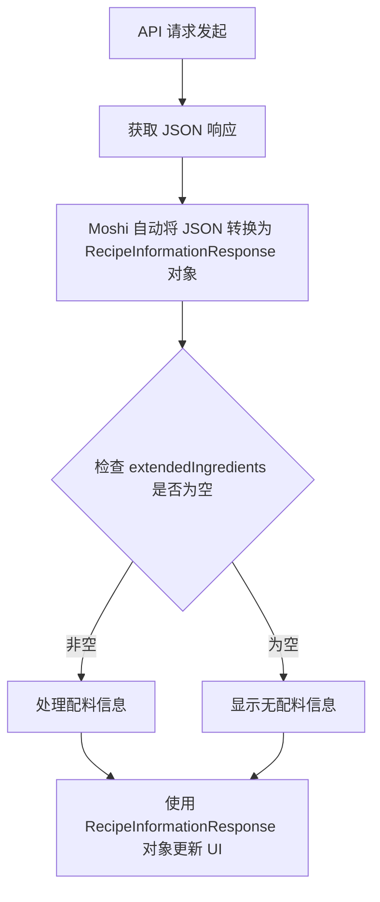

# RecipeInformationResponse.kt 文件分析报告

## 文件基本信息

- **文件名称**：RecipeInformationResponse.kt
- **文件路径**：app/src/main/java/com/kodeco/recipefinder/data/models/RecipeInformationResponse.kt
- **主要功能**：定义获取食谱详情 API 的响应数据模型，包含食谱的完整信息
- **技术要点**：Kotlin 数据类、JSON 序列化、可空类型、默认参数值、列表类型
- **Android 基础概念**：API 响应模型、网络请求映射
- **与已知技术栈对比**：
  - iOS/Swift：类似于 Swift 中的结构体和 Codable 协议
  - Flutter/Dart：类似于 Dart 中的模型类和 JSON 序列化
  - 前端框架：类似于 TypeScript 接口或 React/Vue 中的数据模型

## 语法元素分析

### 语法元素概览

- **包声明**：`package com.kodeco.recipefinder.data.models`
- **导入声明**：`import com.squareup.moshi.JsonClass`
- **元素统计**：

  | 元素类型 | 数量 | 备注 |
  |---|---|---|
  | 类      | 1    | 包括 1 个数据类 |
  | 接口    | 0    | 无接口定义 |
  | 对象    | 0    | 无对象定义 |
  | 函数    | 0    | 无函数定义 |
  | 扩展函数 | 0    | 无扩展函数 |
  | 属性    | 12   | 数据类的属性 |

### 类与接口分析

#### RecipeInformationResponse 类

- **类/接口名称**：RecipeInformationResponse
- **类型**：数据类（data class）
- **职责描述**：表示从 API 获取的食谱详细信息，包含完整的食谱内容如标题、图片、配料、制作时间等
- **Kotlin 语法特点**：
  - 使用 `data class` 关键字定义，自动生成 equals()、hashCode()、toString() 等方法
  - 为所有属性提供默认值，使实例化更灵活
  - 使用可空类型处理可能为空的 API 响应字段
  - 使用列表类型表示配料集合
- **与其他语言对比**：
  - Swift：类似于带默认值的 Swift 结构体，但 Kotlin 数据类是引用类型
  - Dart：类似于 Dart 类，但 Kotlin 数据类自动生成更多方法
  - Java：比 Java 模型类更简洁，省去了 getter/setter、equals/hashCode 等样板代码
  - JavaScript：比 JS 对象定义有更严格的类型安全性
- **属性分析**：
  
  | 属性名 | 类型 | 可见性 | 用途 |
  |----|---|----|---|
  | id | Int | public | 食谱的唯一标识符，默认值为 0 |
  | title | String | public | 食谱标题或名称，默认为空字符串 |
  | image | String? | public | 食谱图片的 URL，可能为空 |
  | imageType | String | public | 图片的文件类型，默认为空字符串 |
  | summary | String | public | 食谱的摘要描述，默认为空字符串 |
  | instructions | String? | public | 制作步骤说明，可能为空 |
  | sourceUrl | String | public | 食谱的来源网址，默认为空字符串 |
  | preparationMinutes | Int | public | 准备时间（分钟），默认为 0 |
  | cookingMinutes | Int | public | 烹饪时间（分钟），默认为 0 |
  | extendedIngredients | List\<ExtendedIngredient\> | public | 配料列表，默认为空列表 |
  | readyInMinutes | Int | public | 总制作时间（分钟），默认为 0 |
  | servings | Int | public | 可供人数，默认为 0 |

- **类 UML 图**：
  
  ```mermaid
  classDiagram
      RecipeInformationResponse o-- ExtendedIngredient : contains
      
      class RecipeInformationResponse {
          +id: Int
          +title: String
          +image: String?
          +imageType: String
          +summary: String
          +instructions: String?
          +sourceUrl: String
          +preparationMinutes: Int
          +cookingMinutes: Int
          +extendedIngredients: List~ExtendedIngredient~
          +readyInMinutes: Int
          +servings: Int
      }
      
      class ExtendedIngredient {
          +id: Int
          +name: String
          +aisle: String?
          +image: String?
          +original: String
          +amount: Double
          +unit: String
      }
  ```

- **注解分析**：
  - `@JsonClass(generateAdapter = true)`：Moshi 库的注解，指示编译时生成 JSON 适配器，用于 JSON 和对象之间的序列化和反序列化

- **关系分析**：
  - 与 ExtendedIngredient 类型形成组合关系，一个 RecipeInformationResponse 包含多个 ExtendedIngredient
  - 与 Recipe 类的关系：可视为 Recipe 的详细扩展版，包含更多细节信息

## Kotlin 语法分析

### Kotlin 特性与语法

- **空安全特性**：使用 `String?` 表示可为空的字段（image、instructions）
  - 与 Swift 的 Optional 对比：语法不同但概念相同，都是避免空指针异常的类型系统特性
  - 与 Dart 的空安全对比：概念相似，都使用 `?` 标记可空类型
- **数据类**：使用 `data class` 关键字定义
  - 自动生成 equals()、hashCode()、toString()、copy() 等方法
  - 提供解构声明功能
  - 与 Swift 结构体对比：功能类似但实现不同，Swift 结构体是值类型
  - 与 Java 记录类对比：Java 16+ 引入的 Record 类似但功能较少
- **默认参数值**：为所有构造函数参数提供默认值
  - 对基本类型使用 0 或空字符串作为默认值
  - 对列表类型使用 listOf() 创建空列表作为默认值
  - 与 Swift 默认参数对比：语法和功能基本相同
  - 与 JavaScript 默认参数对比：语法相似，但 Kotlin 类型更严格
- **集合类型**：使用 `List<ExtendedIngredient>` 表示配料列表
  - Kotlin 默认使用不可变集合类型，提升代码安全性
  - 与 Swift 数组对比：Swift 使用 `[ExtendedIngredient]` 或 `Array<ExtendedIngredient>`
  - 与 Dart 列表对比：Dart 使用 `List<ExtendedIngredient>`，语法相同

### API 使用分析

- **重要 API**：

  | API 名称 | 用途 | 文档链接 | 类似 iOS/Flutter API |
  |---|---|---|---|
  | Moshi JsonClass   | JSON 序列化/反序列化注解 | [链接](mdc:https:/github.com/square/moshi) | iOS 的 Codable 协议 / Flutter 的 json_serializable |
  | Kotlin List       | 表示不可变列表集合 | [链接](mdc:https:/kotlinlang.org/api/latest/jvm/stdlib/kotlin.collections/-list/) | Swift 的 Array / Dart 的 List |

## 注意事项与最佳实践

- **优点**：
  - 使用数据类简化模型定义，提高代码可读性
  - 为所有属性提供默认值，使实例化更灵活
  - 合理使用可空类型处理 API 中可能缺失的字段
  - 使用不可变属性增强数据安全性
- **改进空间**：
  - 可考虑添加文档注释说明各属性的具体用途
  - 可考虑添加扩展函数增强功能，如计算总时间、格式化时间等
  - 可考虑添加验证逻辑确保数据一致性
- **初学者指南**：
  - API 响应模型通常应与 API 返回结构严格匹配
  - 理解数据类的优势可以减少大量样板代码
  - 对于 iOS 开发者：类似于 Swift 中的 Codable 结构体，但具有引用类型特性
  - 对于 Flutter 开发者：类似于 Dart 中使用 json_serializable 的模型类
- **风险点**：
  - API 响应结构变化需要同步更新模型，确保字段名称和类型匹配

## 与相关类的关系分析

- **与 Recipe 类的关系**：
  - RecipeInformationResponse 是 Recipe 的扩展版本，包含更详细的信息
  - Recipe 适用于列表展示，RecipeInformationResponse 适用于详情页展示
- **与 ExtendedIngredient 的关系**：
  - 通过 extendedIngredients 属性包含多个 ExtendedIngredient 对象
  - 形成"整体-部分"的组合关系

## 函数流程分析

由于该文件只包含数据类定义而没有函数实现，以下是典型使用此数据类的函数流程图：



## 跨平台开发考虑

- **Flutter**：可使用 Dart 类和 json_serializable 包实现类似功能

  ```dart
  class RecipeInformationResponse {
    final int id;
    final String title;
    final String? image;
    final String imageType;
    final String summary;
    final String? instructions;
    final String sourceUrl;
    final int preparationMinutes;
    final int cookingMinutes;
    final List<ExtendedIngredient> extendedIngredients;
    final int readyInMinutes;
    final int servings;
    
    RecipeInformationResponse({
      this.id = 0,
      this.title = '',
      this.image,
      this.imageType = '',
      this.summary = '',
      this.instructions,
      this.sourceUrl = '',
      this.preparationMinutes = 0,
      this.cookingMinutes = 0,
      this.extendedIngredients = const [],
      this.readyInMinutes = 0,
      this.servings = 0
    });
    
    factory RecipeInformationResponse.fromJson(Map<String, dynamic> json) => 
      _$RecipeInformationResponseFromJson(json);
  }
  ```

- **iOS/Swift**：可使用 Swift 结构体和 Codable 协议实现类似功能

  ```swift
  struct RecipeInformationResponse: Codable {
    let id: Int
    let title: String
    let image: String?
    let imageType: String
    let summary: String
    let instructions: String?
    let sourceUrl: String
    let preparationMinutes: Int
    let cookingMinutes: Int
    let extendedIngredients: [ExtendedIngredient]
    let readyInMinutes: Int
    let servings: Int
    
    init(id: Int = 0, title: String = "", image: String? = nil, ...) {
      self.id = id
      self.title = title
      // 其他属性初始化
    }
  }
  ```

- **React/TypeScript**：可使用 TypeScript 接口实现类似定义

  ```typescript
  interface RecipeInformationResponse {
    id: number;
    title: string;
    image?: string;
    imageType: string;
    summary: string;
    instructions?: string;
    sourceUrl: string;
    preparationMinutes: number;
    cookingMinutes: number;
    extendedIngredients: ExtendedIngredient[];
    readyInMinutes: number;
    servings: number;
  }
  ```
