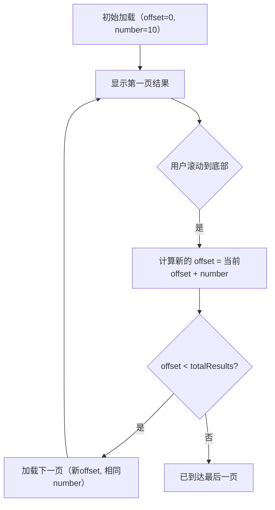

# SearchRecipesResponse.kt 文件分析报告

## 文件基本信息

- **文件名称**：SearchRecipesResponse.kt
- **文件路径**：app/src/main/java/com/kodeco/recipefinder/data/models/SearchRecipesResponse.kt
- **主要功能**：定义搜索食谱 API 的响应数据模型，包含分页信息和食谱列表
- **技术要点**：Kotlin 数据类、JSON 序列化、字段别名映射
- **Android 基础概念**：API 响应模型、JSON 映射、分页数据结构
- **与已知技术栈对比**：
  - iOS/Swift：类似于 Swift 中的 Codable 结构体
  - Flutter/Dart：类似于 Dart 中的 JSON 模型类
  - 前端框架：类似于 TypeScript 接口或 React/Vue 中的状态模型

## 语法元素分析

### 语法元素概览

- **包声明**：`package com.kodeco.recipefinder.data.models`
- **导入声明**：
  - `import com.squareup.moshi.Json`
  - `import com.squareup.moshi.JsonClass`
- **元素统计**：

  | 元素类型 | 数量 | 备注 |
  |---|---|---|
  | 类      | 1    | 包括 1 个数据类 |
  | 接口    | 0    | 无接口定义 |
  | 对象    | 0    | 无对象定义 |
  | 函数    | 0    | 无函数定义 |
  | 扩展函数 | 0    | 无扩展函数 |
  | 属性    | 4    | 数据类的属性 |

### 类与接口分析

#### SearchRecipesResponse 类

- **类/接口名称**：SearchRecipesResponse
- **类型**：数据类（data class）
- **职责描述**：表示食谱搜索 API 的响应结果，包含分页信息和食谱列表
- **Kotlin 语法特点**：
  - 使用 `data class` 关键字定义，自动生成 equals()、hashCode()、toString() 等方法
  - 使用 `@Json` 注解进行 JSON 字段名映射
  - 使用列表类型表示多个食谱对象
- **与其他语言对比**：
  - Swift：类似于 Swift 中的结构体和 Codable 协议，但 Kotlin 数据类是引用类型
  - Dart：类似于 Dart 中的类和 JSON 序列化，但更简洁
  - Java：比 Java 模型类更简洁，减少样板代码
  - JavaScript：比 JS 对象有更严格的类型检查
- **属性分析**：
  
  | 属性名 | 类型 | 可见性 | 用途 |
  |----|---|----|---|
  | offset | Int | public | 当前结果的偏移量，用于分页 |
  | number | Int | public | 当前返回的结果数量 |
  | totalResults | Int | public | 符合搜索条件的总结果数 |
  | recipes | List\<Recipe\> | public | 食谱列表，JSON 字段名为 "results" |

- **类 UML 图**：
  
  ```mermaid
  classDiagram
      SearchRecipesResponse o-- Recipe : contains
      
      class SearchRecipesResponse {
          +offset: Int
          +number: Int
          +totalResults: Int
          +recipes: List~Recipe~
      }
      
      class Recipe {
          +id: Int
          +title: String
          +image: String?
      }
  ```

- **注解分析**：
  - `@JsonClass(generateAdapter = true)`：Moshi 库的注解，指示编译时生成 JSON 适配器
  - `@Json(name = "results")`：Moshi 库的注解，指定 JSON 中字段名为 "results"，但在 Kotlin 代码中使用 "recipes" 属性名

- **关系分析**：
  - 与 Recipe 类形成组合关系，一个 SearchRecipesResponse 包含多个 Recipe
  - 该类表示分页结果集，包含用于分页的元数据（offset、number、totalResults）和实际数据（recipes）

## Kotlin 语法分析

### Kotlin 特性与语法

- **数据类**：使用 `data class` 关键字定义
  - 自动生成 equals()、hashCode()、toString()、copy() 等方法
  - 提供解构声明功能
  - 与 Swift 结构体对比：功能相似但实现不同
  - 与 TypeScript 接口对比：Kotlin 数据类既定义结构又提供功能
- **注解**：使用 `@Json` 注解进行字段重命名
  - 允许 API 返回的 JSON 字段名与代码中的属性名不同
  - 类似于 Swift Codable 中的 `CodingKeys`
  - 类似于 Dart json_serializable 中的 `@JsonKey`
- **集合类型**：使用 `List<Recipe>` 表示食谱列表
  - Kotlin 默认使用不可变集合，提升代码安全性
  - 与 Swift 数组类似，但 Swift 使用 `[Recipe]` 语法
  - 与 Dart 列表相同，都使用 `List<T>` 泛型语法

### API 使用分析

- **重要 API**：

  | API 名称 | 用途 | 文档链接 | 类似 iOS/Flutter API |
  |---|---|---|---|
  | Moshi JsonClass   | JSON 序列化/反序列化注解 | [链接](mdc:https:/github.com/square/moshi) | iOS 的 Codable 协议 / Flutter 的 json_serializable |
  | Moshi Json        | JSON 字段名映射注解 | [链接](mdc:https:/github.com/square/moshi) | iOS 的 CodingKeys / Flutter 的 @JsonKey |
  | Kotlin List       | 表示不可变列表集合 | [链接](mdc:https:/kotlinlang.org/api/latest/jvm/stdlib/kotlin.collections/-list/) | Swift 的 Array / Dart 的 List |

## 注意事项与最佳实践

- **优点**：
  - 使用数据类简化模型定义
  - 使用 `@Json` 注解处理 API 字段名与代码属性名不一致的情况
  - 使用有意义的属性名（recipes 比 results 更明确表示内容）
  - 清晰表示分页结构
- **改进空间**：
  - 可考虑添加文档注释说明分页参数的具体用途
  - 可考虑添加扩展函数用于分页计算，如 hasNextPage() 等
  - 可考虑为属性添加类型约束或验证
- **初学者指南**：
  - 了解 API 响应模型通常需要与后端 API 结构严格匹配
  - 注意 JSON 字段映射可以解决命名不一致问题
  - 对于 iOS 开发者：类比 Swift 的 Codable 协议和 CodingKeys 枚举
  - 对于 Flutter 开发者：类比 Dart 的 json_serializable 和 @JsonKey 注解
- **风险点**：
  - API 结构变化需要同步更新模型
  - 需注意分页参数的正确使用

## 分页结构和实现

SearchRecipesResponse 实现了典型的分页响应结构：

- **offset**：从第几个结果开始（类似于 SQL 中的 OFFSET）
- **number**：返回多少个结果（类似于 SQL 中的 LIMIT）
- **totalResults**：总共有多少结果（用于计算总页数）

使用这些字段可以实现以下分页功能：



## 与相关类的关系分析

- **与 Recipe 类的关系**：
  - SearchRecipesResponse 包含多个 Recipe 对象，形成组合关系
  - Recipe 作为列表项模型，提供搜索结果中每个食谱的基本信息
- **与 RecipeInformationResponse 的关系**：
  - 间接关系：SearchRecipesResponse 返回简化的 Recipe 对象列表
  - 用户选择特定 Recipe 后，可能需要使用其 id 获取 RecipeInformationResponse 获取详细信息

## 跨平台开发考虑

- **Flutter**：可使用 Dart 类和 json_serializable 包实现类似功能

  ```dart
  class SearchRecipesResponse {
    final int offset;
    final int number;
    final int totalResults;
    @JsonKey(name: 'results')
    final List<Recipe> recipes;
    
    SearchRecipesResponse({
      required this.offset,
      required this.number,
      required this.totalResults,
      required this.recipes
    });
    
    factory SearchRecipesResponse.fromJson(Map<String, dynamic> json) => 
      _$SearchRecipesResponseFromJson(json);
  }
  ```

- **iOS/Swift**：可使用 Swift 结构体和 Codable 协议实现类似功能

  ```swift
  struct SearchRecipesResponse: Codable {
    let offset: Int
    let number: Int
    let totalResults: Int
    let recipes: [Recipe]
    
    enum CodingKeys: String, CodingKey {
      case offset
      case number
      case totalResults
      case recipes = "results"
    }
  }
  ```

- **React/TypeScript**：可使用 TypeScript 接口实现类似定义

  ```typescript
  interface SearchRecipesResponse {
    offset: number;
    number: number;
    totalResults: number;
    recipes: Recipe[]; // 在运行时映射 'results' 字段
  }
  
  // 使用示例
  const mapResponse = (data: any): SearchRecipesResponse => {
    return {
      offset: data.offset,
      number: data.number,
      totalResults: data.totalResults,
      recipes: data.results
    };
  };
  ```
