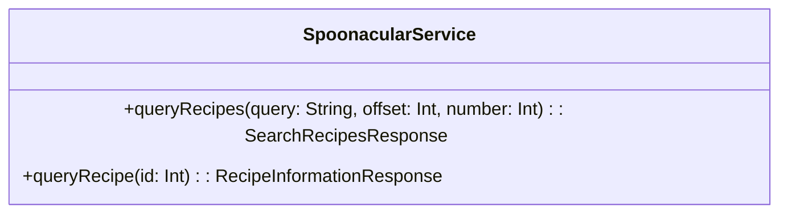
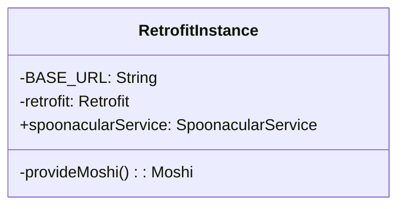
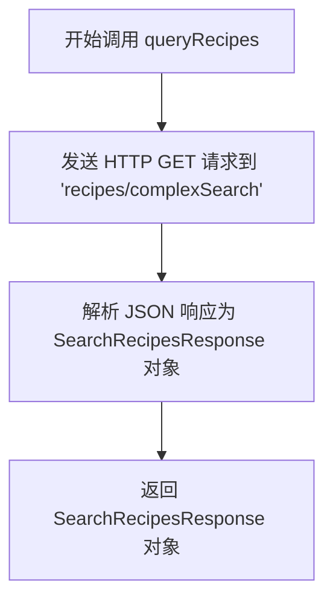
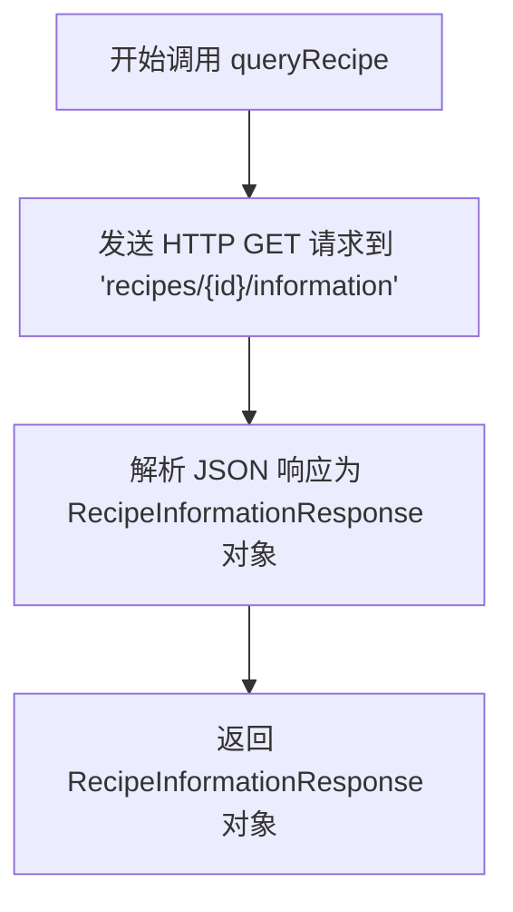
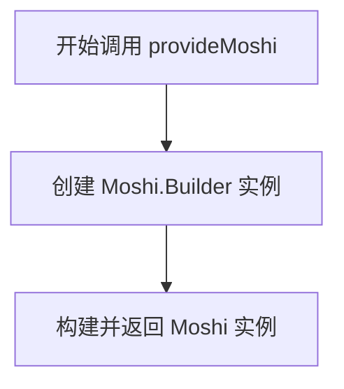

# SpoonacularService.kt 文件分析

## 文件基本信息

- **文件名称**：SpoonacularService.kt
- **文件路径**：app/src/main/java/com/kodeco/recipefinder/network/SpoonacularService.kt
- **主要功能**：定义了与 Spoonacular 食谱 API 交互的网络服务接口和 Retrofit 配置
- **技术要点**：Retrofit、协程、Moshi JSON 解析
- **Android 基础概念**：网络请求、API 服务接口、单例模式
- **与已知技术栈对比**：
  - iOS：类似 Alamofire + Codable
  - Flutter：类似 Dio + json_serializable
  - 前端：类似 Axios + TypeScript 接口

## 语法元素分析

### 语法元素概览

- **包声明**：`com.kodeco.recipefinder.network`，使用了标准 Android 应用的包命名规范
- **导入声明**：数据模型、Retrofit 和 Moshi 相关库以及协程支持

| 元素类型 | 数量 | 备注 |
|---------|-----|------|
| 类      | 0   | 无普通类声明 |
| 接口    | 1   | SpoonacularService 接口 |
| 对象    | 1   | RetrofitInstance 单例对象 |
| 函数    | 4   | 包括 2 个接口方法和 2 个对象内方法 |
| 扩展函数 | 0   | 无扩展函数 |
| 属性    | 3   | 1 个顶层常量，2 个对象内属性 |

### 类与接口分析

#### SpoonacularService 接口

- **接口名称**：SpoonacularService
- **类型**：接口
- **职责描述**：定义与 Spoonacular API 交互的请求方法
- **Kotlin 语法特点**：使用挂起函数（suspend）支持协程，函数参数默认值
- **与其他语言对比**：
  - Swift：类似 Protocol 结合 async/await
  - Dart：类似 abstract class 结合 Future
  - JavaScript：类似 async 函数的接口

- **方法分析**：

| 方法名 | 参数 | 返回类型 | 用途 |
|-------|------|---------|-----|
| queryRecipes | query: String, offset: Int, number: Int = PAGE_SIZE | SearchRecipesResponse | 根据搜索词获取食谱列表 |
| queryRecipe | id: Int | RecipeInformationResponse | 根据 ID 获取单个食谱详情 |

- **UML 类图**：

- **依赖关系**：依赖 RecipeInformationResponse 和 SearchRecipesResponse 数据模型类
- **与 Java 对比**：Java 中需要使用 Future 或回调，而不是 suspend 函数
- **与 Swift 对比**：Swift 中使用 async 函数，可用 protocol 定义接口
- **与 Dart/Flutter 对比**：Dart 中使用 Future 返回类型，类似于 JavaScript Promise

#### RetrofitInstance 对象

- **对象名称**：RetrofitInstance
- **类型**：单例对象（object 关键字）
- **职责描述**：创建和配置 Retrofit 实例，提供 SpoonacularService 接口实现
- **Kotlin 语法特点**：使用 object 关键字实现单例模式，使用 by lazy 实现延迟初始化
- **与其他语言对比**：
  - Swift：类似使用 static let 静态属性的单例
  - Java：传统单例需要写更多样板代码
  - Dart：类似 factory 构造函数实现的单例

- **属性分析**：

| 属性名 | 类型 | 可见性 | 用途 |
|--------|------|-------|-----|
| BASE_URL | String | private | 指定 API 的基础 URL |
| retrofit | Retrofit | private | 存储 Retrofit 实例 |
| spoonacularService | SpoonacularService | public | 提供服务接口实现 |

- **方法分析**：

| 方法名 | 参数 | 返回类型 | 用途 |
|-------|------|---------|-----|
| provideMoshi | 无 | Moshi | 创建 Moshi JSON 解析器实例 |

- **UML 类图**：

### 函数分析

#### queryRecipes 函数

- **函数名称**：queryRecipes
- **函数签名**：`suspend fun queryRecipes(@Query("query") query: String, @Query("offset") offset: Int, @Query("number") number: Int = PAGE_SIZE): SearchRecipesResponse`
- **函数职责**：向 Spoonacular API 发送请求获取食谱列表
- **参数分析**：
  - query：搜索关键词
  - offset：结果集偏移量，用于分页
  - number：每页显示数量，默认使用 PAGE_SIZE (20)
- **返回值分析**：返回 SearchRecipesResponse 对象，包含食谱列表和总结果数
- **函数流程图**：

- **调用关系**：被 RecipeViewModel.queryRecipes() 方法调用
- **边界条件**：网络连接失败时会抛出异常，需要调用者处理
- **复杂度分析**：时间复杂度 O(1)，取决于网络请求的响应时间
- **Kotlin 特有语法**：
  - suspend 关键字标记协程挂起函数
  - 使用 @Query 注解标记 URL 查询参数
  - 参数默认值的使用

#### queryRecipe 函数

- **函数名称**：queryRecipe
- **函数签名**：`suspend fun queryRecipe(@Path("id") id: Int): RecipeInformationResponse`
- **函数职责**：获取指定 ID 的食谱详细信息
- **参数分析**：
  - id：食谱的唯一标识符
- **返回值分析**：返回 RecipeInformationResponse 对象，包含食谱的详细信息
- **函数流程图**：

- **调用关系**：被 RecipeViewModel.queryRecipe() 方法调用
- **边界条件**：无效 ID 或网络连接失败时会抛出异常
- **复杂度分析**：时间复杂度 O(1)，取决于网络请求的响应时间
- **Kotlin 特有语法**：
  - suspend 关键字标记协程挂起函数
  - 使用 @Path 注解标记 URL 路径参数

#### provideMoshi 函数

- **函数名称**：provideMoshi
- **函数签名**：`private fun provideMoshi(): Moshi`
- **函数职责**：创建和配置 Moshi JSON 解析器实例
- **参数分析**：无参数
- **返回值分析**：返回配置好的 Moshi 实例，用于 JSON 序列化和反序列化
- **函数流程图**：

- **调用关系**：仅在 RetrofitInstance 对象内部使用
- **复杂度分析**：时间复杂度 O(1)，简单创建对象
- **Kotlin 特有语法**：使用 builder 模式链式调用

### 全局变量与常量分析

- **变量/常量名**：apiKey
- **类型**：String
- **作用域**：包级别常量
- **用途**：存储 Spoonacular API 的授权密钥
- **初始化**：直接硬编码字符串值
- **使用方式**：在 SpoonacularService 接口的 GET 注解中作为查询参数
- **与其他语言对比**：
  - Swift 中会用 let 声明常量
  - JavaScript 中使用 const 声明常量
  - Java 中使用 static final 声明常量

### Kotlin 语法分析

#### 空安全特性

- 本文件中未显式使用空安全特性，但数据模型类如 RecipeInformationResponse 中的某些属性（如 image、instructions）使用了可空类型（String?）
- 与 Swift 的 Optional 对比：类似 Swift 中的 String? 可选类型
- 与 Dart 的空安全对比：Kotlin 的 ? 语法与 Dart 中的可空类型声明相似

#### 函数式编程特性

- 使用 by lazy 委托属性实现懒加载，体现了函数式编程特性
- 与 Swift 中 lazy 属性类似，但 Kotlin 通过委托实现更加灵活

#### 协程与异步

- 使用 suspend 关键字标记挂起函数，支持协程异步调用
- 与 Swift 的 async/await 对比：概念类似，但语法和实现机制不同
- 与 JavaScript Promise/async/await 对比：概念类似，但协程提供更强大的上下文管理

#### 智能类型转换

- 本文件中未使用智能类型转换

#### 数据类与密封类

- 本文件未直接定义数据类，但依赖了其他文件中的数据类 (RecipeInformationResponse, SearchRecipesResponse)

#### 委托属性

- 使用 by lazy 实现属性的懒加载，避免不必要的初始化开销
- 例如：`private val retrofit: Retrofit by lazy { ... }`

### API 使用分析

#### 重要 API

| API 名称 | 用途 | 文档链接 | 类似 iOS/Flutter API |
|---------|------|---------|---------------------|
| Retrofit | 类型安全的 HTTP 客户端 | [链接](mdc:https:/square.github.io/retrofit/) | iOS 中的 Alamofire / Flutter 中的 Dio |
| Moshi | JSON 解析库 | [链接](mdc:https:/github.com/square/moshi) | iOS 中的 Codable / Flutter 中的 json_serializable |
| Kotlin Coroutines | 异步编程框架 | [链接](mdc:https:/kotlinlang.org/docs/coroutines-overview.html) | iOS 中的 Swift Concurrency / Flutter 中的 async-await |

#### 第三方库

- **Retrofit**：用于定义和实现 REST API 客户端，由 Square 开发
  - 与 iOS 中 Alamofire 类似，但更加类型安全，与编译时代码生成结合更紧密
  - 在 Flutter 中，Dio 或 http 包提供类似功能，但缺少同样强大的注解驱动能力
- **Moshi**：JSON 解析库，也由 Square 开发
  - 与 iOS 中的 Codable 协议类似，但更灵活
  - 在 Flutter 中，json_serializable 提供类似功能

#### Android 框架 API

- **Spoonacular API**：本文件中使用的外部 Web API，用于获取食谱数据
  - 在 iOS/Flutter 中也可以使用相同的 API，只是客户端实现框架不同

### 注意事项与最佳实践

#### 优点

1. **接口定义清晰**：使用 Retrofit 接口定义 API 服务，代码简洁明了
2. **使用协程**：通过 suspend 关键字支持协程，避免回调地狱
3. **单例设计**：使用 Kotlin object 实现单例，代码简洁优雅
4. **懒加载**：使用 by lazy 实现属性的惰性初始化，提高性能

#### 改进空间

1. **API 密钥硬编码**：API 密钥直接硬编码在代码中是一种安全风险，应该放在安全的配置中
2. **缺少网络层抽象**：没有对网络层进行抽象，可能导致测试和模块切换困难
3. **错误处理**：缺少统一的错误处理机制，异常处理完全依赖调用者
4. **缺少网络状态检查**：没有检查网络连接状态的机制
5. **缺少请求拦截器**：没有添加请求拦截器用于日志记录或认证令牌刷新

#### 风险点

1. **API 限流问题**：没有处理 API 限流或请求频率限制
2. **异常处理不完善**：网络异常需要在调用处正确捕获和处理
3. **密钥泄露风险**：API 密钥硬编码在代码中可能导致泄露

#### 初学者指南

对于 Android 初学者，建议学习以下内容：

1. **Retrofit 基础**：了解 Retrofit 如何通过接口定义 API 客户端
2. **Kotlin 协程**：学习协程的基本概念和使用方法
3. **Moshi JSON 解析**：了解如何使用 Moshi 进行 JSON 序列化和反序列化
4. **单例设计模式**：理解 Kotlin object 如何简化单例实现

针对有 iOS/Flutter 背景的开发者：

- iOS 开发者：可以将 Retrofit+Moshi 与 Alamofire+Codable 对比学习
- Flutter 开发者：可以将 Kotlin 协程与 Dart async/await 机制对比理解

#### 替代方案

1. **KTor**：可以使用 KTor 代替 Retrofit，它是 Kotlin 官方的 HTTP 客户端，与协程集成更好
2. **LiveData/Flow**：可以将网络请求结果包装在 LiveData 或 Flow 中以支持响应式编程
3. **依赖注入**：使用 Hilt 或 Koin 进行依赖注入，替代手动创建的单例
4. **配置安全存储**：使用 BuildConfig 或 PropertiesFile 存储 API 密钥，提高安全性

#### 跨平台开发考虑

1. **共享网络模型**：使用 Kotlin Multiplatform 可以在 iOS 和 Android 之间共享网络层模型
2. **统一 API 接口**：在跨平台框架中定义统一的 API 接口抽象
3. **统一错误处理**：实现跨平台的错误处理机制
4. **安全配置管理**：跨平台项目中应统一管理 API 密钥和配置
