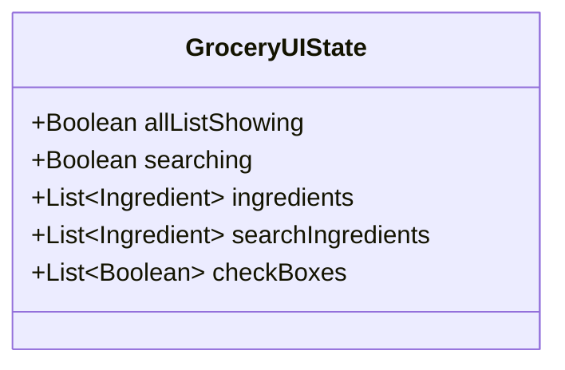
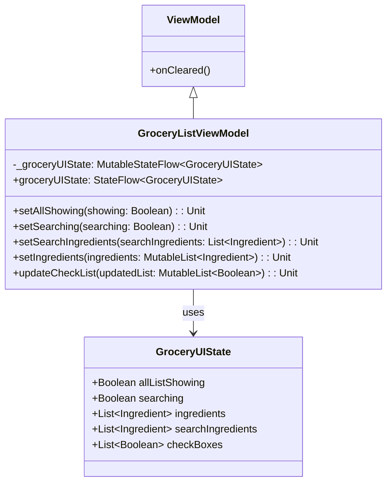
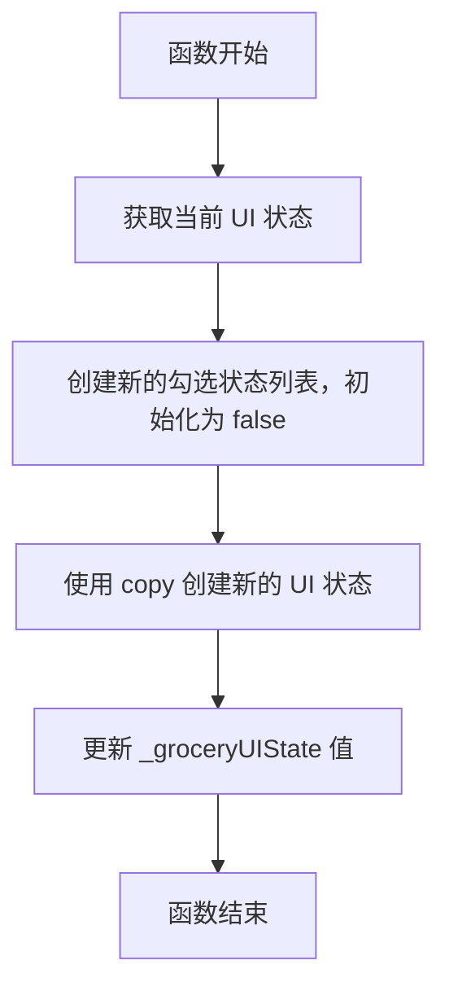

# GroceryListViewModel.kt 文件分析

## 文件基本信息

- **文件名称**：GroceryListViewModel.kt
- **文件路径**：app/src/main/java/com/kodeco/recipefinder/viewmodels/GroceryListViewModel.kt
- **主要功能**：管理食材购物清单的状态和操作逻辑
- **技术要点**：ViewModel、Kotlin Flow、状态管理、不可变数据模型
- **Android 基础概念**：MVVM 架构模式、状态流（StateFlow）、可观察数据
- **与已知技术栈对比**：
  - iOS：类似 SwiftUI 中的 ObservableObject/StateObject
  - Flutter：类似 ChangeNotifier/ValueNotifier 或 BLoC 模式
  - 前端：类似 React 中的 useState/useReducer 或 Vue 中的响应式数据

## 语法元素分析

### 语法元素概览

- **包声明**：`com.kodeco.recipefinder.viewmodels`，使用标准 Android 包命名规范
- **导入声明**：导入了 Android ViewModel、数据模型和 Kotlin 协程流相关库

| 元素类型 | 数量 | 备注 |
|---------|-----|------|
| 类      | 2   | 包括 GroceryListViewModel 类和 GroceryUIState 数据类 |
| 接口    | 0   | 无接口定义 |
| 对象    | 0   | 无单例对象 |
| 函数    | 5   | 全部为类内方法 |
| 扩展函数 | 0   | 无扩展函数 |
| 属性    | 2   | 类内属性 |

### 类与接口分析

#### GroceryUIState 数据类

- **类名称**：GroceryUIState
- **类型**：数据类（data class）
- **职责描述**：表示购物清单 UI 的状态数据
- **Kotlin 语法特点**：使用数据类自动生成 equals()、hashCode()、toString() 等方法，参数默认值
- **与其他语言对比**：
  - Swift：类似 struct 结构体，但 Swift 结构体是值类型
  - Dart/Flutter：类似 Dart 的不可变类，通常用 freezed 包实现
  - JavaScript/TypeScript：类似接口（interface）或具有默认值的对象

- **属性分析**：

| 属性名 | 类型 | 可见性 | 用途 |
|--------|------|-------|------|
| allListShowing | Boolean | public | 控制是否显示所有清单项 |
| searching | Boolean | public | 标识是否处于搜索状态 |
| ingredients | List<Ingredient> | public | 存储所有食材列表 |
| searchIngredients | List<Ingredient> | public | 存储搜索结果食材列表 |
| checkBoxes | List<Boolean> | public | 跟踪每个食材项的选中状态 |

- **UML 类图**：

#### GroceryListViewModel 类

- **类名称**：GroceryListViewModel
- **类型**：普通类，继承 ViewModel
- **职责描述**：管理购物清单的数据和业务逻辑，提供状态更新的方法
- **Kotlin 语法特点**：使用 StateFlow 实现响应式数据流，使用不可变状态模式
- **与其他语言对比**：
  - Swift：类似结合 ObservableObject 的类
  - Flutter：类似 ChangeNotifier 或 BLoC 实现
  - JavaScript/React：类似结合 Redux 的组件

- **属性分析**：

| 属性名 | 类型 | 可见性 | 用途 |
|--------|------|-------|------|
| _groceryUIState | MutableStateFlow<GroceryUIState> | private | 可变状态流，内部使用 |
| groceryUIState | StateFlow<GroceryUIState> | public | 不可变状态流，对外暴露 |

- **方法分析**：

| 方法名 | 参数 | 返回类型 | 用途 |
|--------|------|---------|------|
| setAllShowing | showing: Boolean | Unit | 更新是否显示所有列表项的状态 |
| setSearching | searching: Boolean | Unit | 更新搜索状态 |
| setSearchIngredients | searchIngredients: List<Ingredient> | Unit | 更新搜索结果食材列表 |
| setIngredients | ingredients: MutableList<Ingredient> | Unit | 更新主食材列表并初始化选中状态 |
| updateCheckList | updatedList: MutableList<Boolean> | Unit | 更新食材项的选中状态列表 |

- **UML 类图**：

- **继承关系**：继承自 Android 架构组件的 ViewModel 类
- **依赖关系**：依赖 Ingredient 数据模型
- **与 Java 对比**：Java 实现需要更多样板代码，不支持数据类和默认参数
- **与 Swift 对比**：Swift 中可能使用 @Published 属性结合 ObservableObject
- **与 Dart/Flutter 对比**：Flutter 中可能使用 StreamController 或 ValueNotifier

### 函数分析

#### setIngredients 函数

- **函数名称**：setIngredients
- **函数签名**：`fun setIngredients(ingredients: MutableList<Ingredient>): Unit`
- **函数职责**：更新食材列表并初始化对应的勾选状态
- **参数分析**：
  - ingredients：可变食材列表，包含要显示的所有食材
- **返回值分析**：无返回值（Unit）
- **函数流程图**：

- **调用关系**：被 UI 层调用，用于初始化或更新食材列表
- **边界条件**：如果传入空列表，会创建空的勾选状态列表
- **复杂度分析**：时间复杂度 O(n)，空间复杂度 O(n)，其中 n 为食材列表长度
- **Kotlin 特有语法**：使用数据类的 copy 方法实现不可变状态模式
- **与其他语言的函数对比**：
  - Swift：类似 mutating 函数更新状态
  - JavaScript：类似 React 中 useState 的 setter 函数

### Kotlin 语法分析

**Kotlin 特性与语法**：

- **不可变状态管理**：使用数据类的 copy 方法创建新状态，而不是直接修改现有状态
  - 与 JavaScript 中 React 的不可变状态更新类似
  - 与 SwiftUI 中的状态更新模式类似
- **数据类**：使用 data class 自动生成 equals、hashCode、toString 和 copy 方法
  - 与 Swift 结构体类似但更为强大
  - 与 TypeScript 中的接口+实现类模式类似
- **StateFlow**：使用 Kotlin 协程流实现响应式编程
  - 与 Swift Combine 的 CurrentValueSubject 类似
  - 与 RxJava 的 BehaviorSubject 类似
  - 与 JavaScript 的 Observable 模式类似
- **默认参数值**：GroceryUIState 的所有属性都有默认值，使实例化更简洁
  - 与 JavaScript 的默认参数和解构类似
  - 与 Swift 的默认参数类似

### API 使用分析

- **重要 API**：

| API 名称 | 用途 | 文档链接 | 类似 iOS/Flutter API |
|---------|------|---------|----------------------|
| ViewModel | Android 架构组件，生命周期感知的数据持有者 | [链接](mdc:https:/developer.android.com/topic/libraries/architecture/viewmodel) | SwiftUI 的 StateObject / Flutter 的 ChangeNotifier |
| StateFlow | Kotlin 响应式流 API，类似于可观察的状态容器 | [链接](mdc:https:/kotlin.github.io/kotlinx.coroutines/kotlinx-coroutines-core/kotlinx.coroutines.flow/-state-flow/) | Swift Combine 的 CurrentValueSubject / Flutter 的 StreamController |
| MutableStateFlow | StateFlow 的可变版本 | [链接](mdc:https:/kotlin.github.io/kotlinx.coroutines/kotlinx-coroutines-core/kotlinx.coroutines.flow/-mutable-state-flow/) | Swift 的 @Published / Flutter 的 ValueNotifier |

### 注意事项与最佳实践

- **优点**：
  - 采用单一数据源原则，所有 UI 状态封装在一个数据类中
  - 使用不可变状态模式，通过 copy 方法创建新状态，减少副作用
  - 使用 StateFlow 实现响应式编程，支持状态变化的实时观察
  - 清晰的职责分离，ViewModel 只关注数据和业务逻辑，不涉及 UI 细节

- **改进空间**：
  - 缺少错误处理机制，例如处理边界情况或无效输入
  - 食材列表和勾选状态列表需保持一致性，可考虑合并为单一数据结构
  - 缺少注释说明各方法的用途和参数含义

- **风险点**：
  - 食材列表和勾选状态是分离的，如果不同步更新可能导致索引错误
  - 所有检查框状态使用单一列表管理，可能在大量数据时影响性能

- **初学者指南**：
  - 学习 Android MVVM 架构模式的基本概念
  - 理解 Kotlin 中的 StateFlow 和不可变状态管理
  - 熟悉 Kotlin 数据类的使用和优势
  - 建议资源：
    - 针对 iOS 开发者：关注 ViewModel 与 SwiftUI ObservableObject 的异同
    - 针对 Flutter 开发者：关注 StateFlow 与 StreamBuilder/BLoC 的异同

- **替代方案**：
  - 使用 LiveData 代替 StateFlow（较传统的 Android 方法）
  - 使用 Redux 或 MVI 架构实现不可变状态管理
  - 考虑使用 Room 数据库持久化储存清单项 