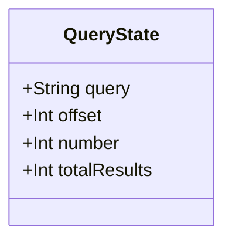
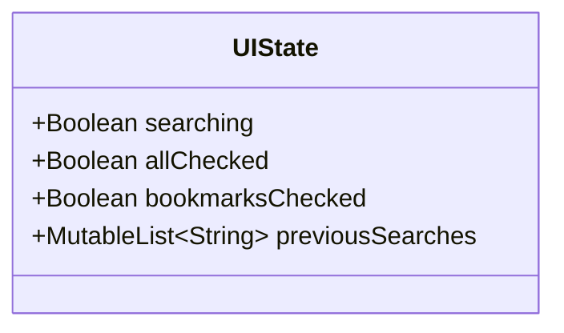
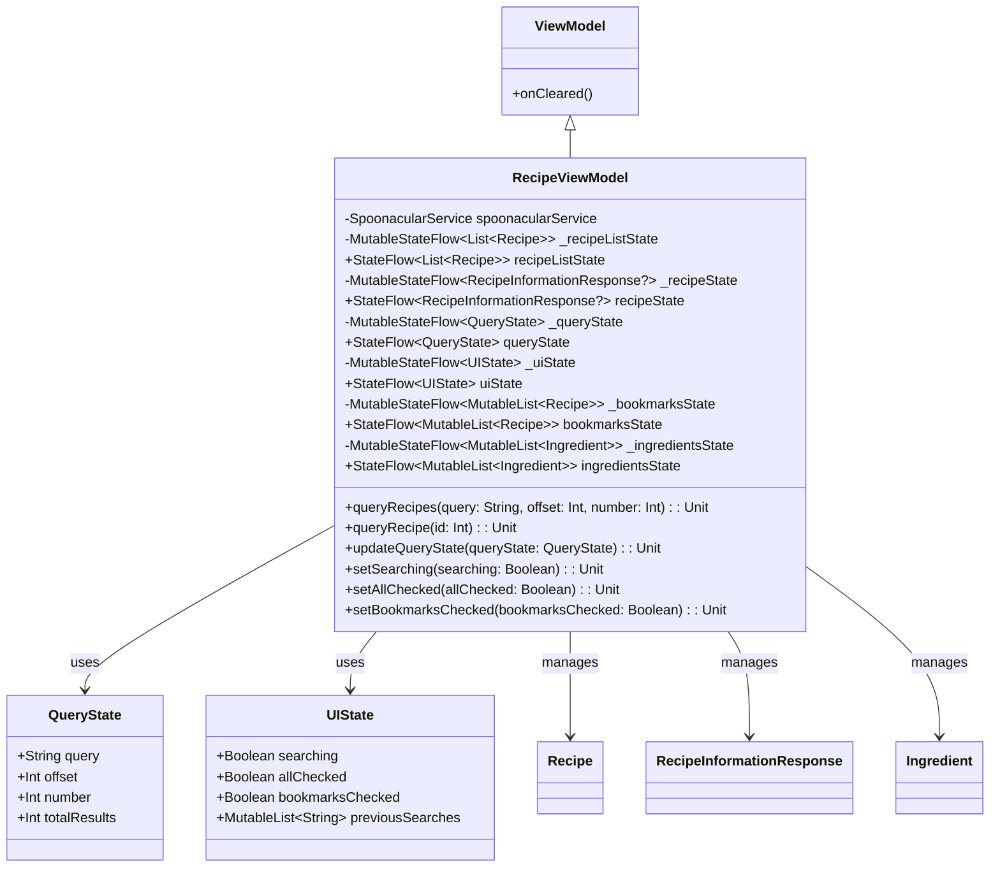
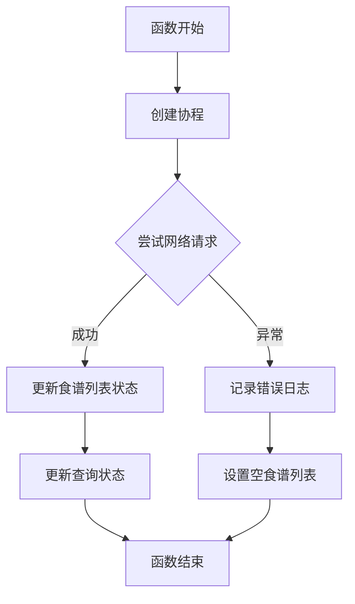
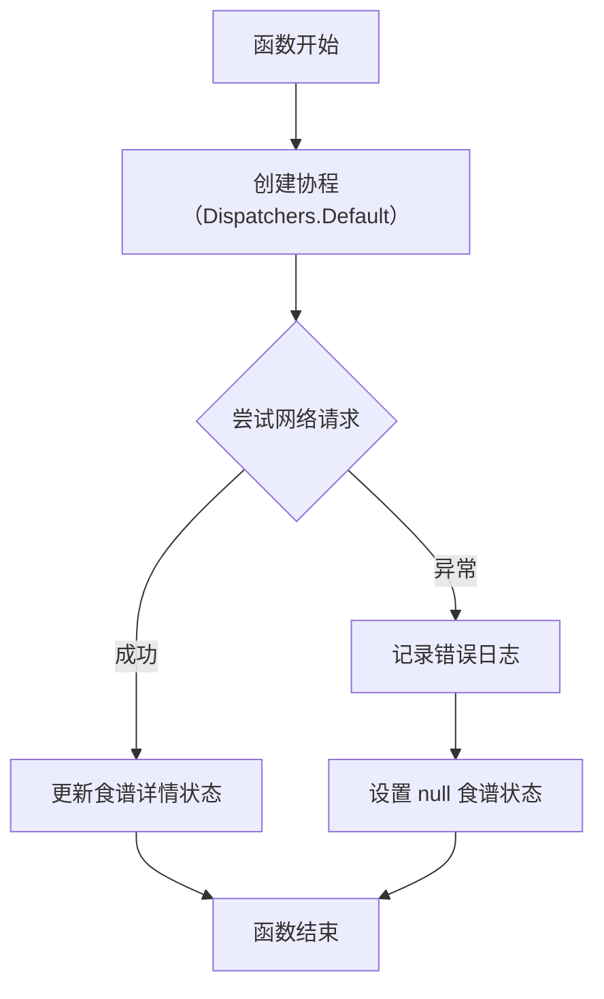

# RecipeViewModel.kt 文件分析

## 文件基本信息

- **文件名称**：RecipeViewModel.kt
- **文件路径**：app/src/main/java/com/kodeco/recipefinder/viewmodels/RecipeViewModel.kt
- **主要功能**：管理食谱应用的数据获取、存储和状态管理的核心视图模型
- **技术要点**：ViewModel、协程、Retrofit、状态管理、Kotlin Flow
- **Android 基础概念**：MVVM 架构模式、网络请求、状态流、视图模型生命周期
- **与已知技术栈对比**：
  - iOS：类似 SwiftUI/Combine 中的 ViewModel + URLSession
  - Flutter：类似 BLoC/Provider 模式 + Dio 网络库
  - 前端：类似 React 中的 Redux/Context + Axios

## 语法元素分析

### 语法元素概览

- **包声明**：`com.kodeco.recipefinder.viewmodels`，标准 Android 包命名规范
- **导入声明**：ViewModel、协程、网络、数据模型和日志相关库

| 元素类型 | 数量 | 备注 |
|---------|-----|------|
| 类      | 3   | RecipeViewModel 主类和 QueryState、UIState 数据类 |
| 接口    | 0   | 无接口定义 |
| 对象    | 0   | 无单例对象，但有 companion object |
| 函数    | 14  | 包括网络请求、状态更新、书签管理等 |
| 扩展函数 | 0   | 无扩展函数 |
| 属性    | 9   | 包括状态流和常量 |

### 类与接口分析

#### QueryState 数据类

- **类名称**：QueryState
- **类型**：数据类（data class）
- **职责描述**：封装食谱查询的相关参数和结果状态
- **Kotlin 语法特点**：使用数据类和参数默认值，自动生成 equals()、hashCode() 等方法
- **与其他语言对比**：
  - Swift：类似 struct 结构体
  - Dart：类似 immutable 类，常用 freezed 包实现
  - TypeScript：类似 interface 或 type 定义的对象

- **属性分析**：

| 属性名 | 类型 | 可见性 | 用途 |
|--------|------|-------|------|
| query | String | public | 存储当前搜索关键词 |
| offset | Int | public | 分页加载的偏移量 |
| number | Int | public | 每页加载的数量 |
| totalResults | Int | public | 搜索结果总数 |

- **UML 类图**：

#### UIState 数据类

- **类名称**：UIState
- **类型**：数据类（data class）
- **职责描述**：管理 UI 相关的状态信息
- **Kotlin 语法特点**：数据类、默认参数值、可变集合
- **与其他语言对比**：
  - Swift：类似 struct 结构体
  - React：类似组件的 state 对象

- **属性分析**：

| 属性名 | 类型 | 可见性 | 用途 |
|--------|------|-------|------|
| searching | Boolean | public | 标识是否处于搜索状态 |
| allChecked | Boolean | public | 是否选中"所有"选项 |
| bookmarksChecked | Boolean | public | 是否选中"书签"选项 |
| previousSearches | MutableList<String> | public | 存储历史搜索记录 |

- **UML 类图**：

#### RecipeViewModel 类

- **类名称**：RecipeViewModel
- **类型**：普通类，继承 ViewModel
- **职责描述**：管理食谱应用的数据和状态，处理网络请求、本地存储操作
- **Kotlin 语法特点**：使用协程、StateFlow、伴生对象、范型
- **与其他语言对比**：
  - Swift：类似结合 ObservableObject 的 ViewModel
  - Flutter：类似 ChangeNotifier 或 BLoC 模式
  - JavaScript：类似 React 的 Redux store

- **属性分析**：

| 属性名 | 类型 | 可见性 | 用途 |
|--------|------|-------|------|
| spoonacularService | SpoonacularService | private | 网络服务实例 |
| _recipeListState | MutableStateFlow<List<Recipe>> | private | 食谱列表状态流 |
| recipeListState | StateFlow<List<Recipe>> | public | 不可变食谱列表状态流 |
| _recipeState | MutableStateFlow<RecipeInformationResponse?> | private | 单个食谱详情状态流 |
| recipeState | StateFlow<RecipeInformationResponse?> | public | 不可变食谱详情状态流 |
| _queryState | MutableStateFlow<QueryState> | private | 查询参数状态流 |
| queryState | StateFlow<QueryState> | public | 不可变查询参数状态流 |
| _uiState | MutableStateFlow<UIState> | private | UI 状态流 |
| uiState | StateFlow<UIState> | public | 不可变 UI 状态流 |
| _bookmarksState | MutableStateFlow<MutableList<Recipe>> | private | 书签列表状态流 |
| bookmarksState | StateFlow<MutableList<Recipe>> | public | 不可变书签列表状态流 |
| _ingredientsState | MutableStateFlow<MutableList<Ingredient>> | private | 食材列表状态流 |
| ingredientsState | StateFlow<MutableList<Ingredient>> | public | 不可变食材列表状态流 |

- **方法分析**：

| 方法名 | 参数 | 返回类型 | 用途 |
|--------|------|---------|------|
| queryRecipes | query: String, offset: Int, number: Int | Unit | 查询食谱列表 |
| savePreviousSearches | 无 | Unit | 保存历史搜索记录（待实现） |
| queryRecipe | id: Int | Unit | 查询单个食谱详情 |
| getBookmarks | 无 | Unit | 获取书签列表（待实现） |
| getIngredients | 无 | Unit | 获取食材列表（待实现） |
| getBookmark | 无 | Unit | 获取单个书签（待实现） |
| bookmarkRecipe | 无 | Unit | 添加书签（待实现） |
| addPreviousSearch | searchString: String | Unit | 添加历史搜索（待实现） |
| updateQueryState | queryState: QueryState | Unit | 更新查询状态 |
| setSearching | searching: Boolean | Unit | 设置搜索状态 |
| setAllChecked | allChecked: Boolean | Unit | 设置"所有"选项状态 |
| setBookmarksChecked | bookmarksChecked: Boolean | Unit | 设置"书签"选项状态 |
| deleteBookmark (无参) | 无 | Unit | 删除书签（待实现） |
| deleteBookmark (带参) | recipeId: Int | Unit | 删除指定 ID 的书签（待实现） |

- **UML 类图**：

- **继承关系**：继承自 Android 架构组件的 ViewModel 类
- **依赖关系**：
  - 依赖 RetrofitInstance 获取网络服务
  - 依赖 Recipe、RecipeInformationResponse、Ingredient 等数据模型
  - 使用 Timber 进行日志记录
- **与 Java 对比**：Java 实现需要更多样板代码，不支持数据类和协程
- **与 Swift 对比**：Swift 中可能使用 Combine 框架结合 @Published 属性
- **与 Dart/Flutter 对比**：Flutter 中类似于 BLoC 模式，但 Dart 无协程原生支持

### 函数分析

#### queryRecipes 函数

- **函数名称**：queryRecipes
- **函数签名**：`fun queryRecipes(query: String, offset: Int, number: Int = PAGE_SIZE): Unit`
- **函数职责**：调用网络 API 获取食谱列表并更新状态
- **参数分析**：
  - query：搜索关键词
  - offset：分页起始位置
  - number：每页数量，默认为 PAGE_SIZE (20)
- **返回值分析**：无返回值（Unit）
- **函数流程图**：

- **调用关系**：由 UI 层调用，触发网络请求并更新 UI 状态
- **边界条件**：处理网络请求异常，设置空列表避免 UI 错误
- **复杂度分析**：时间复杂度取决于网络请求，本地操作为 O(1)
- **Kotlin 特有语法**：
  - 使用 viewModelScope.launch 启动协程
  - 使用 try-catch 进行异常处理
  - 使用默认参数值简化函数调用
- **与其他语言的函数对比**：
  - Swift：类似使用 async/await 或 Combine
  - JavaScript：类似使用 async/await 结合 Promise

#### queryRecipe 函数

- **函数名称**：queryRecipe
- **函数签名**：`suspend fun queryRecipe(id: Int): Unit`
- **函数职责**：获取单个食谱的详细信息
- **参数分析**：
  - id：要查询的食谱 ID
- **返回值分析**：无返回值（Unit）
- **函数流程图**：

- **调用关系**：在用户查看食谱详情时由 UI 层调用
- **边界条件**：处理网络异常，将状态设为 null
- **复杂度分析**：时间复杂度取决于网络请求，本地操作为 O(1)
- **Kotlin 特有语法**：
  - 使用 suspend 标记挂起函数
  - 使用 viewModelScope.launch(Dispatchers.Default) 在默认调度器上启动协程
  - 使用插值字符串 `$id` 构建日志消息
- **与其他语言的函数对比**：
  - Swift：类似使用 async 函数
  - JavaScript：类似 async/await 异步函数

### Kotlin 语法分析

**Kotlin 特性与语法**：

- **协程**：使用 viewModelScope.launch 启动协程处理异步操作
  - 与 Swift 的 async/await 机制类似
  - 与 JavaScript 的 Promise 和 async/await 类似
  - 比 Dart 的 Future/async 提供更丰富的上下文控制
- **StateFlow**：使用不可变状态流进行响应式编程
  - 与 Swift Combine 的 CurrentValueSubject 类似
  - 与 RxJava 的 BehaviorSubject 类似
  - 与 React 的 state hooks 理念类似
- **数据类**：使用 data class 简化模型类定义
  - 自动生成 equals()、hashCode()、toString() 等方法
  - 提供 copy() 方法支持不可变数据模式
  - 与 Swift 结构体和 Dart 中的 freezed 类似
- **空安全特性**：使用可空类型（RecipeInformationResponse?）
  - 与 Swift 的 Optional 类似
  - 与 Dart 的可空类型类似
  - 比 JavaScript 的 null/undefined 处理更严格
- **伴生对象**：使用 companion object 定义类级别常量
  - 与 Swift 的 static 属性类似
  - 与 Java 的静态字段类似
- **默认参数值**：多个函数使用默认参数简化调用
  - 与 Swift 的默认参数相似
  - 比 Java 更简洁（Java 需要重载）

### API 使用分析

- **重要 API**：

| API 名称 | 用途 | 文档链接 | 类似 iOS/Flutter API |
|---------|------|---------|----------------------|
| ViewModel | Android 架构组件，生命周期感知的数据持有者 | [链接](mdc:https:/developer.android.com/topic/libraries/architecture/viewmodel) | SwiftUI 的 StateObject / Flutter 的 ChangeNotifier |
| StateFlow | Kotlin 响应式流 API，持有状态并通知观察者 | [链接](mdc:https:/kotlin.github.io/kotlinx.coroutines/kotlinx-coroutines-core/kotlinx.coroutines.flow/-state-flow/) | Swift Combine 的 CurrentValueSubject / Flutter 的 StreamController |
| viewModelScope | ViewModel 专用协程作用域，自动跟随生命周期 | [链接](mdc:https:/developer.android.com/topic/libraries/architecture/coroutines#viewmodelscope) | Swift 的 Task（带取消） / Flutter 中需手动管理 |
| Retrofit | 类型安全的 HTTP 客户端 | [链接](mdc:https:/square.github.io/retrofit/) | iOS 的 Alamofire / Flutter 的 Dio |
| Timber | 日志工具 | [链接](mdc:https:/github.com/JakeWharton/timber) | iOS 的 os.log / Flutter 的 logger 包 |

- **第三方库**：
  - Retrofit：用于网络请求
  - Timber：用于日志记录
  - 与 iOS 的 Alamofire/CocoaLumberjack 类似
  - 与 Flutter 的 Dio/logger 类似

### 注意事项与最佳实践

- **优点**：
  - 使用 StateFlow 实现单向数据流和反应式 UI
  - 使用协程简化异步操作，易于阅读和维护
  - 采用数据类封装状态，保持不可变性
  - 明确的状态分离，便于调试和测试
  - 统一的错误处理和日志记录

- **改进空间**：
  - 多个 TODO 标记的函数需要实现完成
  - 缺少依赖注入，spoonacularService 直接从单例获取
  - 网络请求和数据处理混合在一起，可考虑引入 Repository 模式
  - 缺少缓存机制，可能导致频繁网络请求

- **风险点**：
  - API 密钥直接硬编码在代码中（在 SpoonacularService.kt 中）
  - 网络请求异常处理简单，缺少重试机制
  - 过多的 TODO 项可能导致功能不完整

- **初学者指南**：
  - 学习 Android MVVM 架构模式
  - 了解 Kotlin 协程基础和 Flow API
  - 熟悉 ViewModel 的生命周期和作用域
  - 建议资源：
    - 针对 iOS 开发者：了解 ViewModel 与 SwiftUI 中 ObservableObject 的异同
    - 针对 Flutter 开发者：了解 StateFlow 与 StreamBuilder/BLoC 模式的异同

- **替代方案**：
  - 使用 LiveData 代替 StateFlow（传统 Android 做法）
  - 使用 MVI 架构结合 Redux 实现更严格的单向数据流
  - 考虑 DataStore 或 Room 数据库持久化存储历史搜索和书签
