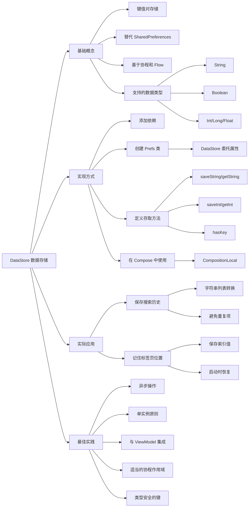

# DataStore 数据存储

## 文字摘要

### 核心概述

本文详细介绍了在 Android 应用中使用 DataStore 库保存和检索简单数据的方法。文章先介绍了 Android 传统的 SharedPreferences API 及其工作原理，然后重点讲解了更现代的 DataStore 库的使用方法，并通过一个实际的应用示例展示了如何保存搜索历史和当前选择的标签页。

### 关键技术点

- Android 中保存数据有三种主要方式：写入文件、使用库写入共享位置和使用 SQLite 数据库
- SharedPreferences 是 Android 传统的键值对存储 API，但已被弃用
- DataStore 是 Google 提供的现代键值对存储库，使用 Kotlin 的 Flow 和协程
- DataStore 支持存储简单的原始类型数据：String、Boolean、Int、Long 和 Float
- DataStore 使用委托属性和扩展函数在 Context 上创建实例
- 保存数据需要使用 suspend 函数和协程作用域，因为操作是异步的
- 使用 Compose 的 CompositionLocal 可以方便地在整个 UI 树中提供 DataStore 实例

### UI 示例

以下是创建和使用 Prefs 类来管理 DataStore 的完整示例：

```kotlin
import android.content.Context
import androidx.datastore.core.DataStore
import androidx.datastore.preferences.core.Preferences
import androidx.datastore.preferences.core.edit
import androidx.datastore.preferences.core.intPreferencesKey
import androidx.datastore.preferences.core.stringPreferencesKey
import androidx.datastore.preferences.preferencesDataStore
import kotlinx.coroutines.flow.first

class Prefs(val context: Context) {
  // 创建 DataStore 实例
  private val Context.dataStore: DataStore<Preferences> by preferencesDataStore(name = "recipes")
  
  // 保存字符串值
  suspend fun saveString(key: String, value: String) {
    val prefKey = stringPreferencesKey(key)
    context.dataStore.edit { prefs ->
        prefs[prefKey] = value
    }
  }
  
  // 获取字符串值
  suspend fun getString(key: String): String? {
    val prefKey = stringPreferencesKey(key)
    return context.dataStore.data.first()[prefKey]
  }
  
  // 保存整数值
  suspend fun saveInt(key: String, value: Int) {
    val prefKey = intPreferencesKey(key)
    context.dataStore.edit { prefs ->
        prefs[prefKey] = value
    }
  }
  
  // 获取整数值
  suspend fun getInt(key: String): Int? {
    val prefKey = intPreferencesKey(key)
    return context.dataStore.data.first()[prefKey]
  }
  
  // 检查键是否存在
  suspend fun hasKey(key: String): Boolean {
    val prefKey = stringPreferencesKey(key)
    return context.dataStore.data.first().contains(prefKey)
  }
}

// 在 ViewModel 中使用
class RecipeViewModel(private val prefs: Prefs) : ViewModel() {
  // 保存之前的搜索记录
  private fun savePreviousSearches() {
    viewModelScope.launch {
      val searchString = _uiState.value.previousSearches.joinToString(",")
      prefs.saveString(PREVIOUS_SEARCH_KEY, searchString)
    }
  }
  
  // 读取之前的搜索记录
  private fun retrievePreviousSearches() {
    viewModelScope.launch {
      val previousSearchString = prefs.getString(PREVIOUS_SEARCH_KEY)
      if (!previousSearchString.isNullOrEmpty()) {
        val storedList = previousSearchString.split(",")
        _uiState.value = _uiState.value.copy(previousSearches = storedList.toMutableList())
      }
    }
  }
}

// 在 Compose UI 中使用
@Composable
fun MainScreen() {
  val prefs = LocalPrefsProvider.current
  val scope = rememberCoroutineScope()
  
  // 读取保存的标签页位置
  LaunchedEffect(Unit) {
    val currentIndex = prefs.getInt(CURRENT_INDEX_KEY)
    if (currentIndex != null) {
      selectedIndex.intValue = currentIndex
    }
  }
  
  // 保存标签页位置
  Button(onClick = {
    scope.launch {
      prefs.saveInt(CURRENT_INDEX_KEY, 0)
    }
  }) {
    Text("保存当前标签页")
  }
}
```

预期 UI 效果：应用将保存用户的搜索历史，并在应用重启后显示之前的搜索记录。同时，应用会记住用户最后访问的标签页，并在下次启动时恢复到相同的标签页。

### 目标分析

本文主要面向 Android 开发者，特别是需要在应用中存储简单数据的初学者和中级开发者。文章的主要目的是教导读者如何从传统的 SharedPreferences API 过渡到更现代的 DataStore 库，并展示如何在实际应用中使用这些知识。

### 技术价值

- 提供了 DataStore 库的完整使用流程，从添加依赖到实现具体功能
- 详细展示了如何在 Jetpack Compose 应用中正确集成 DataStore
- 说明了如何通过 CompositionLocal 在 Compose UI 树中传递 DataStore 实例
- 展示了在 ViewModel 中结合协程使用 DataStore 的最佳实践
- 通过实际例子（保存搜索历史和标签页状态）说明了常见的数据持久化场景

### 版本适用性

文章中使用的 DataStore 版本为 1.0.0，适用于现代 Android 应用开发。

### 与传统视图系统对比

相比传统的 SharedPreferences，DataStore 有以下优势：
- 基于 Kotlin 协程，所有操作都是异步的，避免主线程阻塞
- 使用 Flow API 提供响应式数据访问
- 提供类型安全的数据访问方式
- 更容易与现代 Jetpack 组件（如 ViewModel、Compose）集成

### 最佳实践

- 避免创建多个指向同一偏好文件的 DataStore 实例
- 使用 viewModelScope 在 ViewModel 中执行异步数据操作
- 通过 CompositionLocal 在 Compose UI 层次结构中提供 DataStore 实例
- 对于列表类数据，可将其转换为以分隔符连接的字符串进行存储
- 使用适当的协程作用域来执行异步操作，避免内存泄漏

## 思维导图

