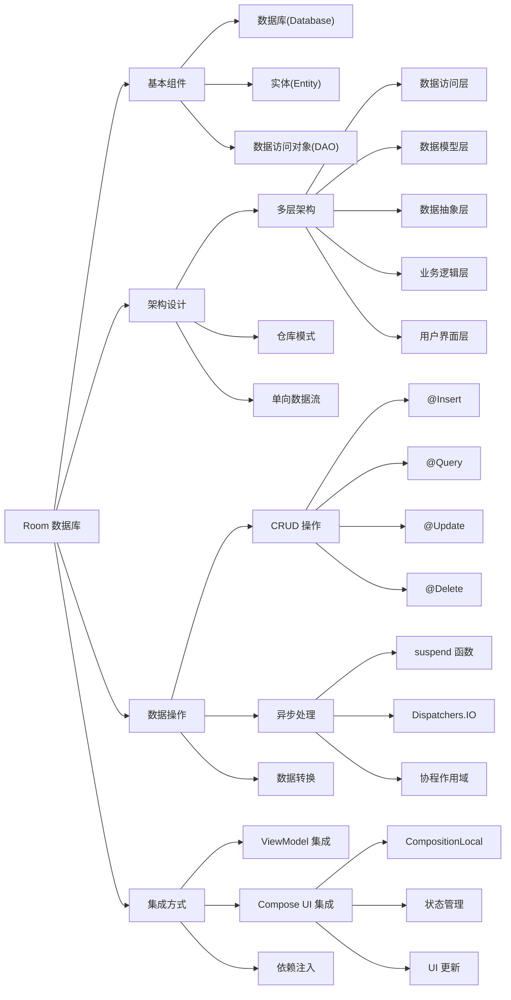

# Room 数据库总结

## 核心概述

本文详细介绍了如何在 Android 应用中使用 Room 数据库库实现数据持久化。Room 是谷歌在 2018 年创建的库，它在 Android 内置的 SQLite 数据库之上添加了一层封装，使数据库操作更为简便。文章通过构建一个食谱查找器应用的书签和杂货功能，展示了 Room 的实际应用，包括数据的插入、查询和删除等操作。

## 关键技术点

- **Room 的三个基本组件**：
  - **数据库**：主要接口，继承自 `RoomDatabase`，使用 `@Database` 注解
  - **实体**：代表存储在数据库中的数据类型，使用 `@Entity` 注解
  - **DAO**（数据访问对象）：定义访问数据库的接口，使用 `@Dao` 注解

- **CRUD 操作**：
  - 创建（Create）：使用 `@Insert` 注解
  - 读取（Read）：使用 `@Query` 注解
  - 更新（Update）：使用 `@Update` 注解
  - 删除（Delete）：使用 `@Delete` 注解或自定义 `@Query` 删除语句

- **仓库模式**：在 Room 和应用程序代码之间添加一层抽象，提供统一的数据访问接口

- **ViewModel 集成**：通过 ViewModel 将数据库操作与 UI 分离

- **Kotlin 协程**：使用 `suspend` 函数和 `withContext(Dispatchers.IO)` 进行后台数据操作

- **CompositionLocal**：使用 `compositionLocalOf` 在 Compose UI 中共享仓库实例

## 应用架构

文章采用了清晰的多层架构设计，各层职责明确：

1. **数据访问和持久化层**（Room）：处理数据库操作
2. **数据模型层**（Model）：定义数据结构
3. **数据抽象层**（Repository）：提供统一的数据访问接口
4. **业务/领域逻辑层**（ViewModel）：处理业务逻辑
5. **用户界面层**（Activity/Fragment/Compose）：展示数据和接收用户输入

## 代码示例

以下是定义 Room 实体的示例代码：

```kotlin
import android.os.Parcelable
import androidx.room.ColumnInfo
import androidx.room.Entity
import androidx.room.PrimaryKey
import kotlinx.parcelize.Parcelize

@Parcelize
@Entity(tableName = "recipes")
data class RecipeDb(
  @PrimaryKey(autoGenerate = false)
  @ColumnInfo(name = "id")
  var id: Int,
  @ColumnInfo(name = "title")
  var title: String,
  @ColumnInfo(name = "image")
  var image: String?,
  @ColumnInfo(name = "summary")
  var summary: String = "",
  @ColumnInfo(name = "instructions")
  var instructions: String? = "",
  @ColumnInfo(name = "sourceUrl")
  var sourceUrl: String = "",
  @ColumnInfo(name = "preparationMinutes")
  var preparationMinutes: Int = 0,
  @ColumnInfo(name = "cookingMinutes")
  var cookingMinutes: Int = 0,
  @ColumnInfo(name = "readyInMinutes")
  var readyInMinutes: Int = 0,
  @ColumnInfo(name = "servings")
  var servings: Int = 0,
) : Parcelable
```

以下是 DAO 接口的示例代码：

```kotlin
import androidx.room.Dao
import androidx.room.Delete
import androidx.room.Insert
import androidx.room.OnConflictStrategy
import androidx.room.Query
import androidx.room.Update

@Dao
interface RecipeDao {
  @Insert(onConflict = OnConflictStrategy.IGNORE)
  suspend fun addRecipe(recipe: RecipeDb)

  @Query("SELECT * FROM recipes WHERE id = :id")
  suspend fun findRecipeById(id: Int): RecipeDb

  @Query("SELECT * FROM recipes")
  suspend fun getAllRecipes(): List<RecipeDb>

  @Update
  suspend fun updateRecipeDetails(recipe: RecipeDb)

  @Delete
  suspend fun deleteRecipe(recipe: RecipeDb)

  @Query("DELETE FROM recipes WHERE id = :recipeId")
  suspend fun deleteRecipeById(recipeId: Int)
}
```

## 目标分析

本文面向想要学习 Android 数据持久化基础知识的开发者，特别是那些需要在应用中存储结构化数据的开发者。读者需要具备基本的 Android 开发知识和 Kotlin 语言基础，但不需要深入了解 SQLite 或数据库系统。

## 技术价值

1. **简化 SQLite 操作**：Room 提供了类型安全的方式来操作 SQLite 数据库，减少了样板代码
2. **编译时 SQL 验证**：在编译时检查 SQL 查询语法，避免运行时错误
3. **清晰的架构设计**：展示了如何使用仓库模式和 ViewModel 构建可维护的应用架构
4. **Kotlin 协程集成**：展示了如何使用协程执行异步数据库操作
5. **Compose 集成**：演示了如何在 Jetpack Compose UI 中使用 Room 数据库

## 扩展分析

### 版本适用性

文章中的示例使用 Room 2.5.2 版本，适用于现代 Android 应用开发。代码示例依赖于 Kotlin 协程和 Jetpack Compose，因此最适合 Android API 级别 21 及以上的应用。

### 性能考量

文章强调了几个性能相关的最佳实践：

- 使用单例模式创建数据库实例（`RecipeDatabase`）
- 使用 `Volatile` 和 `synchronized` 确保线程安全
- 在后台线程（通过 `Dispatchers.IO`）执行所有数据库操作
- 使用仓库模式减少数据库操作的冗余代码

### 最佳实践

1. **使用 DAO 接口**：所有数据库访问都通过 DAO 接口进行，提供了清晰的 API
2. **实现仓库模式**：使用仓库隔离数据源细节
3. **使用 ViewModel 管理 UI 数据**：将数据库操作与 UI 逻辑分离
4. **在 ViewModel 中转换数据模型**：将数据库模型转换为 UI 模型
5. **使用依赖注入**：通过 `CompositionLocal` 提供仓库实例
6. **使用协程进行异步操作**：所有数据库访问都是异步的，不会阻塞主线程

## 思维导图


