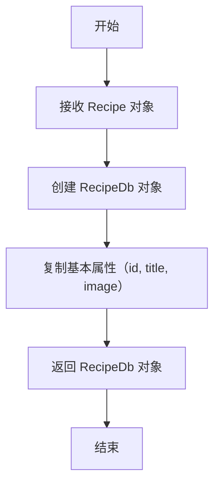
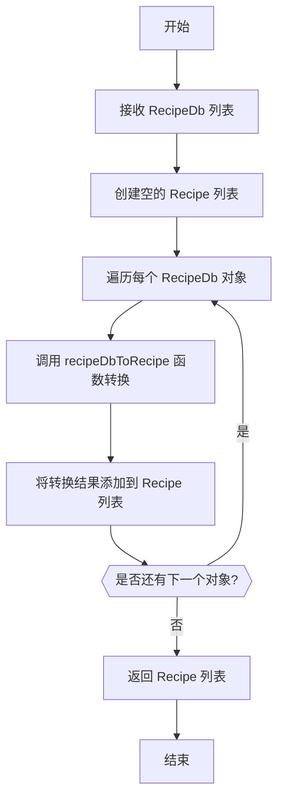
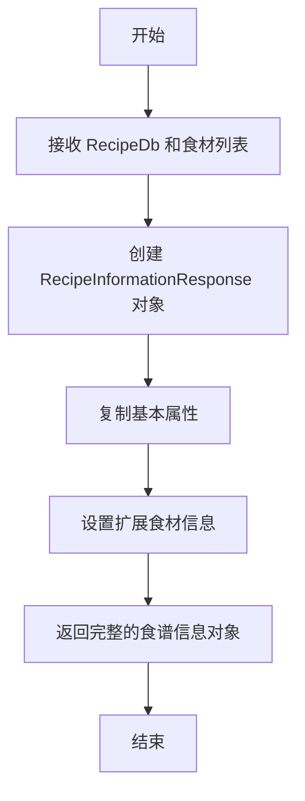
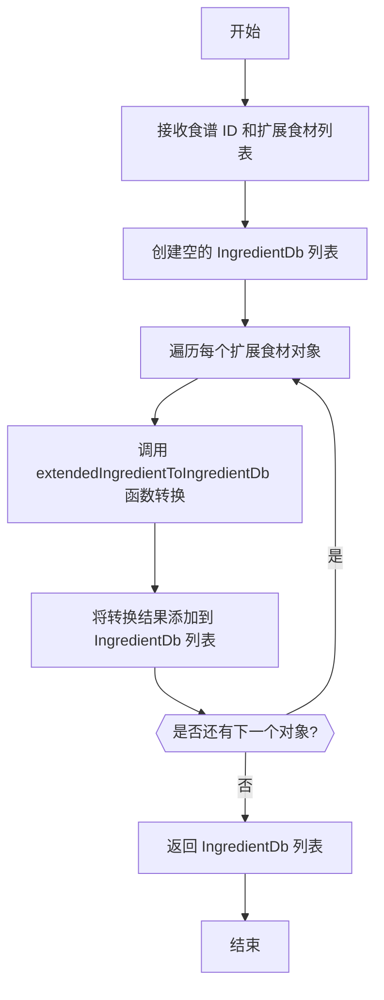

# Conversions.kt 文件分析报告

## 文件基本信息

- **文件名称**：Conversions.kt
- **文件路径**：app/src/main/java/com/kodeco/recipefinder/data/Conversions.kt
- **主要功能**：提供数据模型与数据库实体之间的转换函数，实现应用层数据模型与持久化层的映射
- **技术要点**：顶层函数、Kotlin 扩展函数、数据转换、映射操作
- **Android 基础概念**：
  - 数据映射转换模式
  - 实体与模型的分离
  - 持久化数据处理
- **与已知技术栈对比**：
  - 类似于 iOS 中的 NSManagedObject 与模型对象的转换
  - 类似于 Flutter 中的 Model 与数据库对象转换
  - 类似于前端框架中的数据序列化与反序列化操作

## 语法元素分析

### 语法元素概览

- **包声明**：com.kodeco.recipefinder.data
- **导入声明**：
  - com.kodeco.recipefinder.data.database：数据库实体相关类
  - com.kodeco.recipefinder.data.models：数据模型相关类

| 元素类型 | 数量 | 备注 |
|---|---|---|
| 类      | 0    | 无显式类定义 |
| 接口    | 0    | 无接口定义 |
| 对象    | 0    | 无对象定义 |
| 函数    | 10   | 顶层转换函数 |
| 扩展函数 | 0    | 无扩展函数 |
| 属性    | 0    | 无属性定义 |

### 函数分析

#### recipeToDb 函数

- **函数名称**：recipeToDb
- **函数签名**：fun recipeToDb(recipe: Recipe): RecipeDb
- **函数职责**：将应用层的 Recipe 模型对象转换为数据库层的 RecipeDb 实体
- **参数分析**：recipe - 需要转换的 Recipe 模型对象
- **返回值分析**：返回对应的 RecipeDb 数据库实体对象
- **函数流程图**：

- **调用关系**：当需要将 Recipe 对象保存到数据库时调用
- **复杂度分析**：时间复杂度 O(1)，空间复杂度 O(1)
- **Kotlin 特有语法**：使用命名参数构造 RecipeDb 对象

#### recipeDbsToRecipes 函数

- **函数名称**：recipeDbsToRecipes
- **函数签名**：fun recipeDbsToRecipes(recipes: List\<RecipeDb\>): List\<Recipe\>
- **函数职责**：将数据库实体集合转换为应用层模型集合
- **参数分析**：recipes - 需要转换的 RecipeDb 实体列表
- **返回值分析**：返回对应的 Recipe 模型对象列表
- **函数流程图**：

- **调用关系**：调用 recipeDbToRecipe 函数处理单个对象转换
- **复杂度分析**：时间复杂度 O(n)，空间复杂度 O(n)
- **Kotlin 特有语法**：使用 forEach 高阶函数进行集合遍历处理

#### recipeDbToRecipeInformation 函数

- **函数名称**：recipeDbToRecipeInformation
- **函数签名**：fun recipeDbToRecipeInformation(recipe: RecipeDb, ingredients: List\<ExtendedIngredient\>): RecipeInformationResponse
- **函数职责**：将数据库实体和食材列表转换为食谱详细信息响应对象
- **参数分析**：
  - recipe - RecipeDb 数据库实体对象
  - ingredients - 食材扩展信息列表
- **返回值分析**：返回包含完整食谱信息的 RecipeInformationResponse 对象
- **函数流程图**：

- **调用关系**：当需要获取食谱详细信息时调用
- **复杂度分析**：时间复杂度 O(1)，空间复杂度 O(1)
- **Kotlin 特有语法**：使用命名参数简化对象创建

#### extendedIngredientsToIngredientDbs 函数

- **函数名称**：extendedIngredientsToIngredientDbs
- **函数签名**：fun extendedIngredientsToIngredientDbs(recipeId: Int, ingredients: List\<ExtendedIngredient\>): List\<IngredientDb\>
- **函数职责**：将扩展食材信息列表转换为数据库食材实体列表
- **参数分析**：
  - recipeId - 食谱 ID，用于建立关联关系
  - ingredients - 需要转换的扩展食材列表
- **返回值分析**：返回可存储到数据库的 IngredientDb 实体列表
- **函数流程图**：

- **调用关系**：调用 extendedIngredientToIngredientDb 函数处理单个对象转换
- **复杂度分析**：时间复杂度 O(n)，空间复杂度 O(n)
- **Kotlin 特有语法**：使用 forEach 高阶函数进行集合遍历处理

## Kotlin 语法分析

### Kotlin 特性与语法

- **顶层函数**：
  - 文件中所有函数都定义在包级别，无需包装在类中
  - 比 Java 中的静态工具类更简洁
  - 与 Swift 的全局函数类似
  - 类似于 JavaScript 模块中的导出函数
- **命名参数**：
  - 使用命名参数创建对象，例如 `RecipeDb(id = recipe.id, ...)`
  - 提高代码可读性，明确每个参数的用途
  - 与 Swift 的命名参数类似
  - 与 Python 的关键字参数类似
- **集合操作**：
  - 使用 mutableListOf() 创建可变列表
  - 使用 forEach 高阶函数遍历集合
  - 比 Java 的集合操作更简洁

## API 使用分析

- **重要 API**：

| API 名称 | 用途 | 文档链接 | 类似 iOS/Flutter API |
|---|---|---|---|
| mutableListOf | 创建可变列表 | [Kotlin Collections](https://kotlinlang.org/api/latest/jvm/stdlib/kotlin.collections/mutable-list-of.html) | Swift: var array = [Type]() / Dart: List<Type>() |
| forEach | 遍历集合元素 | [Kotlin forEach](https://kotlinlang.org/api/latest/jvm/stdlib/kotlin.collections/for-each.html) | Swift: for in / Dart: for in |
| List | 不可变列表接口 | [Kotlin List](https://kotlinlang.org/api/latest/jvm/stdlib/kotlin.collections/-list/) | Swift: Array / Dart: List |

## 注意事项与最佳实践

- **优点**：
  - 清晰分离了数据模型与数据库实体
  - 转换函数命名明确，表达了转换方向
  - 代码结构简洁，每个函数职责单一
  - 使用顶层函数组织转换逻辑，避免了不必要的类包装

- **改进空间**：
  - 可以考虑使用扩展函数代替顶层函数，例如 `fun Recipe.toDb(): RecipeDb`
  - 可以添加错误处理机制，处理数据异常情况
  - 可以考虑使用映射库（如 MapStruct）减少样板代码
  - 函数注释可以更完善，说明转换规则和注意事项

- **初学者指南**：
  - 数据转换函数是应用层与数据持久层之间的桥梁
  - 分离模型与实体是一种良好的架构实践，增强了系统的可维护性
  - 使用顶层函数是 Kotlin 中组织工具方法的一种简洁方式

- **替代方案**：
  - 可以使用扩展函数实现转换逻辑
  - 可以使用映射库自动处理对象转换
  - 可以在数据模型类中实现转换方法 