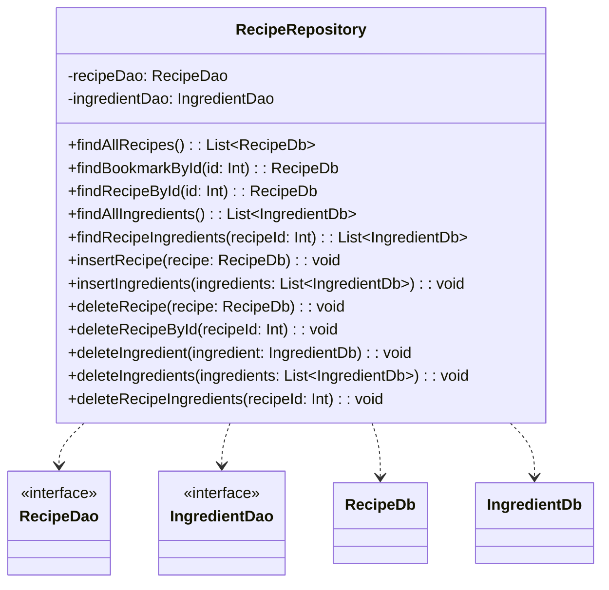
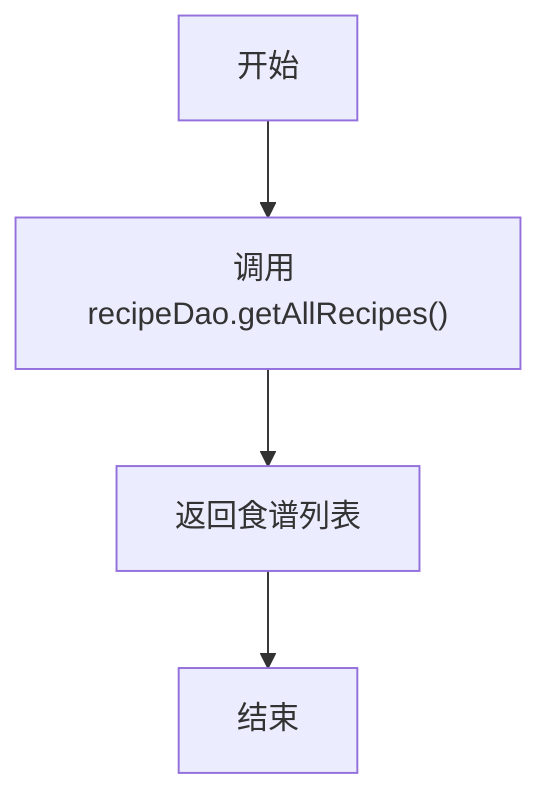
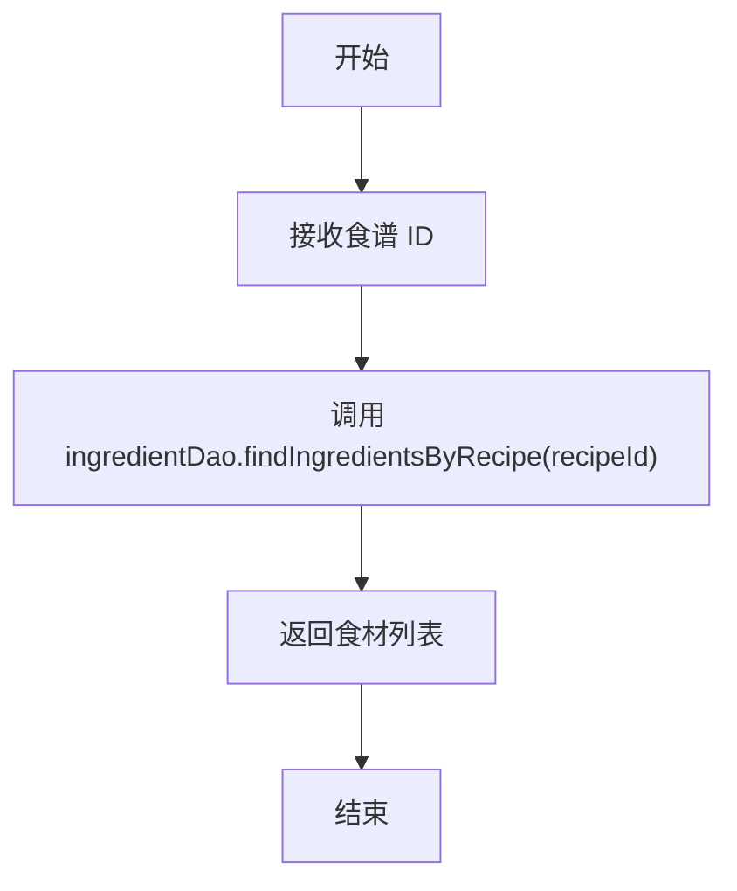
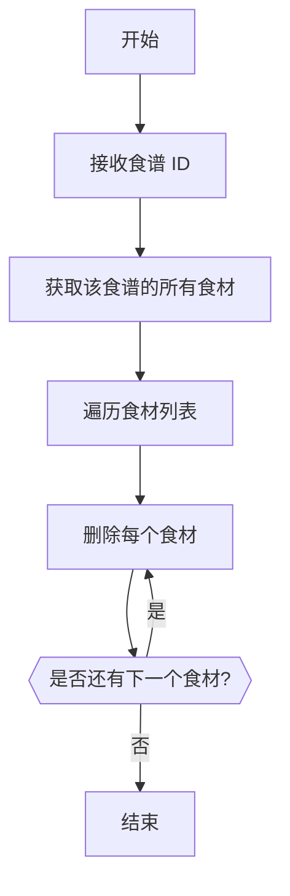

# RecipeRepository.kt 文件分析报告

## 文件基本信息

- **文件名称**：RecipeRepository.kt
- **文件路径**：app/src/main/java/com/kodeco/recipefinder/data/RecipeRepository.kt
- **主要功能**：实现食谱数据仓库，提供对食谱和食材数据的统一访问接口，封装数据库操作
- **技术要点**：仓库模式、依赖注入、挂起函数、数据库访问
- **Android 基础概念**：
  - 仓库模式（Repository Pattern）
  - 依赖注入（Constructor Injection）
  - 协程挂起函数
  - Room 数据库访问
- **与已知技术栈对比**：
  - 类似于 iOS 中的 Repository/Service 层设计
  - 类似于 Flutter 中的 Repository 模式
  - 类似于前端应用中的 Service 层和数据访问层

## 语法元素分析

### 语法元素概览

- **包声明**：com.kodeco.recipefinder.data
- **导入声明**：
  - com.kodeco.recipefinder.data.database：数据库相关类

| 元素类型 | 数量 | 备注 |
|---|---|---|
| 类      | 1    | RecipeRepository 类 |
| 接口    | 0    | 无接口定义 |
| 对象    | 0    | 无对象定义 |
| 函数    | 13   | 数据访问函数 |
| 扩展函数 | 0    | 无扩展函数 |
| 属性    | 2    | 私有属性 |

### 类与接口分析

#### RecipeRepository 类

- **类名**：RecipeRepository
- **类型**：常规类
- **职责描述**：作为应用与数据库之间的中间层，提供对食谱和食材数据的统一访问接口，封装数据库操作
- **Kotlin 语法特点**：
  - 使用主构造函数注入依赖
  - 使用 `suspend` 关键字定义协程挂起函数
  - 使用属性初始化从数据库获取 DAO 对象
- **与其他语言对比**：
  - Swift：类似于 Swift 中的 Repository 类
  - Dart：类似于 Dart 中的 Repository 类
  - Java：比 Java 实现更简洁，直接使用构造函数注入

- **属性分析**：

| 属性名 | 类型 | 可见性 | 用途 |
|----|---|----|---|
| recipeDao | RecipeDao | private | 食谱数据访问对象 |
| ingredientDao | IngredientDao | private | 食材数据访问对象 |

- **类 UML 图**：

- **继承关系**：无继承关系
- **依赖关系**：
  - 依赖于 RecipeDatabase 创建仓库实例
  - 依赖于 RecipeDao 和 IngredientDao 访问数据
  - 依赖于 RecipeDb 和 IngredientDb 实体类操作数据
- **与 Java 对比**：
  - Kotlin 中使用主构造函数更简洁地注入依赖
  - Kotlin 中使用挂起函数处理异步操作
  - Kotlin 属性初始化更简洁
- **与 Swift 对比**：
  - 类似于 Swift 中的依赖注入模式
  - 类似于 Swift 中的 async/await 异步操作
- **与 Dart/Flutter 对比**：
  - 类似于 Dart 中的 Repository 类模式
  - Kotlin 的挂起函数与 Dart 的 async/await 功能类似

## 函数分析

### findAllRecipes 函数

- **函数名称**：findAllRecipes
- **函数签名**：suspend fun findAllRecipes(): List\<RecipeDb\>
- **函数职责**：获取所有存储在数据库中的食谱记录
- **参数分析**：无参数
- **返回值分析**：返回 RecipeDb 对象列表
- **函数流程图**：

- **调用关系**：调用 RecipeDao 的 getAllRecipes 方法
- **复杂度分析**：时间复杂度和空间复杂度取决于 Room DAO 实现

### findRecipeIngredients 函数

- **函数名称**：findRecipeIngredients
- **函数签名**：suspend fun findRecipeIngredients(recipeId: Int): List\<IngredientDb\>
- **函数职责**：获取特定食谱的所有食材
- **参数分析**：recipeId - 食谱的唯一标识符
- **返回值分析**：返回与该食谱关联的 IngredientDb 对象列表
- **函数流程图**：

- **调用关系**：调用 IngredientDao 的 findIngredientsByRecipe 方法
- **复杂度分析**：时间复杂度和空间复杂度取决于 Room DAO 实现

### deleteRecipeIngredients 函数

- **函数名称**：deleteRecipeIngredients
- **函数签名**：suspend fun deleteRecipeIngredients(recipeId: Int)
- **函数职责**：删除特定食谱的所有食材
- **参数分析**：recipeId - 食谱的唯一标识符
- **返回值分析**：无返回值
- **函数流程图**：

- **调用关系**：
  - 调用 findRecipeIngredients 获取食材列表
  - 调用 ingredientDao.deleteIngredient 删除每个食材
- **复杂度分析**：时间复杂度 O(n)，空间复杂度 O(n)
- **Kotlin 特有语法**：
  - 使用 forEach 循环遍历集合
  - 使用挂起函数处理异步操作

## Kotlin 语法分析

### Kotlin 特性与语法

- **构造函数依赖注入**：
  - 使用主构造函数注入 RecipeDatabase 依赖
  - 相比 Java 的依赖注入更简洁
  - 与 Swift 的初始化器类似
  - 与 Dart 的构造函数注入类似
- **协程与挂起函数**：
  - 所有数据库操作都使用 `suspend` 关键字定义为挂起函数
  - 允许在协程中异步执行数据库操作
  - 与 Swift 的 async/await 相似
  - 与 JavaScript/Dart 的 async/await 相似
- **属性初始化**：
  - 直接在声明时初始化属性：`private val recipeDao: RecipeDao = recipeDatabase.recipeDao()`
  - 比 Java 的字段初始化更简洁

### API 使用分析

- **重要 API**：

| API 名称 | 用途 | 文档链接 | 类似 iOS/Flutter API |
|---|---|---|---|
| Room DAO | 数据库访问 | [Room DAO](https://developer.android.com/reference/androidx/room/Dao) | CoreData NSManagedObjectContext / Moor DAO |
| suspend | 定义挂起函数 | [Kotlin suspend](https://kotlinlang.org/docs/reference/coroutines/composing-suspending-functions.html) | Swift async / Dart async |
| forEach | 遍历集合 | [Kotlin forEach](https://kotlinlang.org/api/latest/jvm/stdlib/kotlin.collections/for-each.html) | Swift forEach / Dart forEach |

- **Android 框架 API**：
  - Room 持久化库：通过 DAO 接口访问数据库
  - Kotlin 协程：用于异步执行数据库操作

## 注意事项与最佳实践

- **优点**：
  - 采用仓库模式封装数据访问逻辑
  - 单一职责原则：仓库只负责数据访问
  - 所有方法都是挂起函数，支持协程异步调用
  - 代码结构清晰，方法命名明确

- **改进空间**：
  - 可以考虑添加接口定义，提高可测试性和灵活性
  - 可以添加错误处理机制，例如 try-catch 或 Result 类型返回值
  - 可以添加缓存机制，减少数据库访问次数
  - 可以使用更复杂的类型而不是简单的实体列表，如 Flow 或 LiveData

- **初学者指南**：
  - 仓库模式是 Android 架构组件推荐的数据访问模式
  - 仓库充当数据源和应用程序其余部分之间的媒介
  - 使用依赖注入可以简化测试并提高代码质量
  - 挂起函数适合处理可能耗时的操作，如数据库访问

- **替代方案**：
  - 可以使用 ViewModel 直接访问 DAO（不推荐）
  - 可以使用响应式模式，返回 Flow 或 LiveData
  - 可以添加数据源抽象，使仓库可以从多个数据源获取数据 