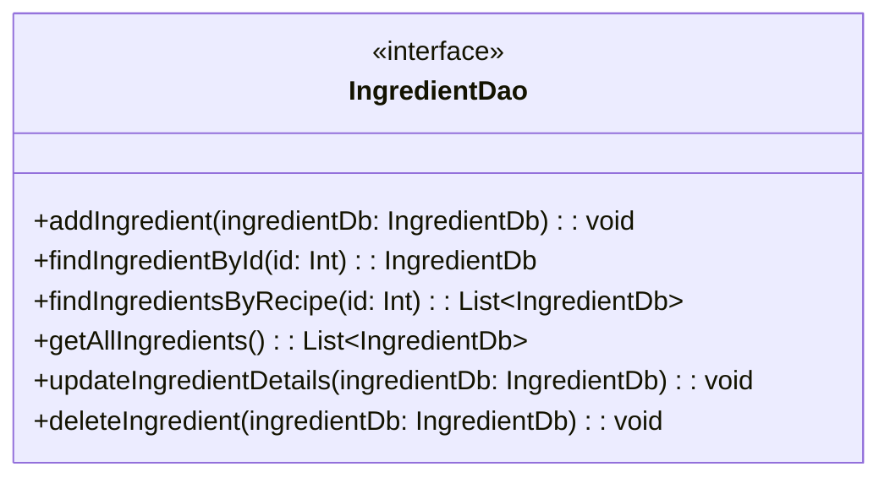
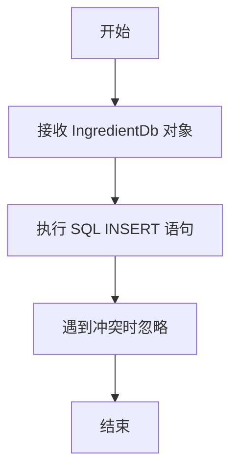
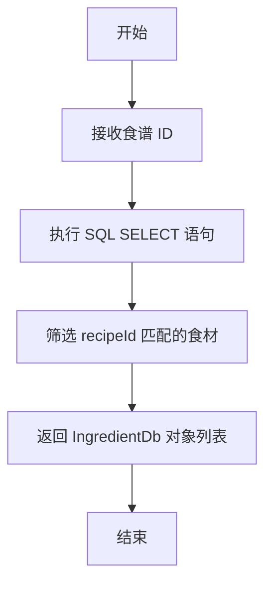

# IngredientDao.kt 文件分析报告

## 文件基本信息

- **文件名称**：IngredientDao.kt
- **文件路径**：app/src/main/java/com/kodeco/recipefinder/data/database/IngredientDao.kt
- **主要功能**：定义对食材数据库表的访问操作接口，提供食材的增删改查功能
- **技术要点**：Room 数据库 DAO、Kotlin 接口、挂起函数、数据库查询
- **Android 基础概念**：
  - Room 持久化库的 DAO（数据访问对象）模式
  - 使用注解进行 SQL 查询定义
  - 协程挂起函数用于异步数据库操作
- **与已知技术栈对比**：
  - 类似于 iOS 中的 CoreData 存储管理器
  - 类似于 Flutter 中的 Repository 模式结合 SQL 查询
  - 类似于前端框架中的数据服务层

## 语法元素分析

### 语法元素概览

- **包声明**：com.kodeco.recipefinder.data.database
- **导入声明**：
  - androidx.room：Room 数据库相关注解和接口

| 元素类型 | 数量 | 备注 |
|---|---|---|
| 类      | 0    | 无显式类定义 |
| 接口    | 1    | IngredientDao 接口 |
| 对象    | 0    | 无对象定义 |
| 函数    | 6    | 接口中的方法定义 |
| 扩展函数 | 0    | 无扩展函数 |
| 属性    | 0    | 无属性定义 |

### 类与接口分析

#### IngredientDao 接口

- **接口名**：IngredientDao
- **类型**：接口（interface）
- **职责描述**：定义与食材表交互的数据库操作方法，包括添加、查询、更新和删除食材记录
- **Kotlin 语法特点**：
  - 使用 `interface` 定义数据访问接口
  - 使用 Room 注解定义数据库操作
  - 使用 `suspend` 关键字定义协程挂起函数，使数据库操作可以异步执行
- **与其他语言对比**：
  - Swift：类似于 Swift 中的协议（protocol）
  - Dart：类似于 Dart 中的抽象类或接口
  - Java：Java 中的接口，但 Kotlin 接口可包含默认实现
  - Objective-C：类似于 Objective-C 中的协议

- **方法分析**：

| 方法名 | 参数 | 返回类型 | 用途 |
|----|---|---|---|
| addIngredient | (ingredientDb: IngredientDb) | 无返回值 | 添加新的食材记录到数据库 |
| findIngredientById | (id: Int) | IngredientDb | 根据 ID 查询特定食材 |
| findIngredientsByRecipe | (id: Int) | List\<IngredientDb\> | 查询特定食谱的所有食材 |
| getAllIngredients | 无参数 | List\<IngredientDb\> | 查询所有食材记录 |
| updateIngredientDetails | (ingredientDb: IngredientDb) | 无返回值 | 更新食材信息 |
| deleteIngredient | (ingredientDb: IngredientDb) | 无返回值 | 删除特定食材记录 |

- **类 UML 图**：

- **继承关系**：无直接继承关系
- **依赖关系**：
  - 依赖于 Room 数据库注解定义数据库操作
  - 依赖于 IngredientDb 实体类作为方法参数和返回值
- **与 Java 对比**：
  - Kotlin 中的挂起函数是 Java 接口中没有的概念
  - Java 中通常使用回调或 Future 处理异步数据库操作
- **与 Swift 对比**：
  - Swift 中使用类似 Combine 框架或 async/await 处理异步操作
  - Swift 协议实现更倾向于面向协议编程模式
- **与 Dart/Flutter 对比**：
  - Dart 中使用 Future 和 async/await 处理异步操作
  - Flutter 中常用 Provider 或 BLoC 模式组织数据访问层

## 函数分析

### addIngredient 函数

- **函数名称**：addIngredient
- **函数签名**：suspend fun addIngredient(ingredientDb: IngredientDb)
- **函数职责**：将新的食材记录插入数据库
- **参数分析**：ingredientDb - 待插入的食材实体对象
- **返回值分析**：无返回值
- **函数流程图**：

- **Kotlin 特有语法**：
  - 挂起函数（suspend）用于协程中执行异步操作
  - @Insert 注解自动生成 SQL 插入语句

### findIngredientsByRecipe 函数

- **函数名称**：findIngredientsByRecipe
- **函数签名**：suspend fun findIngredientsByRecipe(id: Int): List\<IngredientDb\>
- **函数职责**：查询特定食谱的所有食材记录
- **参数分析**：id - 食谱的唯一标识符
- **返回值分析**：返回属于该食谱的 IngredientDb 对象列表
- **函数流程图**：

- **Kotlin 特有语法**：
  - 使用 @Query 注解定义 SQL 查询语句
  - 使用字符串模板将参数注入 SQL 语句中

## Kotlin 语法分析

### Kotlin 特性与语法

- **协程与挂起函数**：
  - 使用 `suspend` 关键字标记异步操作函数
  - 与 Swift 的 async/await 相似
  - 与 JavaScript/Dart 的 async/await 相似，但实现机制不同
- **接口定义**：
  - Kotlin 接口比 Java 接口更灵活，可包含默认实现
  - 接口中的方法可以是抽象的（不提供实现）
- **Room 注解**：
  - 使用 @Dao 标记数据访问对象接口
  - 使用 @Insert、@Query、@Update、@Delete 等注解定义数据库操作

### API 使用分析

- **重要 API**：

| API 名称 | 用途 | 文档链接 | 类似 iOS/Flutter API |
|---|---|---|---|
| @Dao | 标记类为 Room 数据访问对象 | [Room Dao](https://developer.android.com/reference/androidx/room/Dao) | CoreData FetchRequest / Moor DAO |
| @Insert | 定义插入数据库操作 | [Room Insert](https://developer.android.com/reference/androidx/room/Insert) | CoreData save / Moor 插入操作 |
| @Query | 定义 SQL 查询操作 | [Room Query](https://developer.android.com/reference/androidx/room/Query) | CoreData NSPredicate / Moor 查询 |
| @Update | 定义更新操作 | [Room Update](https://developer.android.com/reference/androidx/room/Update) | CoreData save / Moor 更新操作 |
| @Delete | 定义删除操作 | [Room Delete](https://developer.android.com/reference/androidx/room/Delete) | CoreData delete / Moor 删除操作 |
| OnConflictStrategy | 定义冲突处理策略 | [OnConflictStrategy](https://developer.android.com/reference/androidx/room/OnConflictStrategy) | CoreData merge policy |

- **Android 框架 API**：
  - Room 持久化库：Android 官方推荐的 SQLite 抽象层
  - Kotlin 协程：用于简化异步操作的框架

## 注意事项与最佳实践

- **优点**：
  - 使用接口分离数据访问逻辑
  - 提供了根据食谱 ID 查询相关食材的方法，支持一对多关系查询
  - 所有数据库操作都使用挂起函数，支持协程异步调用
  - 遵循了 Room 架构的最佳实践

- **改进空间**：
  - 可以添加按食材名称或类型搜索的查询方法
  - 可以添加批量操作方法提高效率
  - 可以考虑使用 Flow 或 LiveData 返回类型以支持响应式编程

- **初学者指南**：
  - DAO 是 Room 数据库的核心组件，定义了应用程序与数据库交互的方式
  - findIngredientsByRecipe 方法展示了如何实现一对多关系的查询
  - Room 会自动将 SQL 查询结果转换为 Kotlin 对象

- **替代方案**：
  - 可以使用 RxJava 结合 Room 实现响应式数据库操作
  - 可以返回 Flow 类型实现数据变化的自动通知
