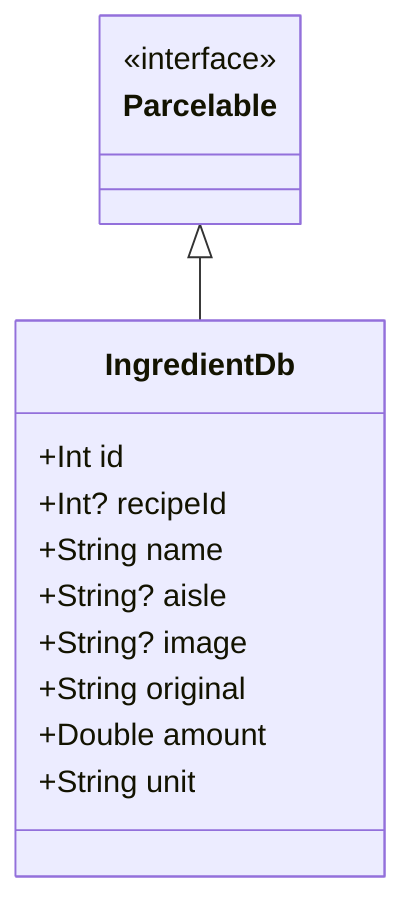

# IngredientDb.kt 文件分析报告

## 文件基本信息

- **文件名称**：IngredientDb.kt
- **文件路径**：app/src/main/java/com/kodeco/recipefinder/data/database/IngredientDb.kt
- **主要功能**：定义食材数据库实体类，用于在 Room 数据库中存储食谱食材信息
- **技术要点**：Room 数据库 ORM、数据类、Parcelable 序列化
- **Android 基础概念**：Room 持久化库、数据实体类、列注解、主键定义、外键关系
- **与已知技术栈对比**：
  - 类似于 iOS 中的 CoreData 实体模型
  - 类似于 Flutter 中的 Model 类结合 SQLite 插件
  - 类似于前端 React/Vue 中的数据模型

## 语法元素分析

### 语法元素概览

- **包声明**：com.kodeco.recipefinder.data.database
- **导入声明**：
  - android.os.Parcelable：Android 序列化接口
  - androidx.room：Room 数据库相关注解
  - kotlinx.parcelize：Kotlin Parcelable 实现工具

| 元素类型 | 数量 | 备注 |
|---|---|---|
| 类      | 1    | 数据类 IngredientDb |
| 接口    | 0    | 无接口定义 |
| 对象    | 0    | 无对象定义 |
| 函数    | 0    | 无显式函数定义（数据类自动生成的方法除外） |
| 扩展函数 | 0    | 无扩展函数 |
| 属性    | 8    | 实体类的属性字段 |

### 类与接口分析

#### IngredientDb 类

- **类名**：IngredientDb
- **类型**：数据类（data class）
- **职责描述**：表示食材在数据库中的存储格式，包含食材的基本信息如 ID、名称、所属食谱 ID、图片、数量等
- **Kotlin 语法特点**：
  - 使用 `data class` 自动生成 equals()、hashCode()、toString() 和 copy() 方法
  - 使用注解配置 Room 数据库映射
  - 使用可空类型（?）标记非必需字段
  - 使用默认参数值简化对象创建
- **与其他语言对比**：
  - Swift：类似于 Swift 中的结构体（struct），但 Swift 结构体是值类型
  - Dart：类似于 Dart 中的类与构造函数，但更简洁
  - Java：比 Java 中的 POJO 类更简洁，无需手动实现 getter/setter
  - Objective-C：比 Objective-C 类定义更简洁，无需分离接口和实现

- **属性分析**：

| 属性名 | 类型 | 可见性 | 用途 |
|----|---|----|---|
| id | Int | public | 食材唯一标识符，主键 |
| recipeId | Int? | public | 所属食谱的 ID，可空，是食谱表的外键 |
| name | String | public | 食材名称 |
| aisle | String? | public | 食材所在超市区域，可空 |
| image | String? | public | 食材图片 URL，可空 |
| original | String | public | 原始食材描述 |
| amount | Double | public | 食材数量 |
| unit | String | public | 食材单位 |

- **类 UML 图**：

- **继承关系**：实现了 Parcelable 接口
- **依赖关系**：
  - 依赖于 Room 数据库注解进行 ORM 映射
  - 通过 recipeId 与 RecipeDb 实体形成外键关系
- **与 Java 对比**：
  - Java 中需要更多样板代码来实现相同功能
  - Java 中实现 Parcelable 接口需要手动编写大量代码
- **与 Swift 对比**：
  - Swift 中使用 Codable 协议实现类似功能
  - Swift 中使用 NSCoding 协议实现类似 Parcelable 的功能
- **与 Dart/Flutter 对比**：
  - Dart 中需要手动实现 fromJson 和 toJson 方法
  - Flutter 中需要额外库来简化序列化过程

## Kotlin 语法分析

### Kotlin 特性与语法

- **空安全特性**：
  - 使用 `Int?`、`String?` 等表示可空类型
  - 与 Swift 的 Optional 类型相似
  - 与 Dart 的可空类型相似
- **数据类**：
  - 使用 `data class` 自动生成常用方法
  - 比 Java 中的 POJO 类更简洁
  - 类似 Swift 中的结构体，但更强大
  - 比 Dart 中的常规类更简洁
- **默认参数值**：
  - 为非必需字段设置默认值，如 `aisle: String? = ""`
  - 简化对象创建，无需设置所有参数
  - 与 Swift 的默认参数相似
  - 比 Dart 的命名参数更简洁

### API 使用分析

- **重要 API**：

| API 名称 | 用途 | 文档链接 | 类似 iOS/Flutter API |
|---|---|---|---|
| @Entity | 标记类为 Room 数据库表 | [Room Entity](https://developer.android.com/reference/androidx/room/Entity) | CoreData Entity / Moor 表定义 |
| @PrimaryKey | 定义表主键 | [Room PrimaryKey](https://developer.android.com/reference/androidx/room/PrimaryKey) | CoreData 属性约束 / Moor 主键 |
| @ColumnInfo | 定义表列名和属性 | [Room ColumnInfo](https://developer.android.com/reference/androidx/room/ColumnInfo) | CoreData 属性映射 / Moor 列定义 |
| @Parcelize | 自动实现 Parcelable 接口 | [Kotlin Parcelize](https://developer.android.com/kotlin/parcelize) | Swift Codable 协议 |

- **Android 框架 API**：
  - Room 持久化库：Android 官方推荐的 SQLite 抽象层
  - Parcelable：Android 系统内高效的序列化机制

## 注意事项与最佳实践

- **优点**：
  - 使用数据类简洁地定义实体模型
  - 良好的默认值设计，简化对象创建
  - 使用 Parcelize 注解简化 Parcelable 实现
  - 清晰的数据库映射关系定义

- **改进空间**：
  - 可以添加文档注释说明各字段的具体用途
  - 显式定义与 RecipeDb 的外键关系约束
  - 考虑添加数据验证逻辑

- **初学者指南**：
  - Room 实体类中的可空类型（?）表示该字段在数据库中允许为 NULL
  - 两个实体类（RecipeDb 和 IngredientDb）形成了一对多的关系模型
  - 使用默认参数值可以简化数据库实体的创建过程

- **替代方案**：
  - 可以使用 ForeignKey 注解显式定义外键关系
  - 可以添加索引（@Index）加速查询操作
