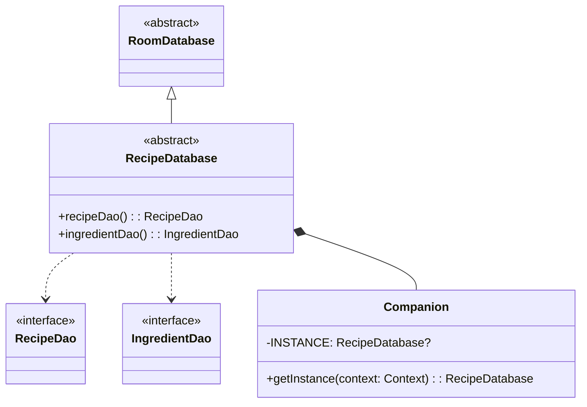
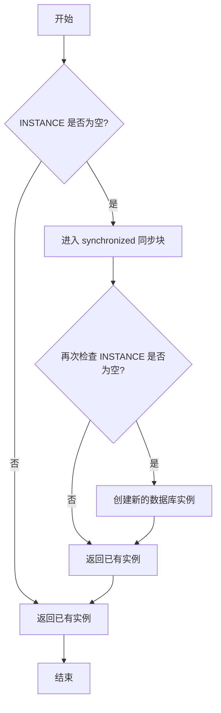

# RecipeDatabase.kt 文件分析报告

## 文件基本信息

- **文件名称**：RecipeDatabase.kt
- **文件路径**：app/src/main/java/com/kodeco/recipefinder/data/database/RecipeDatabase.kt
- **主要功能**：定义 Room 数据库类，为应用程序提供单例数据库实例及其访问接口
- **技术要点**：Room 数据库、单例模式、伴生对象、双重检查锁定
- **Android 基础概念**：
  - Room 持久化库架构
  - 数据库抽象层
  - DAO 访问模式
  - 单例设计模式
- **与已知技术栈对比**：
  - 类似于 iOS 中的 CoreData 持久化存储
  - 类似于 Flutter 中的 SQLite 数据库服务
  - 类似于前端应用中的数据层和服务层

## 语法元素分析

### 语法元素概览

- **包声明**：com.kodeco.recipefinder.data.database
- **导入声明**：
  - android.content.Context：Android 上下文环境
  - androidx.room：Room 数据库相关组件

| 元素类型 | 数量 | 备注 |
|---|---|---|
| 类      | 1    | 抽象类 RecipeDatabase |
| 接口    | 0    | 无接口定义 |
| 对象    | 1    | 伴生对象（companion object） |
| 函数    | 4    | 2个抽象方法，1个公开方法，1个私有属性 |
| 扩展函数 | 0    | 无扩展函数 |
| 属性    | 1    | INSTANCE 私有属性 |

### 类与接口分析

#### RecipeDatabase 类

- **类名**：RecipeDatabase
- **类型**：抽象类（abstract class）
- **职责描述**：作为 Room 数据库的基类，定义数据库配置和提供 DAO 访问实例
- **Kotlin 语法特点**：
  - 使用 `abstract class` 定义抽象数据库类
  - 使用 Room 注解配置数据库
  - 包含伴生对象（companion object）实现单例模式
  - 使用 `synchronized` 块和 `@Volatile` 注解实现线程安全
- **与其他语言对比**：
  - Swift：类似于 Swift 中的抽象类结合单例模式
  - Dart：类似于 Dart 中的抽象类和工厂模式
  - Java：与 Java 抽象类类似，但 Kotlin 语法更简洁
  - Objective-C：类似于 Objective-C 中的单例类和抽象基类

- **类成员分析**：

| 成员名 | 类型 | 可见性 | 用途 |
|----|---|----|---|
| recipeDao | 抽象函数 | public | 获取食谱 DAO 实例的方法 |
| ingredientDao | 抽象函数 | public | 获取食材 DAO 实例的方法 |
| INSTANCE | 属性 | private | 单例数据库实例引用 |
| getInstance | 函数 | public | 获取数据库单例实例的方法 |

- **类 UML 图**：

- **继承关系**：继承自 RoomDatabase 抽象类
- **依赖关系**：
  - 依赖于 Room 数据库框架
  - 依赖于 RecipeDao 和 IngredientDao 接口
  - 依赖于 RecipeDb 和 IngredientDb 实体类
- **与 Java 对比**：
  - Kotlin 中的伴生对象比 Java 中的静态成员更灵活
  - Kotlin 中的线程安全实现更简洁
- **与 Swift 对比**：
  - 类似于 Swift 中的单例模式实现，但 Swift 使用静态属性
  - Room 数据库配置类似于 Swift CoreData 的持久化容器配置
- **与 Dart/Flutter 对比**：
  - 类似于 Dart 中的单例工厂模式
  - Room 注解机制与 Dart 中的元数据标记不同

## 函数分析

### getInstance 函数

- **函数名称**：getInstance
- **函数签名**：fun getInstance(context: Context): RecipeDatabase
- **函数职责**：以线程安全的方式获取或创建数据库单例实例
- **参数分析**：context - Android 应用程序上下文，用于创建数据库
- **返回值分析**：返回 RecipeDatabase 单例实例
- **函数流程图**：

- **调用关系**：此函数被 Repository 类或其他需要数据库访问的组件调用
- **边界条件**：
  - 首次调用时创建新实例
  - 多线程环境下确保只创建一个实例
- **复杂度分析**：时间复杂度 O(1)，空间复杂度 O(1)
- **Kotlin 特有语法**：
  - 使用 `synchronized(this)` 确保线程安全
  - 使用双重检查锁定模式（Double-Checked Locking Pattern）
  - 伴生对象中的函数相当于 Java 中的静态方法

## Kotlin 语法分析

### Kotlin 特性与语法

- **伴生对象**：
  - 使用 `companion object` 实现类似静态成员的功能
  - 比 Java 中的静态方法更灵活，可以实现接口
  - 与 Swift 的类型方法或静态属性类似
- **可空类型与线程安全**：
  - 使用 `@Volatile` 注解确保多线程环境下 INSTANCE 的可见性
  - 使用可空类型 `RecipeDatabase?` 表示实例可能不存在
  - 使用安全调用操作符 `?.` 处理空值情况
- **单例模式实现**：
  - 使用双重检查锁定模式实现高效的线程安全单例
  - 比 Java 传统单例实现更简洁

### API 使用分析

- **重要 API**：

| API 名称 | 用途 | 文档链接 | 类似 iOS/Flutter API |
|---|---|---|---|
| @Database | 定义 Room 数据库配置 | [Room Database](https://developer.android.com/reference/androidx/room/Database) | CoreData NSPersistentContainer / Moor Database |
| Room.databaseBuilder | 创建数据库实例 | [Room.databaseBuilder](https://developer.android.com/reference/androidx/room/Room#databaseBuilder(android.content.Context,java.lang.Class,java.lang.String)) | CoreData 持久化存储创建 |
| fallbackToDestructiveMigration | 数据库版本变更时重建 | [fallbackToDestructiveMigration](https://developer.android.com/reference/androidx/room/RoomDatabase.Builder#fallbackToDestructiveMigration()) | CoreData 轻量迁移 |
| @Volatile | 确保字段在多线程环境下的可见性 | [Kotlin Volatile](https://kotlinlang.org/api/latest/jvm/stdlib/kotlin.jvm/-volatile/) | Swift 的 atomic 属性 |

- **Android 框架 API**：
  - Room 持久化库：Android 官方推荐的 SQLite 抽象层
  - Context：Android 应用程序环境与资源访问

## 注意事项与最佳实践

- **优点**：
  - 使用单例模式确保整个应用只有一个数据库实例
  - 线程安全的实现方式，适合多线程环境
  - 清晰的抽象层设计，符合 Room 架构推荐模式
  - 使用 fallbackToDestructiveMigration 简化版本迁移（适合开发阶段）

- **改进空间**：
  - 可以添加数据库迁移策略，而不是直接使用 fallbackToDestructiveMigration
  - 可以添加数据库回调处理初始化逻辑
  - 可以添加更多的错误处理和日志记录

- **初学者指南**：
  - Room 数据库是 Android 架构组件的一部分，提供 SQLite 抽象层
  - 双重检查锁定模式是实现线程安全单例的高效方法
  - @Database 注解定义了数据库的基本配置，包括实体类和版本号

- **替代方案**：
  - 可以使用 Dagger/Hilt 依赖注入框架提供数据库实例
  - 可以使用其他持久化方案如 Realm 或 ObjectBox 