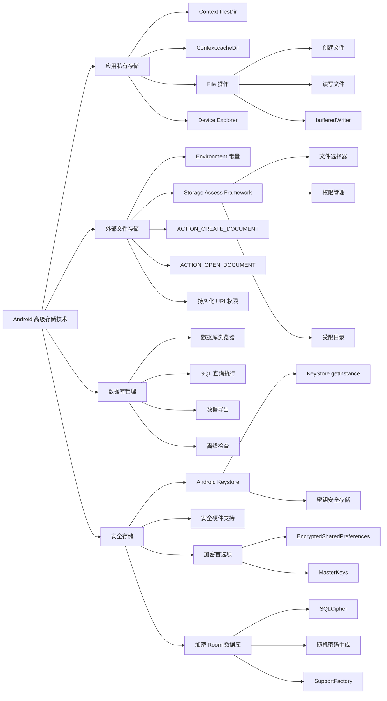

# Android 高级存储技术总结

## 文字摘要

### 核心概述

本文详细介绍了 Android 平台上的高级存储技术，包括应用私有文件存储、缓存管理、外部存储访问以及数据加密存储等关键内容。文章不仅解释了基本文件操作，还深入探讨了数据库加密和安全存储的实现方法，为开发安全的 Android 应用提供了全面指导。

### 关键技术点

- **应用私有存储**：
  - 使用 `Context.filesDir` 和 `Context.cacheDir` 访问应用私有目录
  - 通过 File 类创建、读写和删除文件
  - 使用 Device Explorer 查看和管理应用文件

- **缓存管理**：
  - 创建临时缓存文件 `File.createTempFile()`
  - 获取缓存配额 `storageManager.getCacheQuotaBytes()`
  - 缓存文件的生命周期管理

- **外部存储访问**：
  - 使用 Environment 类常量访问系统目录
  - 通过 Storage Access Framework 安全访问用户文件
  - 使用意图创建、打开文件和访问目录
  - 持久化 URI 权限

- **数据库工具**：
  - Android Studio 的数据库浏览器和检查器
  - 运行和保存 SQL 查询
  - 导出数据库内容为不同格式

- **安全存储**：
  - Android Keystore 系统基础
  - 加密的 SharedPreferences 实现
  - 使用 SQLCipher 加密 Room 数据库
  - 随机密码生成与安全存储

### UI 示例

以下是如何创建和使用安全的加密首选项的代码示例：

```kotlin
import android.content.Context
import android.content.SharedPreferences
import androidx.security.crypto.EncryptedSharedPreferences
import androidx.security.crypto.MasterKeys

class SecurePrefs(context: Context) {
  private val prefs: SharedPreferences

  init {
    // 创建或获取主密钥
    val masterKeyAlias = MasterKeys.getOrCreate(MasterKeys.AES256_GCM_SPEC)

    // 创建加密的 SharedPreferences
    prefs = EncryptedSharedPreferences.create(
      "encrypted_preferences",
      masterKeyAlias,
      context,
      EncryptedSharedPreferences.PrefKeyEncryptionScheme.AES256_SIV,
      EncryptedSharedPreferences.PrefValueEncryptionScheme.AES256_GCM
    )
  }

  // 保存字符串
  fun saveString(key: String, value: String) {
    prefs.edit().putString(key, value).apply()
  }

  // 获取字符串
  fun getString(key: String): String? {
    return prefs.getString(key, null)
  }

  // 检查键是否存在
  fun hasKey(key: String): Boolean {
    return prefs.contains(key)
  }
}

// 使用示例
@Composable
@Preview
fun SecurePrefsDemo() {
  val securePrefs = SecurePrefs(LocalContext.current)
  Column(modifier = Modifier.padding(16.dp)) {
    var savedText by remember { mutableStateOf(securePrefs.getString("DEMO_KEY") ?: "") }
    var inputText by remember { mutableStateOf("") }
    
    Text("加密首选项演示", style = MaterialTheme.typography.headlineSmall)
    Spacer(modifier = Modifier.height(8.dp))
    
    OutlinedTextField(
      value = inputText,
      onValueChange = { inputText = it },
      label = { Text("输入要保存的内容") }
    )
    
    Row(modifier = Modifier.fillMaxWidth(), horizontalArrangement = Arrangement.SpaceBetween) {
      Button(onClick = {
        securePrefs.saveString("DEMO_KEY", inputText)
        savedText = inputText
      }) {
        Text("保存")
      }
      
      Button(onClick = {
        savedText = securePrefs.getString("DEMO_KEY") ?: ""
      }) {
        Text("加载")
      }
    }
    
    Spacer(modifier = Modifier.height(16.dp))
    Text("当前保存的内容: $savedText")
  }
}
```

### 目标分析

本文面向具有一定 Android 开发经验的开发者，目的是提供高级存储和安全数据管理的实用指南。文章假设读者已熟悉基本的 Android 开发，现在需要了解更安全、更高级的数据存储技术。

### 技术价值

文章最有价值的技术见解包括：

1. 使用 Android Keystore 和加密库实现真正安全的数据存储
2. 采用随机生成的密码加密 SQLite 数据库，避免硬编码密码的安全隐患
3. 通过 Storage Access Framework 访问外部文件，无需请求广泛的存储权限
4. 利用 Android Studio 的数据库工具进行高效的数据库调试和检查

### 版本适用性

文章内容适用于 Android API 级别 23 (Marshmallow) 及以上版本，安全库使用的是 androidx.security:security-crypto:1.0.0，而 SQLCipher 使用的是 4.4.0 版本。

### 性能考量

- 加密操作会带来一定的性能开销，特别是大型数据库的加密/解密
- 应避免在主线程进行密集的加密/解密操作
- 缓存目录有大小限制，超出限制后系统可能删除文件

### 最佳实践

- 不要在代码中硬编码加密密钥或密码
- 使用随机生成的密码结合加密的首选项存储
- 对重要数据同时使用 KeyStore 和加密库进行双重保护
- 使用 Storage Access Framework 代替请求广泛的文件系统权限
- 使用持久化 URI 权限来确保应用在设备重启后仍能访问用户选择的文件

## 思维导图

